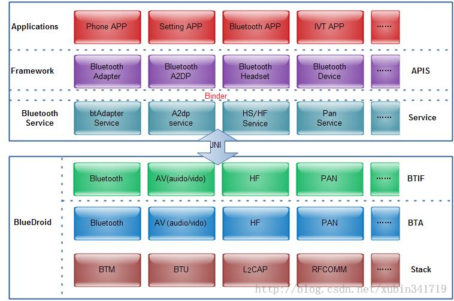
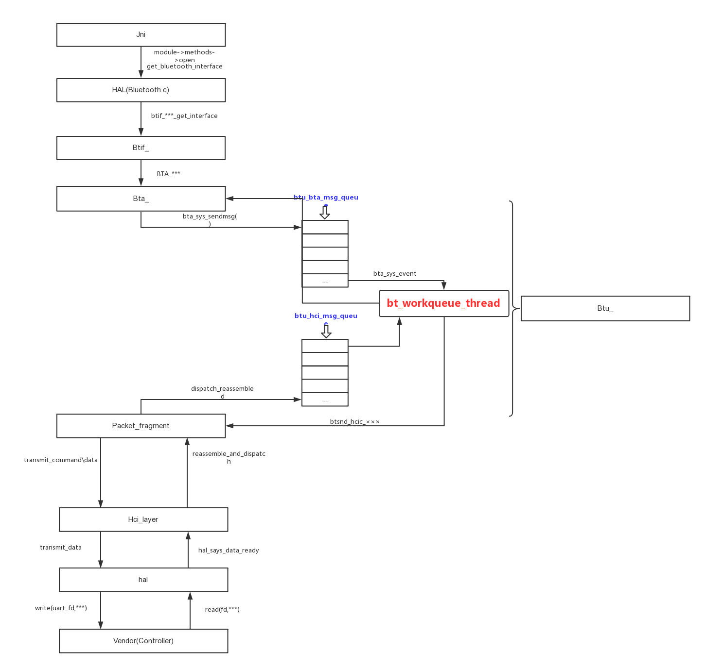
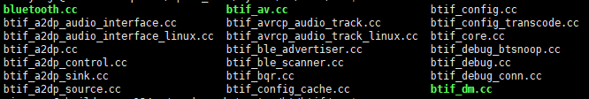
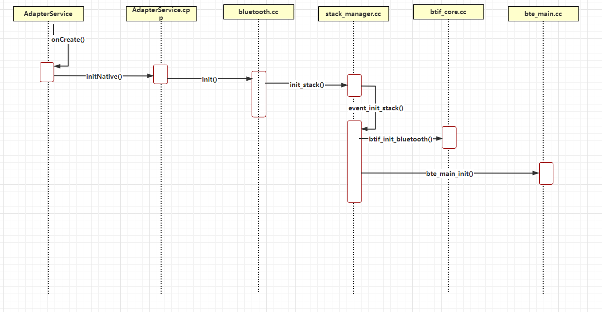
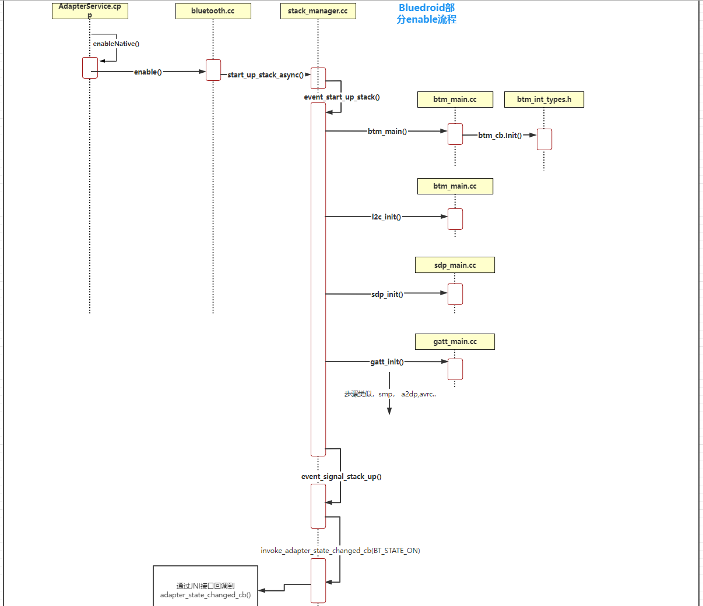

## 常用名词解释

```Java
HAL ：Hardware Abstraction Layer
 
Btif ：Bluetooth interface
 
Bta ：Bluetooth application
 
Btu ：Bluetooth uper layer
 
Bte ：Bluetooth embedded layer
 
Btm ：Bluetooth devicemanager
 
CO ： callout\CI: call in
 
HF ： Handsfree Profile
 
HH ：HID Host Profile
 
HL ：Health Device Profile
 
AV ：audio\vidio
 
Ag ：audiogateway
 
Ar ：audio/videoregistration
 
Gattc ：GATT client
 
Gatts ：GATT server
 
BLE ：Bluetooth Low Energy
```

bluedroid架构





整个bluedroid可以分为两大模块：BTIF，BTE

BTIF：提供bluedroid对外的接口

BTE：bluedroid的内部处理，又细分为BTA，BTU，BTM和HCI

BTA：bluedroid中各profile的逻辑实现和处理

BTU：主要用于核心协议层之间的事件处理与转换

BTM：蓝牙配对与链路管理

HCI：读取或写入数据到蓝牙hw

## 流程分析

分析流程的时候，从上层到底层都会经过btif，这里负责提供一些对外的结果，下面就是蓝牙基本的对外接口声明，在 system\bt\btif\src\bluetooth.cc文件中，里面还有各个声明的实现，这里不一一介绍

```Java
EXPORT_SYMBOL bt_interface_t bluetoothInterface = {
    sizeof(bluetoothInterface),
    init,
    enable,
    disable,
    cleanup,
    get_adapter_properties,
    get_adapter_property,
    set_adapter_property,
    get_remote_device_properties,
    get_remote_device_property,
    set_remote_device_property,
    get_remote_service_record,
    get_remote_services,
    start_discovery,
    cancel_discovery,
    create_bond,
    create_bond_out_of_band,
    remove_bond,
    cancel_bond,
    get_connection_state,
    pin_reply,
    ssp_reply,
    get_profile_interface,
    dut_mode_configure,
    dut_mode_send,
    le_test_mode,
    set_os_callouts,
    read_energy_info,
    dump,
    dumpMetrics,
    config_clear,
    interop_database_clear,
    interop_database_add,
    get_avrcp_service,
    obfuscate_address,
    get_metric_id,
#if (defined(SPRD_FEATURE_AOBFIX) && SPRD_FEATURE_AOBFIX == TRUE)
    sprd_set_profile_state,
#else
    nullptr,
#endif
};
```

看看btif文件的命名，基本上都是btif_用途的命令方式，比如btif_a2dp.cc，就是代表着a2dp的接口，如果要查看某个具体profile的功能接口，直接到对应文件里查找即可。



## 协议栈的初始化过程

基于android 12



## 协议栈启动流程

基于android 12

