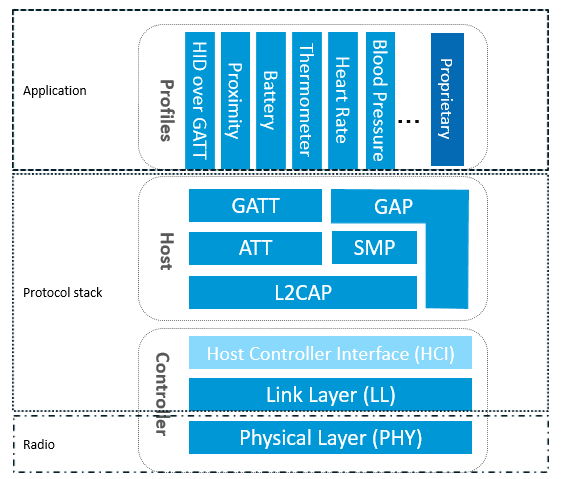
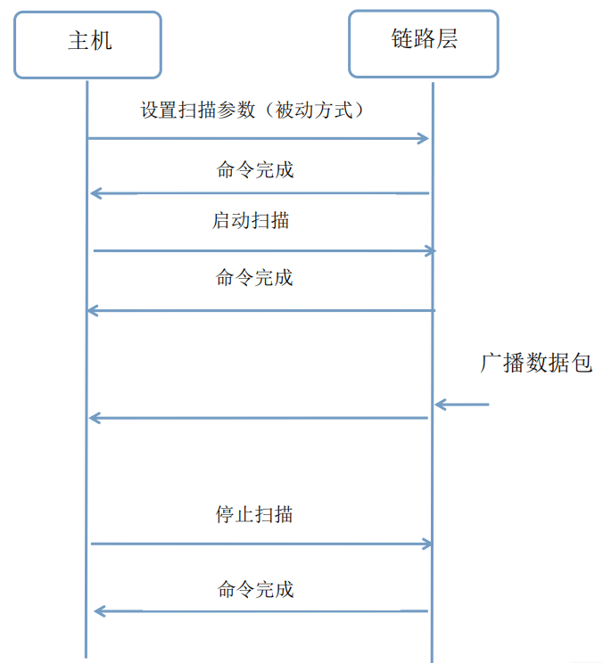
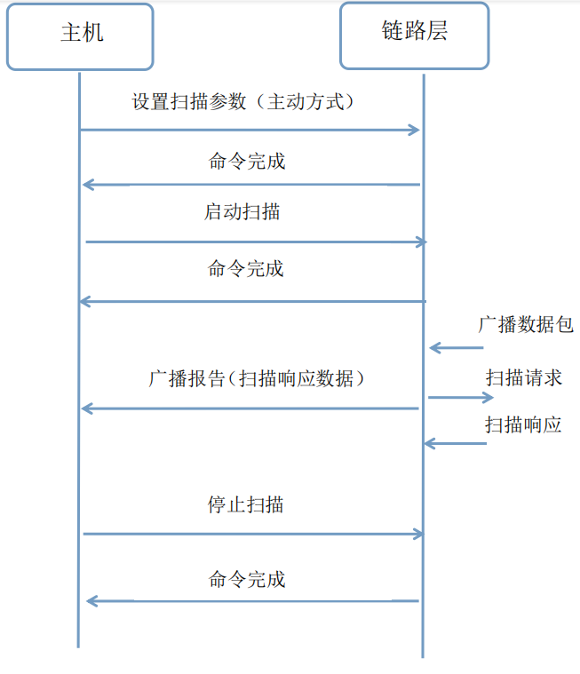
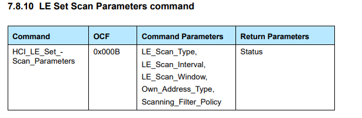

BLE 扫描参数

参考博客：[(16条消息) ESP32学习笔记（27）——BLE GAP主机端扫描_Leung_ManWah的博客-CSDN博客](https://blog.csdn.net/qq_36347513/article/details/118103231)


# 背景

## 1.1 低功耗蓝牙（BLE）协议栈




**链路层（LL）** 控制设备的射频状态，有五个设备状态：待机、广播、扫描、初始化和连接。

广播 为广播数据包，而 **扫描 则是监听广播**。

GAP通信中角色，中心设备（Central - 主机） 用来扫描和连接 外围设备（Peripheral - 从机）。

大部分情况下外围设备通过广播自己来让中心设备发现自己，并建立 GATT 连接，从而进行更多的数据交换。

也有些情况是不需要连接的，只要外设广播自己的数据即可，用这种方式主要目的是让外围设备，把自己的信息发送给多个中心设备。


## 1.2 扫描概念

扫描是一个在一定范围内用来寻址其他低功耗蓝牙设备广播的过程。扫描者设备在扫描过程中会使用广播信道。与广播过程不同的是，扫描过程没有严格的时间定义和信道规则。扫描过程应该按照由 Host 层所设定扫描定时参数还运行。


### 1.2.1 被动扫描

被动扫描：在被动扫描中，扫描设备应该仅仅去监听广播包，而不向广播设备发送任何数据。





一旦扫描参数设置完成，主机就可以在协议栈中发送命令启动扫描。扫描过程中，如果控制器接收到符合过滤策略或其他规则的广播数据包，则发送一个广播报告事件给主机。报告事件除了有广播者的设备地址外，还包括广播数据包中的数据，以及接收广播数据包时的信号接收强度。我们可以利用该信号强度以及位于广播包中的发射功率，共同确定信号的路径损失，从而给出大致的范围，这个应用就是防丢器和蓝牙定位。


### 1.2.2 主动扫描

主动扫描：不仅可以捕获到从端设备的广播数据包，还可以捕获扫描响应包，并区分它们。



控制器收到扫描数据后将向主机发送一个广播报告事件（adv_report），该事件包括了链路层数据包的广播类型。因此，主机能够判断从端设备是否可以连接或扫描，并且区分出广播数据包和扫描响应包。

# 扫描参数



esp_ble_gap_set_scan_params() 使用 esp_ble_scan_params_t 结构体进行设置

```C
static esp_ble_scan_params_t ble_scan_params = {
 .scan_type = BLE_SCAN_TYPE_ACTIVE, //扫描类型
 .own_addr_type = BLE_ADDR_TYPE_PUBLIC, //拥有者的蓝牙设备地址类型
 .scan_filter_policy = BLE_SCAN_FILTER_ALLOW_ALL,//扫描过滤器设置
 .scan_interval = 0x50, //扫描间隔
 .scan_window = 0x30, //扫描窗口
 .scan_duplicate = BLE_SCAN_DUPLICATE_DISABLE //扫描重复类型
}
```

## 扫描类型

是否主动扫描，配置为1则是主动扫描，0则是被动扫描

```C%2B%2B
/// Ble scan type
typedef enum {
    BLE_SCAN_TYPE_PASSIVE   =   0x0,            /*!< Passive scan */
    BLE_SCAN_TYPE_ACTIVE    =   0x1,            /*!< Active scan */
} esp_ble_scan_type_t;
```

## 扫描过滤策略

在 ESP32 的 BLE 中，通过设置 scan_filter_policy 枚举类型来实现扫描过滤策略，此枚举类型中有以下 4 个值：

```C%2B%2B
/// Ble scan filter type
typedef enum {
    BLE_SCAN_FILTER_ALLOW_ALL           = 0x0,  /*!< Accept all :
                                                  1. advertisement packets except directed advertising packets not addressed to this device (default). */
    BLE_SCAN_FILTER_ALLOW_ONLY_WLST     = 0x1,  /*!< Accept only :
                                                  1. advertisement packets from devices where the advertiser’s address is in the White list.
                                                  2. Directed advertising packets which are not addressed for this device shall be ignored. */
    BLE_SCAN_FILTER_ALLOW_UND_RPA_DIR   = 0x2,  /*!< Accept all :
                                                  1. undirected advertisement packets, and
                                                  2. directed advertising packets where the initiator address is a resolvable private address, and
                                                  3. directed advertising packets addressed to this device. */
    BLE_SCAN_FILTER_ALLOW_WLIST_PRA_DIR = 0x3,  /*!< Accept all :
                                                  1. advertisement packets from devices where the advertiser’s address is in the White list, and
                                                  2. directed advertising packets where the initiator address is a resolvable private address, and
                                                  3. directed advertising packets addressed to this device.*/
} esp_ble_scan_filter_t;
```

• **BLE_SCAN_FILTER_ALLOW_ALL**

接受所有的 ：

除了不寻址到此设备的定向广告数据包之外的广告数据包（默认）。

• **BLE_SCAN_FILTER_ALLOW_ONLY_WLST**

只接受：

1.来自广告商地址在白名单中的设备的广告数据包。

2.未针对该设备寻址的定向广告数据包应被忽略。

• **BLE_SCAN_FILTER_ALLOW_UND_RPA_DIR**

接受所有的 ：

1.无定向广告数据包

2.发起者地址是可解析的私有地址的定向广告数据包

3.定向到此设备的广告数据包。

• **BLE_SCAN_FILTER_ALLOW_WLIST_RPA_DIR**

接受所有的 ：

1.来自广告商地址在白名单中的设备的广告数据包

2.发起者地址是可解析的私有地址的定向广告数据包

3.定向到此设备的广告数据包。

## 扫描间隔

扫描间隔，控制器间隔多长时间扫描一次，也就是两个连续的扫描窗口开始时间的时间间隔。在 ESP32 上设置为 0x0004 and 0x4000 in 0.625ms units（2.5ms 到 10.24s）

## 扫描窗口

扫描窗口，每次扫描所持续的时间，在持续时间内，扫描设备一直在广播信道上运行。在 ESP32 上设置为 0x0004 and 0x4000 in 0.625ms units（2.5ms 到 10.24s）

注意：扫描窗口和扫描间隔两个参数非常重要。扫描窗口的设置要小于或等于扫描间隔，并且都要是 0.625ms 的整倍数。这两个参数决定了主机控制器的扫描占空比。 比如，如果设置扫描间隔为 100 ms，扫描窗口为 10ms ，那么主机控制器的扫描占空比就死 10%。特别注意可以捕获的定向数据包的最低占空比为 0.4%，即每一秒中扫描时间为 3.75ms，这些时间设置在任何蓝牙 4.x 处理器中都是一致的，不仅仅限于 NRF 处理器。

如果把时间间隔设置为相同的大小，那么控制器会进行连续扫描，每个间隔会改变扫描频率，也就死切换扫描信道。

## 扫描重复类型

```C%2B%2B
/// Ble scan duplicate type
typedef enum {
    BLE_SCAN_DUPLICATE_DISABLE           = 0x0,  /*!< the Link Layer should generate advertising reports to the host for each packet received */
    BLE_SCAN_DUPLICATE_ENABLE            = 0x1,  /*!< the Link Layer should filter out duplicate advertising reports to the Host */
    BLE_SCAN_DUPLICATE_MAX               = 0x2,  /*!< 0x02 – 0xFF, Reserved for future use */
} esp_ble_scan_duplicate_t;
```

BLE_SCAN_DUPLICATE_DISABLE 链路层应为接收到的每个数据包生成向主机的广告报告

BLE_SCAN_DUPLICATE_ENABLE 链路层应过滤掉向主机发送的重复广告报告


# 安卓里面的ble扫描

```C%2B%2B
struct scanning_phy_cfg {
  uint8_t scan_type;
  uint16_t scan_int;
  uint16_t scan_win;
};
```


```C%2B%2B
void btm_send_hci_set_scan_params(uint8_t scan_type, uint16_t scan_int,
                                  uint16_t scan_win, uint8_t addr_type_own,
                                  uint8_t scan_filter_policy) {
  if (controller_get_interface()->supports_ble_extended_advertising()) {
    scanning_phy_cfg phy_cfg;
    phy_cfg.scan_type = scan_type;  //扫描类型
    phy_cfg.scan_int = scan_int;    //这个根据上面esp的扫描参数应该是扫描间隔
    phy_cfg.scan_win = scan_win;   //扫描窗口

    btsnd_hcic_ble_set_extended_scan_params(addr_type_own, scan_filter_policy,
                                            1, &phy_cfg);
  } else {
    btsnd_hcic_ble_set_scan_params(scan_type, scan_int, scan_win, addr_type_own,
                                   scan_filter_policy);
  }
}
```