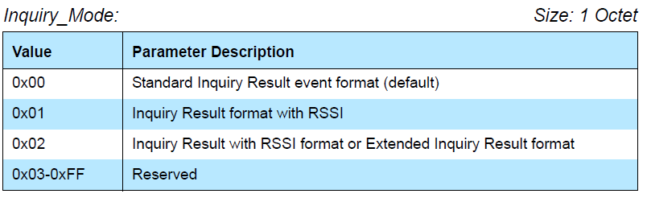

扫描设备响应流程

键盘响应事件

```
Event: HCI_Inquiry_Result_With_RSSI
```




第一种模式：标准返回格式，Standard Inquiry Result event format

第二种模式：查询结果返回带有RSSI格式，Inquiry Result format with RSSI

第三种模式：查询结果带有RSSI的格式或者额外的查询结果格式，Inquiry Result with RSSI format or Extended Inquiry Result format。

Extended Inquiry Result format：除了带有RSSI，可能带有设备名字之类的信息。

下图是Extended Inquiry Result


这张图就是Inquiry Result with RSSI


 


下面进入到 对于Inquiry Result with RSSI format 和 Extended Inquiry Result format 的代码处理流程的分析：

```Objective-C
void btu_hcif_process_event (UNUSED_ATTR UINT8 controller_id, BT_HDR *p_msg)
{
    UINT8   *p = (UINT8 *)(p_msg + 1) + p_msg->offset;
    UINT8   hci_evt_code, hci_evt_len;#if BLE_INCLUDED == TRUE
    UINT8   ble_sub_code;#endif
    STREAM_TO_UINT8  (hci_evt_code, p);
    STREAM_TO_UINT8  (hci_evt_len, p);

    switch (hci_evt_code)
    {
      case HCI_INQUIRY_COMP_EVT:
        btu_hcif_inquiry_comp_evt(p);
        break;
      case HCI_INQUIRY_RESULT_EVT:
        btm_process_inq_results(p, hci_evt_len, BTM_INQ_RESULT_STANDARD);
        break;
      case HCI_INQUIRY_RSSI_RESULT_EVT:
        btm_process_inq_results(p, hci_evt_len, BTM_INQ_RESULT_WITH_RSSI);
        break;
      case HCI_EXTENDED_INQUIRY_RESULT_EVT:
        btm_process_inq_results(p, hci_evt_len, BTM_INQ_RESULT_EXTENDED);
        break;
      case HCI_CONNECTION_COMP_EVT:
        btu_hcif_connection_comp_evt(p, hci_evt_len);
        break;
      case HCI_CONNECTION_REQUEST_EVT:
        btu_hcif_connection_request_evt(p);
        break;
      case HCI_DISCONNECTION_COMP_EVT:
        btu_hcif_disconnection_comp_evt(p);
        break;
```

上面介绍的三种mode，都是调用同一个处理函数，只是传入的参数不同， 我们发现HCI_EXTENDED_INQUIRY_RESULT_EVT流程涵盖了HCI_INQUIRY_RSSI_RESULT_EVT 的流程。

继续看btm_process_inq_results的流程：

```PHP
/*******************************************************************************
**
** Function         btm_process_inq_results
**
** Description      This function is called when inquiry results are received from
**                  the device. It updates the inquiry database. If the inquiry
**                  database is full, the oldest entry is discarded.
**
** Parameters       inq_res_mode - BTM_INQ_RESULT_STANDARD
**                                 BTM_INQ_RESULT_WITH_RSSI
**                                 BTM_INQ_RESULT_EXTENDED
**
** Returns          void
**
*******************************************************************************/
void btm_process_inq_results (UINT8 *p, UINT8 inq_res_mode)
{
    UINT8            num_resp, xx;
    BD_ADDR          bda;
    tINQ_DB_ENT     *p_i;
    tBTM_INQ_RESULTS *p_cur=NULL;
    BOOLEAN          is_new = TRUE;
    BOOLEAN          update = FALSE;
    INT8             i_rssi;
    tBTM_INQUIRY_VAR_ST *p_inq = &btm_cb.btm_inq_vars;
    tBTM_INQ_RESULTS_CB *p_inq_results_cb = p_inq->p_inq_results_cb;
    UINT8            page_scan_rep_mode = 0;
    UINT8            page_scan_per_mode = 0;
    UINT8            page_scan_mode = 0;
    UINT8            rssi = 0;
    DEV_CLASS        dc;
    UINT16           clock_offset;
    UINT8            *p_eir_data = NULL;
...
    STREAM_TO_UINT8 (num_resp, p);//解析出num_resp

    for (xx = 0; xx < num_resp; xx++)//依次处理，一般只有一个
    {
        update = FALSE;//初始化位false
        /* Extract inquiry results */
        STREAM_TO_BDADDR   (bda, p);//解析出地址等
        STREAM_TO_UINT8    (page_scan_rep_mode, p);
        STREAM_TO_UINT8    (page_scan_per_mode, p);

        if (inq_res_mode == BTM_INQ_RESULT_STANDARD)
        {
            STREAM_TO_UINT8(page_scan_mode, p);
        }

        STREAM_TO_DEVCLASS (dc, p);//解析device class
        STREAM_TO_UINT16   (clock_offset, p);
        if (inq_res_mode != BTM_INQ_RESULT_STANDARD)
        {
            STREAM_TO_UINT8(rssi, p);//stand 没有rssi
        }

        p_i = btm_inq_db_find (bda);//查找数据库，后续会判断是否已经处理过
...
        /* Check if this address has already been processed for this inquiry */
        if (btm_inq_find_bdaddr(bda))// true 说明已经处理过，check是否要update
        {
            i_rssi = (INT8)rssi;
            /* If this new RSSI is higher than the last one */
            if ((rssi != 0) && p_i &&
              (i_rssi > p_i->inq_info.results.rssi ||
               p_i->inq_info.results.rssi == 0
               /* BR/EDR inquiry information update */
               || (p_i->inq_info.results.device_type & BT_DEVICE_TYPE_BREDR) != 0))
            {
                p_cur = &p_i->inq_info.results;
                BTM_TRACE_DEBUG("update RSSI new:%d, old:%d", i_rssi, p_cur->rssi);
                p_cur->rssi = i_rssi;
                update = TRUE;
            }
            /* If we received a second Extended Inq Event for an already */
            /* discovered device, this is because for the first one EIR was not received */
            else if ((inq_res_mode == BTM_INQ_RESULT_EXTENDED) && (p_i))
            {
                p_cur = &p_i->inq_info.results;
                update = TRUE;
            }
            /* If no update needed continue with next response (if any) */
            else
                continue;
        }

        /* If existing entry, use that, else get a new one (possibly reusing the oldest) */
        if (p_i == NULL)
        {
            p_i = btm_inq_db_new (bda);//新建数据库
            is_new = TRUE;
        }

        /* If an entry for the device already exists, overwrite it ONLY if it is from
           a previous inquiry. (Ignore it if it is a duplicate response from the same
           inquiry.
        */
        else if (p_i->inq_count == p_inq->inq_counter //相等说明是本次inquiry
#if (BLE_INCLUDED == TRUE )
            && (p_i->inq_info.results.device_type == BT_DEVICE_TYPE_BREDR)#endif
            )
            is_new = FALSE;//不是新的

        /* keep updating RSSI to have latest value */
        if( inq_res_mode != BTM_INQ_RESULT_STANDARD )//如果不是标准模式，rssi每次都要更新
            p_i->inq_info.results.rssi = (INT8)rssi;
        else
            p_i->inq_info.results.rssi = BTM_INQ_RES_IGNORE_RSSI;

        if (is_new == TRUE)//如果是新设备，那么保存这些信息
        {
            /* Save the info */
            p_cur = &p_i->inq_info.results;
            p_cur->page_scan_rep_mode = page_scan_rep_mode;
            p_cur->page_scan_per_mode = page_scan_per_mode;
            p_cur->page_scan_mode     = page_scan_mode;
            p_cur->dev_class[0]       = dc[0];
            p_cur->dev_class[1]       = dc[1];
            p_cur->dev_class[2]       = dc[2];
            p_cur->clock_offset       = clock_offset  | BTM_CLOCK_OFFSET_VALID;

            p_i->time_of_resp = GKI_get_os_tick_count();//获取时间，用以计算最老的item

            if (p_i->inq_count != p_inq->inq_counter)
                p_inq->inq_cmpl_info.num_resp++;       /* A new response was found */
#if (defined BLE_INCLUDED && BLE_INCLUDED == TRUE)
            p_cur->inq_result_type    = BTM_INQ_RESULT_BR;
            if (p_i->inq_count != p_inq->inq_counter)
            {
                p_cur->device_type  = BT_DEVICE_TYPE_BREDR;
                p_i->scan_rsp       = FALSE;
            }
            else
                p_cur->device_type    |= BT_DEVICE_TYPE_BREDR;#endif
                p_i->inq_count = p_inq->inq_counter;   /* Mark entry for current inquiry */
...
            /* Initialize flag to FALSE. This flag is set/used by application */
            p_i->inq_info.appl_knows_rem_name = FALSE;//初始化位false
        }
        if (is_new || update)
        {
            if( inq_res_mode == BTM_INQ_RESULT_EXTENDED )
            {
                memset( p_cur->eir_uuid, 0,
                        BTM_EIR_SERVICE_ARRAY_SIZE * (BTM_EIR_ARRAY_BITS/8));
                /* set bit map of UUID list from received EIR */
                btm_set_eir_uuid( p, p_cur );//将UUID list保存在tBTM_INQ_RESULTS->eir_uuid中
                p_eir_data = p;
            }
            else
                p_eir_data = NULL;

            /* If a callback is registered, call it with the results */
            if (p_inq_results_cb) {
                (p_inq_results_cb)((tBTM_INQ_RESULTS*)p_cur, p_eir_data,
                               HCI_EXT_INQ_RESPONSE_LEN);
            } else {
                BTM_TRACE_DEBUG("No callback is registered");
            }
        }
    }
}
```

 上面的流程比较简单，主要就是保存inquiry回来的信息，然后调用p_inq_results_cb 来处理 设备信息。这个在BTM_StartInquiry的时候传入参数bta_dm_inq_results_cb: result.status = BTM_StartInquiry(bta_dm_inq_results_cb, bta_dm_inq_cmpl_cb) ，调用的也就是这个回调函数。下面继续分析bta_dm_inq_results_cb

```C
 /*******************************************************************************
**
** Function         bta_dm_inq_results_cb
**
** Description      Inquiry results callback from BTM
**
** Returns          void
**
*******************************************************************************/
static void bta_dm_inq_results_cb(tBTM_INQ_RESULTS* p_inq, uint8_t* p_eir,
                                    uint16_t eir_len) {
{
  tBTA_DM_SEARCH result;
  tBTM_INQ_INFO* p_inq_info;
  uint16_t service_class;

  result.inq_res.bd_addr = p_inq->remote_bd_addr;
  memcpy(result.inq_res.dev_class, p_inq->dev_class, DEV_CLASS_LEN);
  BTM_COD_SERVICE_CLASS(service_class, p_inq->dev_class);
  result.inq_res.is_limited =
      (service_class & BTM_COD_SERVICE_LMTD_DISCOVER) ? true : false;
  result.inq_res.rssi = p_inq->rssi;

  result.inq_res.ble_addr_type = p_inq->ble_addr_type;
  result.inq_res.inq_result_type = p_inq->inq_result_type;
  result.inq_res.device_type = p_inq->device_type;
  result.inq_res.flag = p_inq->flag;

  /* application will parse EIR to find out remote device name */
  result.inq_res.p_eir = p_eir;
  result.inq_res.eir_len = eir_len;

  p_inq_info = BTM_InqDbRead(p_inq->remote_bd_addr);
  if (p_inq_info != NULL) {
    /* initialize remt_name_not_required to false so that we get the name by
     * default */
    result.inq_res.remt_name_not_required = false;
  }

  if (bta_dm_search_cb.p_search_cback)
    bta_dm_search_cb.p_search_cback(BTA_DM_INQ_RES_EVT, &result);

  if (p_inq_info) {
    /* application indicates if it knows the remote name, inside the callback
     copy that to the inquiry data base*/
    if (result.inq_res.remt_name_not_required)
      p_inq_info->appl_knows_rem_name = true;
  }
}
```

找到响应BTA_DM_INQ_RES_EVT的地方: btif_dm_search_devices_evt

我们继续看btif_dm_search_devices_evt

```C%2B%2B
/******************************************************************************
**
** Function         btif_dm_search_devices_evt
**
** Description      Executes search devices callback events in btif context
**
** Returns          void
**
******************************************************************************/
static void btif_dm_search_devices_evt(tBTA_DM_SEARCH_EVT event,
                                       tBTA_DM_SEARCH* p_search_data) {
{
    BTIF_TRACE_EVENT("%s event=%s", __FUNCTION__, dump_dm_search_event(event));

    switch (event)
    {
...
    case BTA_DM_INQ_RES_EVT: {
      /* inquiry result */
      bt_bdname_t bdname;
      uint8_t remote_name_len;
      tBTA_SERVICE_MASK services = 0;

      p_search_data->inq_res.remt_name_not_required =
          check_eir_remote_name(p_search_data, NULL, NULL);
      RawAddress& bdaddr = p_search_data->inq_res.bd_addr;

      BTIF_TRACE_DEBUG("%s() %s device_type = 0x%x\n", __func__,
                       bdaddr.ToString().c_str(),
                       p_search_data->inq_res.device_type);
      bdname.name[0] = 0;

      if (!check_eir_remote_name(p_search_data, bdname.name, &remote_name_len))
        check_cached_remote_name(p_search_data, bdname.name, &remote_name_len);

      /* Check EIR for remote name and services */
      if (p_search_data->inq_res.p_eir) {
        BTA_GetEirService(p_search_data->inq_res.p_eir,
                          p_search_data->inq_res.eir_len, &services);
        BTIF_TRACE_DEBUG("%s()EIR BTA services = %08X", __func__,
                         (uint32_t)services);
        /* TODO:  Get the service list and check to see which uuids we got and
         * send it back to the client. */
      }

      {
        //NFBD: ADD NFRFP-4984 by dawei.wang 20210630 start
        bt_property_t properties[6];
        //NFBD: ADD NFRFP-4984 by dawei.wang 20210630 end
        bt_device_type_t dev_type;
        uint32_t num_properties = 0;
        bt_status_t status;
        tBLE_ADDR_TYPE addr_type = BLE_ADDR_PUBLIC;

        memset(properties, 0, sizeof(properties));
        /* RawAddress */
        BTIF_STORAGE_FILL_PROPERTY(&properties[num_properties],
                                   BT_PROPERTY_BDADDR, sizeof(bdaddr), &bdaddr);
        num_properties++;
        /* BD_NAME */
        /* Don't send BDNAME if it is empty */
        if (bdname.name[0]) {
          BTIF_STORAGE_FILL_PROPERTY(&properties[num_properties],
                                     BT_PROPERTY_BDNAME,
                                     strlen((char*)bdname.name), &bdname);
          num_properties++;
        }

        /* DEV_CLASS */
        uint32_t cod = devclass2uint(p_search_data->inq_res.dev_class);
        BTIF_TRACE_DEBUG("%s cod is 0x%06x", __func__, cod);
        /** M: Bug fix for Fix connect speaker with ble adv @{ */
        if (cod != 0 && cod != COD_UNCLASSIFIED) {
        /** @} */
          BTIF_STORAGE_FILL_PROPERTY(&properties[num_properties],
                                     BT_PROPERTY_CLASS_OF_DEVICE, sizeof(cod),
                                     &cod);
          num_properties++;
        }

        /** M: Bug fix connect device with clock_offset=0  @{ */
        BTIF_TRACE_DEBUG("%s clock_offset is 0x%x", __func__,
            p_search_data->inq_res.clock_offset);
        if (p_search_data->inq_res.clock_offset & BTM_CLOCK_OFFSET_VALID) {
          mtk_btif_set_device_clockoffset(bdaddr, (int)p_search_data->inq_res.clock_offset);
        }
        /** @} */

        /* DEV_TYPE */
        /* FixMe: Assumption is that bluetooth.h and BTE enums match */

        /* Verify if the device is dual mode in NVRAM */
        int stored_device_type = 0;
        /** M: Bug fix for Fix connect speaker with ble adv @{ */
        /* don't need care the actual value, just OR it
         * because when it's DUMO, the orig check will fail
         * and it will be set as new dev type
         */
        if (btif_get_device_type(bdaddr, &stored_device_type)) {
          dev_type = (bt_device_type_t)(stored_device_type | p_search_data->inq_res.device_type);
        /** @} */
        } else {
          dev_type = (bt_device_type_t)p_search_data->inq_res.device_type;
        }

        if (p_search_data->inq_res.device_type == BT_DEVICE_TYPE_BLE)
          addr_type = p_search_data->inq_res.ble_addr_type;
        BTIF_STORAGE_FILL_PROPERTY(&properties[num_properties],
                                   BT_PROPERTY_TYPE_OF_DEVICE, sizeof(dev_type),
                                   &dev_type);
        num_properties++;
        /* RSSI */
        BTIF_STORAGE_FILL_PROPERTY(&properties[num_properties],
                                   BT_PROPERTY_REMOTE_RSSI, sizeof(int8_t),
                                   &(p_search_data->inq_res.rssi));
        num_properties++;

        //NFBD: ADD NFRFP-4984 by dawei.wang 20210630 end
        uint8_t* manufac_p = p_search_data->inq_res.p_eir;
        while((services != 0) && (*manufac_p != 0)){
            uint8_t length= *(manufac_p);
                  uint8_t type= *(++manufac_p);
                  if (type == 0xff){
                uint8_t* manu_data = new uint8_t[length-1];
                for(int8_t i = 1; i < length; i++) {
                    manu_data[i-1] = *(manufac_p+i);
                }
                BTIF_STORAGE_FILL_PROPERTY(&properties[num_properties],
                        BT_PROPERTY_REMOTE_MANUFACTURE_DATA, length-1,
                        manu_data);
                num_properties++;
                break;
            }
            manufac_p += length;
            // manufac_p++;
            BTIF_TRACE_DEBUG("%s manufac_p=%d", __func__, *manufac_p);
        }
        //NFBD: ADD NFRFP-4984 by dawei.wang 20210630 end
        status =
            btif_storage_add_remote_device(&bdaddr, num_properties, properties);//保存各个属性值到文件系统中
        ASSERTC(status == BT_STATUS_SUCCESS,
                "failed to save remote device (inquiry)", status);
        status = btif_storage_set_remote_addr_type(&bdaddr, addr_type);
        ASSERTC(status == BT_STATUS_SUCCESS,
                "failed to save remote addr type (inquiry)", status);
        /* Callback to notify upper layer of device */
        invoke_device_found_cb(num_properties, properties);//向上层汇报
      }
    } break;
```

 这里注意btif_storage_add_remote_device 是将各个属性保存在系统的配置文件中。

上面的代码和BLE的广播包的处理 如出一辙，都是组装成bt_property_t的形式进行上报，通过invoke_device_found_cb(num_properties, properties)*;* 来上面五个属性：设备地址、设备名字、设备类、设备类型、设备rssi

那关于BREDR 的inquiry 的数据包处理流程就分析到这里。