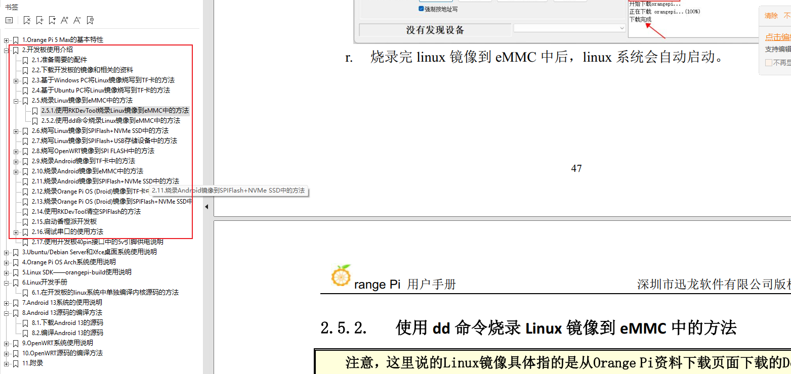

在我们拿到开发板后，根据官方文档烧录ubuntu系统，我使用预装了 NPU 驱动的系统

Joshua Riek's Ubuntu: https://joshua-riek.github.io/ubuntu-rockchip-download/

下载后需要解压为img文件，让后根据香橙派文档进行烧录




进入系统，执行如下命令，等待ollama下载完成，验证安装结果

```sh
curl -fsSL https://ollama.com/install.sh -o ollama_install.sh
sh ollama_install.sh

badogyang@badogyang-desktop:~/project/deepseek$ ollama --version
Warning: could not connect to a running Ollama instance
Warning: client version is 0.5.11

# 安装完成会直接pull deepseek模型，如果出现不能连接ollama的情况，需要启动一下ollama

badogyang@badogyang-desktop:~/project/deepseek$ ollama pull deepseek-r1:8b
Error: could not connect to ollama app, is it running?

badogyang@badogyang-desktop:~/project/deepseek$ systemctl status ollama
○ ollama.service - Ollama Service
     Loaded: loaded (/etc/systemd/system/ollama.service; disabled; preset: enabled)
     Active: inactive (dead)
     
badogyang@badogyang-desktop:~/project/deepseek$ systemctl start ollama
==== AUTHENTICATING FOR org.freedesktop.systemd1.manage-units ====
Authentication is required to start 'ollama.service'.
Authenticating as: badogyang,,, (badogyang)
Password:
==== AUTHENTICATION COMPLETE ====

badogyang@badogyang-desktop:~/project/deepseek$ ollama pull deepseek-r1:8b
# 等待模型下载完成会比较耗时

#下载完成运行模型测试
ollama run deepseek-r1:8b

```


dify配置deepseek，实现网页访问

```sh
   43  git clone https://github.com/langgenius/dify.git
   44  cd dify/docker/
   45  ls
   46  cp .env.example .env
       docker compose up -d
       
       访问80端口进行登录
```


NPU运行deepseek

```sh
   31  git clone https://github.com/Pelochus/ezrknn-llm.git
   32  cd ezrknn-llm/
   34  sudo bash install.sh
   35  sudo apt install cmake
   36  sudo bash install.sh   #编译报错报uint_8类似找不到，添加对应头文件
   39  vi /home/badogyang/project/deepseek/ezrknn-llm/rkllm-runtime/examples/rkllm_api_demo/../../runtime/Linux/librkllm_api/include/rkllm.h
   40  sudo bash install.sh
   
```


watch -n 1 sudo cat /sys/kernel/debug/rknpu/load


