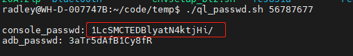
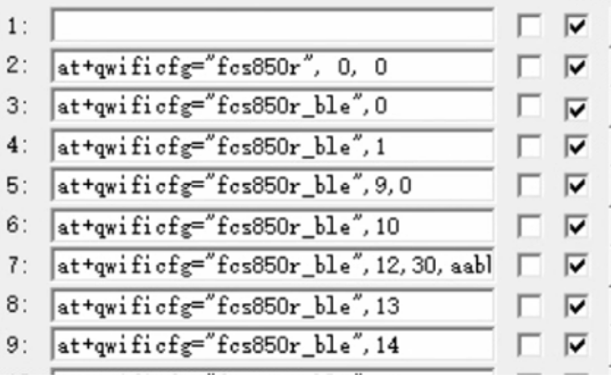

```sh
vim ~/code/01.FC80A/MCU_R06_b02/apps_proc/oe-core/meta-qcom/recipes/quectel/quectel-fcs950r_git.bb

source apps_proc/oe-core/build/conf/set_bb_env.sh
bitbake -c clean -f -v quectel-fcs950r
bitbake -c compile -f -v quectel-fcs950r

bitbake -c clean -f -v linux-quic
bitbake -c compile -f -v linux-quic

4、 总编译：
buildconfig EC20CE_FAG EC20_ELIJAH_0208 STD OL
buildperf9607

vim ./apps_proc/kernel/arch/arm/boot/dts/qcom/mdm9607-pinctrl.dtsi   #内核路径
apps_proc/atfwd-daemon/quectel_at_cmd_defs.h                   #AT指令选择
apps_proc/oe-core/meta-qcom/recipes/images/mdm9607-qti-image.inc  #编译版本选择


rebake atfwd-daemon

buildconfig EC20CE_FAG EC20_FCS945R_AT_20230613 STD OL  #带版本号编译配置


at+qwificfg="ec20_version"  获取版本号

[2023-11-02_19:12:37:484]at+qwificfg="fcs852r", 0,1

[2023-11-02_19:12:43:987]at+qwificfg="fcs852r_ble",0

[2023-11-02_19:13:00:294]at+qwificfg="fcs852r_ble",1

[2023-11-02_19:13:09:947]at+qwificfg="fcs852r_ble",9,0

[2023-11-02_19:13:18:052]at+qwificfg="fcs852r_ble",10

[2023-11-02_19:13:21:820]at+qwificfg="fcs852r_ble",17
[2023-11-02_19:13:21:955]DBG=====ble at, BT_MAC:8988BBCCAADD

```


```
1、烧录固件替换：
mdm9607-perf-boot.img
mdm9607-perf-sysfs.ubi

2、烧录固件：
adb push mp_rtl8723d_fw /lib/firmware
adb push mp_rtl8723ds_config /lib/firmware
adb shell mkdir -p /lib/firmware/rtlbt
adb push rtl8723d_config /lib/firmware/rtlbt
adb push rtl8723d_fw /lib/firmware/rtlbt
adb push hci_uart.ko /home/root
adb push rtlbtmp /home/root
adb push rtk_hciattach /home/root

3、测试驱动工作是否正常：
adb shell
cd /home/root
insmod hci_uart.ko
insmod /usr/lib/modules/3.18.20/extra/hci_uart.ko
sleep 0.5
echo 0 > /sys/class/rfkill/rfkill1/state
echo 1 > /sys/class/rfkill/rfkill1/state
sleep 0.5
rtk_hciattach -n -s 115200 ttyHS6 rtk_h5 &
echo 22 > /sys/class/gpio/export
echo 23 > /sys/class/gpio/export
echo out > /sys/class/gpio/gpio22/direction
echo out > /sys/class/gpio/gpio23/direction
echo 0 > /sys/class/gpio/gpio22/value
echo 0 > /sys/class/gpio/gpio23/value
rtk_hciattach -n -s 115200 ttyHS6 rtk_h5 &

 /usr/lib/bluez5/bluetooth/bluetoothd -n -d &
 
[bluetooth]# show //查看控制器的 Power 是否为 yes，如果 Power 为 no，则运行 power on
[bluetooth]# power on
[bluetooth]# agent NoInputNoOutput //可以设置其他 IO caps, 如 KeyboardDisplay
[bluetooth]# default-agent
[bluetooth]# scan on //扫描到对应的设备后，使用 scan off 关闭 scan。
[bluetooth]# pair e0:08:71:1a:de:31 //配对远端设备。
[bluetooth]# connect 00:22:48:DC:89:0F //连接远端设备

bluetoothctl
show

mbt set_tx_frequency_arm 1 2402 0 0 9 0

cp mp_rtl8* /lib/firmware/
mkdir /lib/firmware/rtlbt
cp rtl8* /lib/firmware/rtlbt/
chmod 777 rtk_hciattach

4、信令测试：
cd /home/root
rtlbtmp
>enable uart5:/dev/ttyHS6

      

rtlbtmp_clt bt_mp_SetParam 1,0 2,0x02 3,0x07 4,0x00 6,0x80 7,0x1F 11,0x000000c6967e

No default controller available
./bluetoothd -n -d  &

[bluetooth]# show //查看控制器的 Power 是否为 yes，如果 Power 为 no，则运行 power on
[bluetooth]# power on
[bluetooth]# agent NoInputNoOutput //可以设置其他 IO caps, 如 KeyboardDisplay
[bluetooth]# default-agent
[bluetooth]# scan on //扫描到对应的设备后，使用 scan off 关闭 scan。
[bluetooth]# pair e0:08:71:1a:de:31 //配对远端设备。
[bluetooth]# connect 00:22:48:DC:89:0F //连接远端设备


adb push mbt文件 /usr/bin
adb push BCM43455.hcd /usr/bin
adb shell
root
quectel123
chmod 777  /usr/bin/*
su
echo 0 > /sys/class/rfkill/rfkill1/state
echo 1 > /sys/class/rfkill/rfkill1/state
export MBT_TRANSPORT=/dev/ttyHS6
mbt
mbt download /usr/bin/BCM43455.hcd 

mbt set_tx_frequency_arm 1 2402 0 0 9 0


insmod /lib/modules/3.18.20/extra/hci_uart.ko
echo 0 > /sys/class/rfkill/rfkill1/state
echo 1 > /sys/class/rfkill/rfkill1/state
rtk_hciattach -n -s 115200 ttyHS6 rtk_h5 &


/etc/init.d/wlan start
ifconfig wlan0 up
rtwpriv wlan0 mp_start
echo 0 > /sys/class/rfkill/rfkill1/state
echo 1 > /sys/class/rfkill/rfkill1/state
echo 22 > /sys/class/gpio/export
echo 23 > /sys/class/gpio/export
echo out > /sys/class/gpio/gpio22/direction
echo out > /sys/class/gpio/gpio23/direction
echo 0 > /sys/class/gpio/gpio22/value
echo 0 > /sys/class/gpio/gpio23/value
rtlbtmp
```


unisoc

```
/etc/init.d/fcs950u_drv start
iwnpi wlan0 get_mac_efuse


hciattach_sprd /dev/ttyBT0  sprd
EC20版本需要
```





