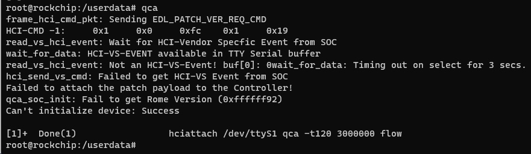

# RK3568

```

--- a/kernel/arch/arm64/boot/dts/rockchip/rk3568-bpi-r2pro-pc.dtsi
+++ b/kernel/arch/arm64/boot/dts/rockchip/rk3568-bpi-r2pro-pc.dtsi
@@ -220,7 +220,7 @@


 &uart8 {
-       status = "disabled";
+       status = "okay";
 };

 &sdio_pwrseq {


./build.sh lunch 
选择 5
BoardConfig-rk3568-bpi-r2pro-pc-openwrt.mk
再输入
./build.sh  kernel 

/kernel/arch/arm64/boot/dts/rockchip/rk3568-pinctrl.dtsi
 vim kernel/arch/arm64/boot/dts/rockchip/rk3568-evb.dtsi   PCM/bluetooth

kernel/arch/arm64/boot/dts/rockchip/rk3568-evb.dtsi
kernel/arch/arm64/configs/rockchip_linux_defconfig
```

source build-quec.sh

build-all-image

make show-targets(查看是否支持quectel-bt)

make quectel-bt-reconfigure(重新配置模组，会自动拷贝、打patch、解压、configure配置等)

make quectel-bt-rebuild(重新编译，如果只是拷贝文件不编译，可不需要)

# QCOM

```
mount -o remount rw /
sleep 0.5
echo 0 > /sys/class/rfkill/rfkill0/state
sleep 0.5
echo 1 > /sys/class/rfkill/rfkill0/state
sleep 0.5
hciattach /dev/ttyS1 qca -t120 3000000 flow &
```




unisoc

```
#950U
mount -o remount rw /
sleep 0.5
insmod usr/lib/modules/fcs950u/uwe5622_bsp_sdio.ko
sleep 0.5
insmod usr/lib/modules/fcs950u/sprdbt_tty.ko
sleep 0.5
echo 0 > /sys/class/rfkill/rfkill0/state
sleep 0.5
echo 1 > /sys/class/rfkill/rfkill0/state
sleep 0.5
usr/bin/unisoc/hciattach_sprd /dev/ttyBT0  sprd


#851U
mount -o remount rw /
sleep 0.5
insmod usr/lib/modules/fcs851u/uwe5621_bsp_sdio.ko
sleep 0.5
insmod usr/lib/modules/fcs851u/sprdbt_tty.ko
sleep 0.5
echo 0 > /sys/class/rfkill/rfkill0/state
sleep 0.5
echo 1 > /sys/class/rfkill/rfkill0/state
sleep 0.5
usr/bin/unisoc/hciattach_sprd /dev/ttyBT0  sprd


bpi
insmod /mnt/uwe5621_bsp_sdio.ko
insmod /mnt/sprdbt_tty.ko
usr/bin/unisoc/hciattach_sprd /dev/ttyBT0  sprd
```


hfp

```
mount -o remount rw /
/etc/init.d/S46ofono stop
sleep 0.5
echo 0 > /sys/class/rfkill/rfkill0/state
echo 0 > /proc/bluetooth/sleep/btwrite
sleep 0.5
echo 1 > /sys/class/rfkill/rfkill0/state
echo 1 > /proc/bluetooth/sleep/btwrite
sleep 0.5
hciattach /dev/ttyS1 qca -t120 3000000 flow


hciconfig hci0 up
amixer -c 0 cset numid=1 3
amixer -c 0 cset numid=2 2
/usr/libexec/bluetooth/bluetoothd -n -d &
hcidump -w all.log &
bluealsa -p hfp-hf -p a2dp-sink  

```


```
	FW_FIND_PATH=$(find ${FW_DIR} -name "*${PRODUCT_NAME}*" | grep Send_Test)
	if [[ -d $FW_FIND_PATH ]];then
		echo "------- FW_FIND_PATH(Send_Test):${FW_FIND_PATH} --------------"
	else
		FW_FIND_PATH=$(find ${FW_DIR} -name "*${PRODUCT_NAME}*")

		if [[ -d $FW_FIND_PATH ]];then
		echo "PRODUCT_NAME: ${PRODUCT_NAME} BDF NOT REALEASE, SWITCH TO ${FW_FIND_PATH}"
			read -r -p "(yes/no): " response
				if [ -z "$response" ]; then
 					response="yes"
				fi
					case "$response" in
							[yY][eE][sS]|[yY])
							echo "PRODUCT_NAME: ${PRODUCT_NAME} continue anyway";;
							 *)
							help;
							exit 1;;
					esac
		else
				echo "PRODUCT_NAME: ${PRODUCT_NAME} BDF is not available,continue anyway"
				read -r -p "(yes/no): " response
				case "$response" in
						[yY][eE][sS]|[yY])
						echo "PRODUCT_NAME: ${PRODUCT_NAME} BDF is not available,continue anyway";;
						*)
						help;
						exit 1;;
				esac
		fi
	fi

```

