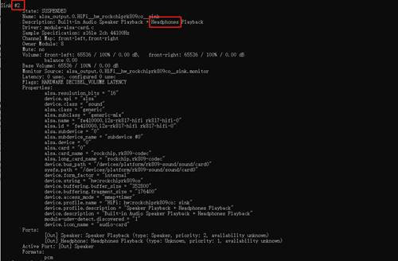
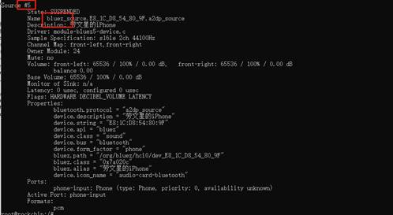

# RK3568适配RTL8723 蓝牙驱动


## 下载RK3568源码和RTL8723芯片驱动

公司应该都有提供，这里不多说。

## 编译RK3568源码，按照官网来[Welcome to ROC-RK3568-PC Manual — Firefly Wiki (t-firefly.com)](https://wiki.t-firefly.com/zh_CN/ROC-RK3568-PC/index.html)

编译好之后刷到RK3568板子上，这个官网也有详细的介绍。

## 编译RTL8723驱动

目前我们使用的是uart驱动蓝牙

### 编译hci_uart.ko

在我们的驱动uart/bluetooth_uart_driver目录下，修改makefile里面的内核路径，我这边选择的是单独编译一个hci_uart.ko的方式，直接贴代码：

```makefile
export KERNELPATH=/home/noah/project/RK3568/BPI-RK3568-Ubuntu-M.2/kernel
export TOOLCHAIN=${KERNELPATH}/../prebuilts/gcc/linux-x86/aarch64/gcc-linaro-6.3.1-2017.05-x86_64_aarch64-linux-gnu/bin/

export KERNELARCH=arm64
export CROSS_COMPILE=${TOOLCHAIN}/aarch64-linux-gnu-
export TOOLPREFIX=${CROSS_COMPILE}
export MAKEARCH=make ARCH=$(KERNELARCH) CROSS_COMPILE=$(TOOLPREFIX)

ifneq ($(KERNELRELEASE),)
    obj-m       := hci_uart.o
    hci_uart-y  := hci_ldisc.o hci_h4.o hci_rtk_h5.o rtk_coex.o
    #EXTRA_CFLAGS += -DDEBUG

else
    PWD := $(shell pwd)
    KVER := $(shell uname -r)
    KDIR := ${KERNELPATH}/drivers/bluetooth/

all:
    make ARCH=$(KERNELARCH) CROSS_COMPILE=$(TOOLPREFIX)  -C ${KERNELPATH} M=$(PWD) modules

clean:
    rm -rf *.o *.mod.c *.mod.o *.ko *.symvers *.order *.a

endif
```

然后直接make就行

### 编译rtk_hciattach

和编译hci_uart.ko相同，打开uart/rtk_hciattach目录，修改Makefile

```makefile
export KERNELPATH=/home/noah/project/RK3568/BPI-RK3568-Ubuntu-M.2/kernel
export TOOLCHAIN=${KERNELPATH}/../prebuilts/gcc/linux-x86/aarch64/gcc-linaro-6.3.1-2017.05-x86_64_aarch64-linux-gnu/bin/

export KERNELARCH=arm64
export CROSS_COMPILE=${TOOLCHAIN}/aarch64-linux-gnu-
export TOOLPREFIX=${CROSS_COMPILE}
export MAKEARCH=make ARCH=$(KERNELARCH) CROSS_COMPILE=$(TOOLPREFIX)

CFLAGS := -Wall -g
CC := $(CROSS_COMPILE)gcc
all: rtk_hciattach
OBJS := hciattach.o hciattach_rtk.o hciattach_h4.o rtb_fwc.o

rtk_hciattach: $(OBJS)
    $(CROSS_COMPILE)gcc $(CFLAGS) -o rtk_hciattach $(OBJS)

%.o: %.c
    $(CROSS_COMPILE)gcc -c $< -o $@ $(CFLAGS)

clean:
    rm -f $(OBJS)  rtk_hciattach

tags: FORCE
    ctags -R
    find ./ -name "*.h" -o -name "*.c" -o -name "*.cc" -o -name "*.cpp" > cscope.files
    cscope -bkq -i cscope.files
PHONY += FORCE
FORCE:

```


## 适配蓝牙驱动

1. 把hci_uart.ko和rtk_hciattach都push到RK3568系统中。

2. 在驱动目录下找到rtkbt-firmware/lib/rtlbt/rtl8723fs_fw和rtkbt-firmware/lib/rtlbt/rtl8723fs_config，push到/lib/firmare/rtlbt下，没有rtlbt目录就创建一个。

3. 执行命令

   ```shell
   insmod hci_uart.ko
   chmod 777 rtk_hciattach
   ./rtk_hciattach -n -s 115200 ttyS8 rtk_h5 &
   
   
   ./rtk_hciattach -n -s 115200 ttyS8 rtk_h5 &
    mount -o remount rw / 重新挂载目录
   
   #realtek
   mount -o remount rw /
   sleep 0.5
   echo 0 > /sys/class/rfkill/rfkill0/state
   sleep 0.5
   echo 1 > /sys/class/rfkill/rfkill0/state
   sleep 0.5
   insmod /usr/lib/modules/hci_uart.ko
   sleep 0.5
   rtk_hciattach -n -s 115200 ttyS1 rtk_h5 &
   
   #高通
   mount -o remount rw /
   sleep 0.5
   echo 0 > /sys/class/rfkill/rfkill0/state
   sleep 0.5
   echo 1 > /sys/class/rfkill/rfkill0/state
   sleep 0.5
   hciattach /dev/ttyS1 qca -t120 3000000 flow &
   
   #950U
   mount -o remount rw /
   sleep 0.5
   insmod usr/lib/modules/fcs950u/uwe5622_bsp_sdio.ko
   sleep 0.5
   insmod usr/lib/modules/fcs950u/sprdbt_tty.ko
   sleep 0.5
   echo 0 > /sys/class/rfkill/rfkill0/state
   sleep 0.5
   echo 1 > /sys/class/rfkill/rfkill0/state
   sleep 0.5
   usr/bin/unisoc/hciattach_sprd /dev/ttyBT0  sprd
   
   
   #851U
   mount -o remount rw /
   sleep 0.5
   insmod usr/lib/modules/fcs851u/uwe5621_bsp_sdio.ko
   sleep 0.5
   insmod usr/lib/modules/fcs851u/sprdbt_tty.ko
   sleep 0.5
   echo 0 > /sys/class/rfkill/rfkill0/state
   sleep 0.5
   echo 1 > /sys/class/rfkill/rfkill0/state
   sleep 0.5
   usr/bin/unisoc/hciattach_sprd /dev/ttyBT0  sprd
   
   #步骤2
   /usr/libexec/bluetooth/bluetoothd -n -d &
   
   #步骤3
   pulseaudio -D  --exit-idle-time=-1  --log-target=file:/tmp/pulse.log
   
   #步骤4
   bluetoothctl
   
   #步骤5
   pactl list sinks
   pactl set-default-sink 2
   
   amixer -c 0 cset numid=1 3
   
   #步骤6     hfp需要
   pactl list cards
   pactl set-card-profile bluez_card.44_71_47_1F_EA_B4 headset_audio_gateway
   
   pactl list sources  
   pactl set-default-source 5（5需要对应为实际的source#）
   
   
   
   bluetoothctl
   [bluetooth]# power on
   [bluetooth]# agent NoInputNoOutput //可以设置其他 IO caps, 如 KeyboardDisplay
   [bluetooth]# default-agent
   [bluetooth]# discoverable on //开发可被发现
   [bluetooth]# scan on //扫描到对应的设备后，使用 scan off 关闭 scan。
   [bluetooth]# pair e0:08:71:1a:de:31 //配对远端设备，也可在手机上搜索到设备之后点击配对，注意需要使用苹果设备，安卓的目前无法配对。
   ```
   
   卡顿
   
   音频测试
   
   #--start
   pulseaudio -D  --exit-idle-time=-1  --log-target=file:/tmp/pulse.log
   
   ### sink
   
   1. 查看所有音频播放设备，并设置为默认播放设备
   
   pactl list sinks
   
   pactl set-default-sink 2（2需要对应为实际的sink#）
   
   
   
   2. 查看蓝牙设备，并设置为默认设备
   
   pactl list sources
   
   pactl set-default-source 5（5需要对应为实际的source#）
   
   
   
   3. alsa设备选择耳机作为播放设备
   
   amixer -c 0 cset numid=1 3
   
   4. 手机播放
   
   手机使用音乐软件播放。观察耳机是否有声音
   
   ### source
   
   ```
   #--start
   pulseaudio -D  --exit-idle-time=-1  --log-target=file:/tmp/pulse.log
   bluetoothctl
   [bluetoothctl] scan on
   [bluetoothctl] scan off
   [bluetoothctl] connect xx:xx:xx:xx:xx:xx(蓝牙音响MAC地址)
   [bluetoothctl] 看到配对码之后，输入yes
   [bluetoothctl] exit
   pactl list sinks
   pactl set-default-sink 2 (具体标号，以第8条看到的实际bluez sink号为准)
   paplay /222.wav。
   	观察蓝牙音响是否有音频播放
   
   ```
   
   

## 期间出现的问题

识别不到ttyS8也就是蓝牙uart串口，因为uart8串口没打开，我们在设备树打开即可

```sh
--- a/kernel/arch/arm64/boot/dts/rockchip/rk3568-bpi-r2pro-pc.dtsi
+++ b/kernel/arch/arm64/boot/dts/rockchip/rk3568-bpi-r2pro-pc.dtsi
@@ -220,7 +220,7 @@


 &uart8 {
-       status = "disabled";
+       status = "okay";
 };
```


蓝牙a2dp source 播放卡顿

有一根bt/wifi共用的天线没有插上，只插了bt的天线导致。查看hci log同样卡顿。

原因：a2dp做source端，linux音频持续刷新音频流到buffer，但是因为信号问题导致一直发送不出去，这样的结果就是buffer里面的输出被冲走，导致了我们看到hci log里面也是卡顿的现象，音频流只走到了缓冲区。
