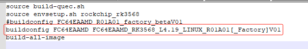

# RK3568适配RTL8723 蓝牙驱动

```

```


## 下载RK3568源码和RTL8723芯片驱动

公司应该都有提供，这里不多说。

## 编译RK3568源码，按照官网来[Welcome to ROC-RK3568-PC Manual — Firefly Wiki (t-firefly.com)](https://wiki.t-firefly.com/zh_CN/ROC-RK3568-PC/index.html)

编译好之后刷到RK3568板子上，这个官网也有详细的介绍。

## 编译RTL8723驱动

目前我们使用的是uart驱动蓝牙

### 编译hci_uart.ko

在我们的驱动uart/bluetooth_uart_driver目录下，修改makefile里面的内核路径，我这边选择的是单独编译一个hci_uart.ko的方式，直接贴代码：

```makefile
export KERNELPATH=/home/noah/project/RK3568/BPI-RK3568-Ubuntu-M.2/kernel
export TOOLCHAIN=${KERNELPATH}/../prebuilts/gcc/linux-x86/aarch64/gcc-linaro-6.3.1-2017.05-x86_64_aarch64-linux-gnu/bin/

export KERNELARCH=arm64
export CROSS_COMPILE=${TOOLCHAIN}/aarch64-linux-gnu-
export TOOLPREFIX=${CROSS_COMPILE}
export MAKEARCH=make ARCH=$(KERNELARCH) CROSS_COMPILE=$(TOOLPREFIX)

ifneq ($(KERNELRELEASE),)
    obj-m       := hci_uart.o
    hci_uart-y  := hci_ldisc.o hci_h4.o hci_rtk_h5.o rtk_coex.o
    #EXTRA_CFLAGS += -DDEBUG

else
    PWD := $(shell pwd)
    KVER := $(shell uname -r)
    KDIR := ${KERNELPATH}/drivers/bluetooth/

all:
    make ARCH=$(KERNELARCH) CROSS_COMPILE=$(TOOLPREFIX)  -C ${KERNELPATH} M=$(PWD) modules

clean:
    rm -rf *.o *.mod.c *.mod.o *.ko *.symvers *.order *.a

endif
```

然后直接make就行

### 编译rtk_hciattach

和编译hci_uart.ko相同，打开uart/rtk_hciattach目录，修改Makefile

```makefile
export KERNELPATH=/home/noah/project/RK3568/BPI-RK3568-Ubuntu-M.2/kernel
export TOOLCHAIN=${KERNELPATH}/../prebuilts/gcc/linux-x86/aarch64/gcc-linaro-6.3.1-2017.05-x86_64_aarch64-linux-gnu/bin/

export KERNELARCH=arm64
export CROSS_COMPILE=${TOOLCHAIN}/aarch64-linux-gnu-
export TOOLPREFIX=${CROSS_COMPILE}
export MAKEARCH=make ARCH=$(KERNELARCH) CROSS_COMPILE=$(TOOLPREFIX)

CFLAGS := -Wall -g
CC := $(CROSS_COMPILE)gcc
all: rtk_hciattach
OBJS := hciattach.o hciattach_rtk.o hciattach_h4.o rtb_fwc.o

rtk_hciattach: $(OBJS)
    $(CROSS_COMPILE)gcc $(CFLAGS) -o rtk_hciattach $(OBJS)

%.o: %.c
    $(CROSS_COMPILE)gcc -c $< -o $@ $(CFLAGS)

clean:
    rm -f $(OBJS)  rtk_hciattach

tags: FORCE
    ctags -R
    find ./ -name "*.h" -o -name "*.c" -o -name "*.cc" -o -name "*.cpp" > cscope.files
    cscope -bkq -i cscope.files
PHONY += FORCE
FORCE:

```



## 适配蓝牙驱动

1. 把hci_uart.ko和rtk_hciattach都push到RK3568系统中。

2. 在驱动目录下找到rtkbt-firmware/lib/rtlbt/rtl8723fs_fw和rtkbt-firmware/lib/rtlbt/rtl8723fs_config，push到/lib/firmare/rtlbt下，没有rtlbt目录就创建一个。

3. 执行命令

   ```shell
   mount -o remount rw /
   /etc/init.d/S50pipewire start
   sleep 0.5
   echo 0 > /sys/class/rfkill/rfkill0/state
   echo 0 > /proc/bluetooth/sleep/btwrite
   sleep 0.5
   echo 1 > /sys/class/rfkill/rfkill0/state
   echo 1 > /proc/bluetooth/sleep/btwrite
   sleep 0.5
   hciattach /dev/ttyS1 qca -t120 3000000 flow &
   
   Btdiag UDT=yes PORT=2391 IOType=SERIAL QDARTIOType=ethernet BT-DEVICE=hci0 BT-BAUDRATE=115200 &
   
   quecdiag UDT=yes PORT=2391 IOType=SERIAL QDARTIOType=ethernet BT-DEVICE=/dev/ttyS1 BT-BAUDRATE=115200 & 
   
   Btdiag UDT=yes PORT=2391 IOType=SERIAL QDARTIOType=ethernet BT-DEVICE=/dev/ttyS1 BT-BAUDRATE=115200 & 
   
   
   
   rmmod hci_uart
   killall rtk_hciattach
   echo 0 > /sys/class/rfkill/rfkill0/state
   echo 0 > /proc/bluetooth/sleep/btwrite
   sleep 0.5
   echo 1 > /sys/class/rfkill/rfkill0/state
   echo 1 > /proc/bluetooth/sleep/btwrite
   
   
   insmod hci_uart.ko
   chmod 777 rtk_hciattach
   ./rtk_hciattach -n -s 115200 ttyS8 rtk_h5 &
   
   
   ./rtk_hciattach -n -s 115200 ttyS8 rtk_h5 &
    mount -o remount rw / 重新挂载目录
   rtlbtmp 
   enable uart5:/dev/ttyS1
   
   加载驱动
   #realtek
   /usr/libexec/bluetooth/bluetoothd -n &
   mount -o remount rw /
   /etc/init.d/S50pipewire start
   sleep 0.5
   insmod /usr/lib/modules/hci_uart.ko
   sleep 0.5
   echo 0 > /sys/class/rfkill/rfkill0/state
   echo 0 > /proc/bluetooth/sleep/btwrite
   sleep 0.5
   echo 1 > /sys/class/rfkill/rfkill0/state
   echo 1 > /proc/bluetooth/sleep/btwrite
   sleep 0.5
   rtk_hciattach -n -s 115200 ttyS1 rtk_h5 &
   
   pactl list sinks short
   pactl set-default-sink 50
   
   amixer -c 0 cset numid=1 3
   amixer -c 0 cset numid=2 1
   
   pactl list sinks short
   
   1988   940
   1888   945
   
   
   #高通
   /usr/libexec/bluetooth/bluetoothd -n &
   mount -o remount rw /
   /etc/init.d/S50pipewire start
   sleep 0.5
   echo 0 > /sys/class/rfkill/rfkill0/state
   echo 0 > /proc/bluetooth/sleep/btwrite
   sleep 0.5
   echo 1 > /sys/class/rfkill/rfkill0/state
   echo 1 > /proc/bluetooth/sleep/btwrite
   sleep 0.5
   hciattach /dev/ttyS1 qca -t120 3000000 flow &
   
   
   #950U
   mount -o remount rw /
   HFP_unisoc_config.sh FCS950U
   sleep 0.5
   /etc/init.d/S50pipewire start
   sleep 0.5
   insmod usr/lib/modules/fcs950u/uwe5622_bsp_sdio.ko
   sleep 0.5
   insmod usr/lib/modules/fcs950u/sprdbt_tty.ko
   sleep 0.5
   echo 0 > /sys/class/rfkill/rfkill0/state
   sleep 0.5
   echo 1 > /sys/class/rfkill/rfkill0/state
   sleep 0.5
   usr/bin/unisoc/hciattach_sprd /dev/ttyBT0  sprd
   
   
   #851U
   /usr/libexec/bluetooth/bluetoothd -n &
   sleep 0.5
   mount -o remount rw /
   HFP_unisoc_config.sh FCS851U
   sleep 0.5
   /etc/init.d/S50pipewire start
   sleep 0.5
   insmod usr/lib/modules/fcs851u/uwe5621_bsp_sdio.ko
   sleep 0.5
   insmod usr/lib/modules/fcs851u/sprdbt_tty.ko
   sleep 0.5
   echo 0 > /sys/class/rfkill/rfkill0/state
   echo 0 > /proc/bluetooth/sleep/btwrite
   sleep 0.5
   echo 1 > /sys/class/rfkill/rfkill0/state
   echo 1 > /proc/bluetooth/sleep/btwrite
   sleep 0.5
   usr/bin/unisoc/hciattach_sprd /dev/ttyBT0  sprd
   
   #步骤2
   /usr/libexec/bluetooth/bluetoothd -n &
   
   #步骤4
   bluetoothctl
   
   #步骤5
   pactl list sinks short
   pactl set-default-sink 64
   
   amixer -c 0 cset numid=1 3
   amixer -c 0 cset numid=2 1
   
   paplay /222.wav。
   
   #步骤6     hfp需要
   pactl list cards
   pactl set-card-profile bluez_card.E0_9D_FA_10_24_5F headset_audio_gateway
   
   pactl list sources  
   pactl set-default-source 5（5需要对应为实际的source#）
   
   
   
   bluetoothctl
   [bluetooth]# power on
   [bluetooth]# agent NoInputNoOutput //可以设置其他 IO caps, 如 KeyboardDisplay
   [bluetooth]# default-agent
   [bluetooth]# discoverable on //开发可被发现
   [bluetooth]# scan on //扫描到对应的设备后，使用 scan off 关闭 scan。
   [bluetooth]# pair e0:08:71:1a:de:31 //配对远端设备，也可在手机上搜索到设备之后点击配对，注意需要使用苹果设备，安卓的目前无法配对。
   
   btmgmt -i hci0 name "ACC_QUECETEL_FC900E"
   btmgmt -i hci0 connectable on
   hci0 Set Connectable complete, settings: powered connectable ssp br/edr le secure-conn
   btmgmt -i hci0 advertising on
   hci0 Set Advertising complete, settings: powered connectable ssp br/edr le advertising secure-conn
   btmgmt -i hci0 le on
   hci0 Set Low Energy complete, settings: powered connectable ssp br/edr le advertising secure-conn
   btmgmt -i hci0 power on
   hci0 Set Powered complete, settings: powered connectable ssp br/edr le advertising secure-conn
   sdptool add --channel=1 GATT SP A2SNK
   gatt-service
   ```
   
   
   
   ```sh
   #!/bin/bash
   #
   # Copyright (c) 2023 noah Quectel Wireless Solutions Co., Ltd
   #
   # SPDX-License-Identifier: GPL-2.0
   #
   
   PRODUCT_NAME=${1}
   
   function reset_platform()
   {
   	/usr/libexec/bluetooth/bluetoothd -n &
   	mount -o remount rw /
   	killall pipewire
   	sleep 0.5
   	/etc/init.d/S50pipewire start
   	sleep 0.5
       echo 0 > /sys/class/rfkill/rfkill0/state
       echo 0 > /proc/bluetooth/sleep/btwrite
       sleep 0.5
       echo 1 > /sys/class/rfkill/rfkill0/state
       echo 1 > /proc/bluetooth/sleep/btwrite
   }
   
   function start_bt_platform()
   {
   	echo "------- get_platform BT/Wi-Fi OC: ${1} --------------"
   	
   	echo "------- PRODUCT_NAME OC: ${PRODUCT_NAME}  --------------"
   	
   	if  [ "${PRODUCT_NAME}" = "qcom" ] || \
   		[ "${PRODUCT_NAME}" = "FC06EABMD" ] || \
   		[ "${PRODUCT_NAME}" = "FC06EABMD" ] || \
   		[ "${PRODUCT_NAME}" = "FC06EACMD" ] || \
   		[ "${PRODUCT_NAME}" = "FC08EAAMD" ] || \
   		[ "${PRODUCT_NAME}" = "FC01EAAMD" ] || \
   		[ "${PRODUCT_NAME}" = "FC60EAAMD" ] || \
   		[ "${PRODUCT_NAME}" = "FC62EAAMD" ] || \
   		[ "${PRODUCT_NAME}" = "FC64EAAMD" ] || \
   		[ "${PRODUCT_NAME}" = "FC64EBAAMD" ] || \
   		[ "${PRODUCT_NAME}" = "FC64EABMD" ] || \
   		[ "${PRODUCT_NAME}" = "FC65EAAMD" ] || \
   		[ "${PRODUCT_NAME}" = "FC65EBAAMD" ] || \
   		[ "${PRODUCT_NAME}" = "FC66EAAMD" ] || \
   		[ "${PRODUCT_NAME}" = "FC66EBAAMD" ]|| \
   		[ "${PRODUCT_NAME}" = "FC66EBABMD" ] || \
   		[ "${PRODUCT_NAME}" = "FC20-Q73" ] || \
   		[ "${PRODUCT_NAME}" = "FC20-Q93" ] || \
   		[ "${PRODUCT_NAME}" = "FC20N-Q73" ] || \
   		[ "${PRODUCT_NAME}" = "FC21SA-Q73" ] || \
   		[ "${PRODUCT_NAME}" = "FC21SA-Q93" ] || \
   		[ "${PRODUCT_NAME}" = "FC900EABMD" ] || \
   		[ "${PRODUCT_NAME}" = "NCM825A" ] || \
   		[ "${PRODUCT_NAME}" = "FGE576QAAMD" ] || \
   		[ "${PRODUCT_NAME}" = "FGE576QABMD" ] || \
   		[ "${PRODUCT_NAME}" = "FGE573QAAMD" ] || \
   		[ "${PRODUCT_NAME}" = "FGE573QABMD" ] || \
   		[ "${PRODUCT_NAME}" = "FME164QAAMD" ]; then
   			kiallall hciattach
   			sleep 0.5
   			hciattach /dev/ttyS1 qca -t120 3000000 flow &	
   	elif [ "${PRODUCT_NAME}" = "realtek" ] || \
   		[ "${PRODUCT_NAME}" = "FCS850RBACMD" ] || \
   		[ "${PRODUCT_NAME}" = "FCS850RACMD" ] || \
   		[ "${PRODUCT_NAME}" = "FCS866RBAAMD" ] || \
   		[ "${PRODUCT_NAME}" = "FCS866RAAMD" ] || \
   		[ "${PRODUCT_NAME}" = "FCE863RBAAMD" ] || \
   		[ "${PRODUCT_NAME}" = "FCE863RAAMD" ] || \
   		[ "${PRODUCT_NAME}" = "FCS950RAAMD" ] || \
   		[ "${PRODUCT_NAME}" = "FCS940RAAMD" ] || \
   		[ "${PRODUCT_NAME}" = "FCS940RABMD" ] || \
   		[ "${PRODUCT_NAME}" = "FCS945RAAMD" ] || \
   		[ "${PRODUCT_NAME}" = "FCS945RNAAMD" ] || \
   		[ "${PRODUCT_NAME}" = "FCS852RAAMD" ] || \
   		[ "${PRODUCT_NAME}" = "FCS852RBAAMD" ] || \
   		[ "${PRODUCT_NAME}" = "FCU743RAAMD" ] ; then
   			rmmod hci_uart
   			killall rtk_hciattach
   			insmod /usr/lib/modules/hci_uart.ko
   			sleep 0.5
   			rtk_hciattach -n -s 115200 ttyS1 rtk_h5 &
   	elif [ "${PRODUCT_NAME}" = "FC80AABMD" ] || \
   		[ "${PRODUCT_NAME}" = "FC80AACMD" ] || \
   		[ "${PRODUCT_NAME}" = "FC905AAAMD" ] || \
   		[ "${PRODUCT_NAME}" = "FCU906AAAMD" ] || \
   		[ "${PRODUCT_NAME}" = "FC906AAAMD" ] || \
   		[ "${PRODUCT_NAME}" = "FC908AAAMD" ] || \
   		[ "${PRODUCT_NAME}" = "FC908AABMD" ] || \
   		[ "${PRODUCT_NAME}" = "FC909AAAMD" ] || \
   		[ "${PRODUCT_NAME}" = "FC906AFMAC" ] || \
   		[ "${PRODUCT_NAME}" = "FCU906AFMAC" ]; then
   			kiallall hciattach
   			sleep 0.5
   			hciattach /dev/ttyS1 qca -t120 3000000 flow &
       elif [ "${PRODUCT_NAME}" = "FCS851UAAMD" ] || \
           [ "${PRODUCT_NAME}" = "FCS851UABMD" ] || \
           [ "${PRODUCT_NAME}" = "FCS851UBAAMD" ] || \
           [ "${PRODUCT_NAME}" = "FCS851UBABMD" ]; then
   			rmmod sprdbt_tty
   			killall usr/bin/unisoc/hciattach_sprd
   			HFP_unisoc_config.sh FCS851U
   			insmod usr/lib/modules/fcs851u/uwe5621_bsp_sdio.ko
   			sleep 0.5
   			insmod usr/lib/modules/fcs851u/sprdbt_tty.ko
   			sleep 0.5
   			usr/bin/unisoc/hciattach_sprd /dev/ttyBT0  sprd
       elif [ "${PRODUCT_NAME}" = "FCS950UAAMD" ] || \
           [ "${PRODUCT_NAME}" = "FCS950UABMD" ]; then
   			rmmod sprdbt_tty
   			killall usr/bin/unisoc/hciattach_sprd
   			HFP_unisoc_config.sh FCS950U
   			insmod usr/lib/modules/fcs950u/uwe5622_bsp_sdio.ko
   			sleep 0.5
   			insmod usr/lib/modules/fcs950u/sprdbt_tty.ko
   			sleep 0.5
   			usr/bin/unisoc/hciattach_sprd /dev/ttyBT0  sprd
   	elif [ "${PRODUCT_NAME}" = "FCS960CAAMD" ]; then
   		echo "${PRODUCT_NAME}"
   	else
   		echo "get_platform() Invalid PRODUCT_NAME: ${PRODUCT_NAME}"
   		exit 1
   	fi
   		
   }
   
   reset_platform
   
   start_bt_platform $1
   ```
   
   
   
   
   
   
   
   ```
   /etc/init.d/S50pipewire start
   
   mount -o remount rw /
   sleep 0.5
   echo 0 > /sys/class/rfkill/rfkill0/state
   echo 0 > /proc/bluetooth/sleep/btwrite
   sleep 0.5
   echo 1 > /sys/class/rfkill/rfkill0/state
   echo 1 > /proc/bluetooth/sleep/btwrite
   sleep 0.5
   hciattach /dev/ttyS1 qca -t120 3000000 flow
   
   hciconfig hci0 up
   /usr/libexec/bluetooth/bluetoothd -n -d > /var/log/bluetoothd.log &
   
   pactl list sinks short
   pactl set-default-sink 50
   
   amixer -c 0 cset numid=1 3
   amixer -c 0 cset numid=2 1
   
   
   
   44:71:47:1f:ea:b4
    env LD_LIBRARY_PATH=/userdata/rk356x-debug/lib ./hfp_hf_demo
    env LD_LIBRARY_PATH=/home/root/imx8-debug/lib ./a2dp_sink_demo
   ```
   
   
   
   
   
   卡顿
   
   音频测试
   
   #--start
   pulseaudio -D  --exit-idle-time=-1  --log-target=file:/tmp/pulse.log
   
   ### sink
   
   1. 查看所有音频播放设备，并设置为默认播放设备
   
   pactl list sinks
   
   pactl set-default-sink 2（2需要对应为实际的sink#）
   
   
   
   2. 查看蓝牙设备，并设置为默认设备
   
   pactl list sources
   
   pactl set-default-source 5（5需要对应为实际的source#）
   
   
   
   3. alsa设备选择耳机作为播放设备
   
   amixer -c 0 cset numid=1 3
   
   4. 手机播放
   
   手机使用音乐软件播放。观察耳机是否有声音
   
   ### source
   
   ```
   #--start
   pulseaudio -D  --exit-idle-time=-1  --log-target=file:/tmp/pulse.log
   bluetoothctl
   [bluetoothctl] scan on
   [bluetoothctl] scan off
   [bluetoothctl] connect xx:xx:xx:xx:xx:xx(蓝牙音响MAC地址)
   [bluetoothctl] 看到配对码之后，输入yes
   [bluetoothctl] exit
   pactl list sinks
   pactl set-default-sink 2 (具体标号，以第8条看到的实际bluez sink号为准)
   paplay /222.wav。
   	观察蓝牙音响是否有音频播放
   
   ```
   
   

## 期间出现的问题

识别不到ttyS8也就是蓝牙uart串口，因为uart8串口没打开，我们在设备树打开即可

```sh
--- a/kernel/arch/arm64/boot/dts/rockchip/rk3568-bpi-r2pro-pc.dtsi
+++ b/kernel/arch/arm64/boot/dts/rockchip/rk3568-bpi-r2pro-pc.dtsi
@@ -220,7 +220,7 @@


 &uart8 {
-       status = "disabled";
+       status = "okay";
 };
```


蓝牙a2dp source 播放卡顿

有一根bt/wifi共用的天线没有插上，只插了bt的天线导致。查看hci log同样卡顿。

原因：a2dp做source端，linux音频持续刷新音频流到buffer，但是因为信号问题导致一直发送不出去，这样的结果就是buffer里面的输出被冲走，导致了我们看到hci log里面也是卡顿的现象，音频流只走到了缓冲区。


暂存

```
  bt_sound: bt-sound {
    status = "okay";
    compatible = "simple-audio-card";
    simple-audio-card,format = "dsp_a";
    simple-audio-card,mclk-fs = <256>;
    simple-audio-card,name = "rockchip,bt";
    //simple-audio-card,bitclock-master = <&sound2_master>;
    //simple-audio-card,frame-master = <&sound2_master>;
    simple-audio-card,cpu {
      sound-dai = <&i2s2_2ch>;
    };
    //sound2_master:simple-audio-card,codec {
    //  sound-dai = <&bt_sco>;
    //};
    simple-audio-card,codec {
      sound-dai = <&bt_sco>;
    };

  };

```


展锐配置：

g_wbs_nv_117 = 0x0000

#[5.02]__/L=2
g_wbs_nv_118 = 0x1855

#[5.03]__/L=2
g_nbv_nv_117 = 0x0000

#[5.04]__/L=2
g_nbv_nv_118 = 0x1855

