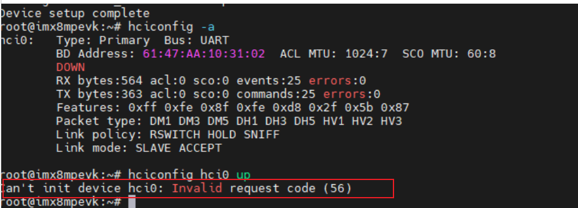

# Yocto bluez配置

下载bluez qcom patch，路径：[BT/Linux/patch · master · WiFi.BT / QCA9377 · GitLab (quectel.com)](https://git-master.quectel.com/wifi.bt/fc2x/-/tree/master/BT/Linux/patch)

把0001-bluetooth-Add-bluetooth-support-for-QCA6174-chip.patch 拷贝到sources/meta-imx/meta-bsp/recipes-connectivity/bluez5/files/目录下

sources/meta-imx/meta-bsp/recipes-connectivity/bluez5 目录下的bb文件bluez5_5.%2525.bbappend添加patch

添加方式：vim sources/meta-imx/meta-bsp/recipes-connectivity/bluez5/bluez5_5.%.bbappend


如果没有找到bluez5这个目录，可以尝试搜索，使用 find ./ -name bluez5 -type d 命令找到meta-bsp/recipes-connectivity/bluez5就是。

示例提交，其中删除的部分是之前bluez对qcom的支持，如果没有可不用在意


# fc2x蓝牙固件

在sources/meta-imx/meta-bsp/目录下新建recipes-quectel-bt/fc2x目录

进入fc2x目录，新建文件bt-fc21x_0.1.bb，输入

```makefile
SUMMARY = "fc21x BT Version"
LICENSE = "CLOSED"

inherit allarch

SRC_URI = " \
    file://tfbtfw11.tlv;unpack=0 \
    file://tfbtnv11.bin;ubpack=0 \
"

do_install () {
    install -d ${D}/lib/firmware/
    install -m 0755 ${WORKDIR}/tfbtfw11.tlv ${D}/lib/firmware/
    install -m 0755 ${WORKDIR}/tfbtnv11.bin ${D}/lib/firmware/
}

FILES_${PN} += "/lib/firmware"
```

拷贝蓝牙固件（tfbtfw11.tlv、tfbtnv11.bin）到recipes-quectel-bt/fc2x/files下，固件git路径：[BT/FW · master · WiFi.BT / QCA9377 · GitLab (quectel.com)](https://git-master.quectel.com/wifi.bt/fc2x/-/tree/master/BT/FW)


sources/poky/meta/recipes-core/images/core-image-minimal.bb中添加如下行

```
IMAGE_INSTALL += " bt-fc21x  "
```


# 内核修改

修改 net/bluetooth/hci_core.c 文件

```c
diff --git a/net/bluetooth/hci_core.c b/net/bluetooth/hci_core.c
index 7754fcef5c21..eb175fd60fb9 100644
--- a/net/bluetooth/hci_core.c
+++ b/net/bluetooth/hci_core.c
@@ -603,9 +603,11 @@ static int hci_init3_req(struct hci_request *req, unsigned long opt)
 	if (hdev->commands[8] & 0x01)
 		hci_req_add(req, HCI_OP_READ_PAGE_SCAN_ACTIVITY, 0, NULL);
 
-	if (hdev->commands[18] & 0x02)
+// noah: 0x02 ==> 0x04
+#if 1
+	if (hdev->commands[18] & 0x04)
 		hci_req_add(req, HCI_OP_READ_DEF_ERR_DATA_REPORTING, 0, NULL);
-
+#endif
 	/* Some older Broadcom based Bluetooth 1.2 controllers do not
 	 * support the Read Page Scan Type command. Check support for
 	 * this command in the bit mask of supported commands.
@@ -844,7 +846,7 @@ static int hci_init4_req(struct hci_request *req, unsigned long opt)
 	/* Set erroneous data reporting if supported to the wideband speech
 	 * setting value
 	 */
-	if (hdev->commands[18] & 0x04) {
+	if (hdev->commands[18] & 0x08) { //noah: 0x04==> 0x08
 		bool enabled = hci_dev_test_flag(hdev,
 						 HCI_WIDEBAND_SPEECH_ENABLED);
```

这里如果不相同，请给出hci_core.c的源码文件，这笔修改是用来修改在hciconfig hci0 up 没有成功的时候，报了如下错的修复，如果没有报错，请忽略：




# 蓝牙开启

hciattach /dev/ttymxc0 qca -t120 3000000 flow

hciconfig -a

hciconfig hci0 up


# 问题确认

如果只需客户需要我们把蓝牙bringup起来，只需要关注bluez配置和蓝牙固件就行，内核的东西一般都只需要保持默认就好，出了问题在进行修改。