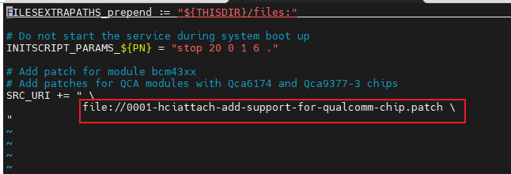
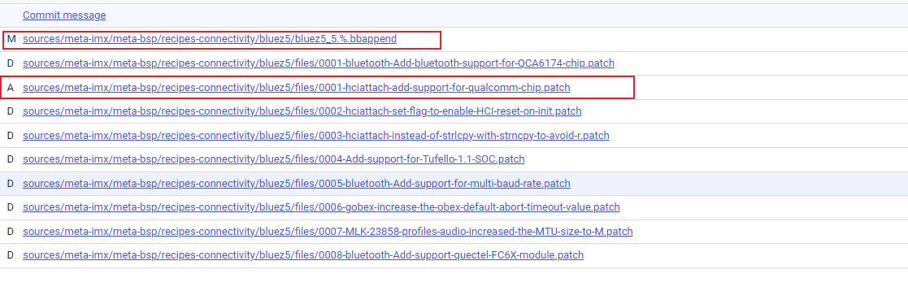

# Yocto bluez配置

下载bluez qcom patch，路径：[BT/Linux/patch · master · WiFi.BT / QCA9377 · GitLab (quectel.com)](https://git-master.quectel.com/wifi.bt/fc2x/-/tree/master/BT/Linux/patch)

把0001-bluetooth-Add-bluetooth-support-for-QCA6174-chip.patch 拷贝到sources/meta-imx/meta-bsp/recipes-connectivity/bluez5/files/目录下

sources/meta-imx/meta-bsp/recipes-connectivity/bluez5 目录下的bb文件bluez5_5.%2525.bbappend添加patch

添加方式：vim sources/meta-imx/meta-bsp/recipes-connectivity/bluez5/bluez5_5.%.bbappend



如果没有找到bluez5这个目录，可以尝试搜索，使用 find ./ -name bluez5 -type d 命令找到meta-bsp/recipes-connectivity/bluez5就是。

示例提交，其中删除的部分是之前bluez对qcom的支持，如果没有可不用在意




# fc2x蓝牙固件


拷贝蓝牙固件（tfbtfw11.tlv、tfbtnv11.bin）到sources/poky/meta/recipes-connectivity/bluez5/bluez5下，固件git路径：[BT/FW · master · WiFi.BT / QCA9377 · GitLab (quectel.com)](https://git-master.quectel.com/wifi.bt/fc2x/-/tree/master/BT/FW)

修改sources/poky/meta/recipes-connectivity/bluez5/bluez5.inc 

```makefile
...
SRC_URI = "${KERNELORG_MIRROR}/linux/bluetooth/bluez-${PV}.tar.xz \
           file://init \
           file://run-ptest \
           ${@bb.utils.contains('DISTRO_FEATURES', 'systemd', '', 'file://0001-Allow-using-obexd-without-systemd-in-the-user-sessio.patch', d)} \
           file://0001-tests-add-a-target-for-building-tests-without-runnin.patch \
           file://0001-test-gatt-Fix-hung-issue.patch \
           file://tfbtfw11.tlv \
           file://tfbtnv11.bin \
           "
#添加 file://tfbtfw11.tlv \ 和 file://tfbtnv11.bin \

S = "${WORKDIR}/bluez-${PV}"

...

do_install:append() {
        install -d ${D}${INIT_D_DIR}
        install -m 0755 ${WORKDIR}/init ${D}${INIT_D_DIR}/bluetooth

#添加如下三行，拷贝固件到firmware目录
        install -d ${D}/${base_libdir}/firmware/qca
        install -m 0755 ${WORKDIR}/tfbtfw11.tlv ${D}/${base_libdir}/firmware/qca
        install -m 0755 ${WORKDIR}/tfbtnv11.bin ${D}/${base_libdir}/firmware/qca

...

FILES:${PN} += " \
    ${libdir}/bluetooth/plugins/*.so \
    ${systemd_unitdir}/ ${datadir}/dbus-1 \
    ${libdir}/cups \
    ${base_libdir}/firmware/qca \
"
# 在FILES:${PN} 加入${base_libdir}/firmware/qca \
```


# 内核修改

## 步骤1

进入kernel_source目录，修改arch/arm64/configs/imx_v8_defconfig文件里面的CONFIG_IMX_SDMA配置项为m

git diff arch/arm64/configs/imx_v8_defconfig > sdma_tmp.patch


进入sources/meta-imx/meta-bsp/recipes-kernel/linux/linux_imx 目录

拷贝sdma_tmp.patch到sources/meta-imx/meta-bsp/recipes-kernel/linux/linux_imx下

```C
diff --git a/arch/arm64/configs/imx_v8_defconfig b/arch/arm64/configs/imx_v8_defconfig
index 97dc633d7800..ddf1d9debbe7 100644
--- a/arch/arm64/configs/imx_v8_defconfig
+++ b/arch/arm64/configs/imx_v8_defconfig
@@ -830,7 +830,7 @@ CONFIG_BCM_SBA_RAID=m
 CONFIG_FSL_EDMA=y
 CONFIG_FSL_QDMA=m
 CONFIG_FSL_EDMA_V3=y
-CONFIG_IMX_SDMA=y
+CONFIG_IMX_SDMA=m
 CONFIG_MV_XOR_V2=y
 CONFIG_MXS_DMA=y
 CONFIG_MXC_PXP_V3=y
```

在sources/meta-imx/meta-bsp/recipes-kernel/linux/linux-imx_5.15.bb添加SRC_URI += "file://sdma_tmp.patch"

```makefile
SRC_URI += "file://002_sai.patch"
SRC_URI += "file://003_sai.patch"
#添加如下行
SRC_URI += "file://sdma_tmp.patch"     
```


## 步骤2

添加 sources/meta-imx/meta-bsp/recipes-bsp/firmware-imx/files 目录及目录文件（已放到对应目录）

修改sources/meta-imx/meta-bsp/recipes-bsp/firmware-imx/firmware-imx_8.18.1.bb文件

```
...
SRC_URI = " \
    file://sdma \
    file://epdc \
    file://regulatory \
    file://hdmi \
    file://sdma-imx6q.bin \
    file://sdma-imx7d.bin \
    file://xcvr-imx8mp.bin \
"
...

do_install() {
...
    install -d ${D}${nonarch_base_libdir}/firmware/imx/sdma
    install -d ${D}${nonarch_base_libdir}/firmware/imx/xcvr
    install -m 0755 ${WORKDIR}/sdma-imx6q.bin ${D}${nonarch_base_libdir}/firmware/imx/sdma
    install -m 0755 ${WORKDIR}/sdma-imx7d.bin ${D}${nonarch_base_libdir}/firmware/imx/sdma
    install -m 0755 ${WORKDIR}/xcvr-imx8mp.bin ${D}${nonarch_base_libdir}/firmware/imx/xcvr
...
    
FILES_${PN} += "${nonarch_base_libdir}/firmware/imx/sdma ${sysconfdir}/sdma ${nonarch_base_libdir}/firmware/imx/xcvr"
...
```


# 蓝牙开启

hciattach /dev/ttymxc0 qca -t120 3000000 flow

hciconfig -a

hciconfig hci0 up


# 问题确认

如果只需客户需要我们把蓝牙bringup起来，只需要关注bluez配置和蓝牙固件就行，内核的东西一般都只需要保持默认就好，出了问题在进行修改。