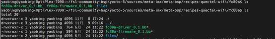
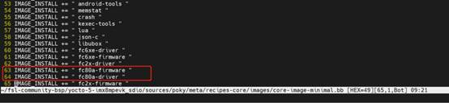
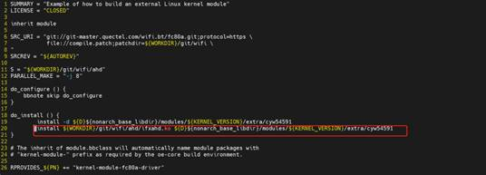
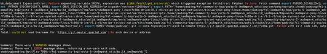
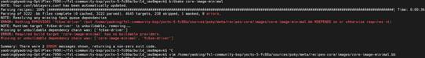
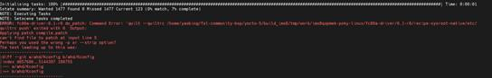
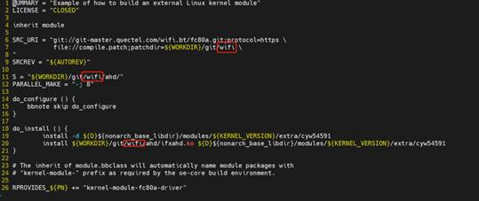

# Yocto 构建工具

[Yocto项目](https://www.yoctoproject.org/)本质是一个构建工具，其帮助开发者能够快速地、简单地设计一个基于Linux的系统。

以下主要是通过已有的i.MX 8M Plus EVK 的yocto镜像配方，构建i.MX 8M Plus EVK的完整镜像包。

 

Yocto-5文件目录

Yocto-5包含的Base目录（配方、源代码、编译包、镜像等）

- sources: 元数据所在的目录 
- build: bitbake命令执行的目录
- build/tmp: bitbake命令执行的目标目录 
- build/tmp/work: 配方任务的工作目录 
- build/tmp/deploy: bitbake输出的目录
- build/tmp/deploy/images: 完整或者部分镜像的目录

注：

1、这里使用的是公司提供的Yocto-5版本环境。

2、具体信息如下#vim /sources/poky/meta-poky/conf/distro/poky.conf

# 1.     Yocto方案编译

移远在Yocto平台做过适配的模组有fc2x、fc30r 、fc6xe 、fc80a，位于sources/meta-imx/meta-bsp/recipes-quectel-bt路径下，每个目录中有两个.bb文件对应driver和firmware编译配方，以fc80a为例：

添加编译模块：./poky/meta/recipes-core/images/core-image-minimal.bb

## 1.1.   编译驱动

第一步：只保留sources/meta-imx/meta-bsp/recipes-quectel-wifi/fc80a/fc80a-driver_0.1.bb，其它删除即可。

第二步：添加编译安装驱动模块

\#vim source/poky/meta/recipes-core/images/core-image-minimal.bb

编辑如下

IMAGE_INSTALL += " json-c "

IMAGE_INSTALL += " libubox "

\+ IMAGE_INSTALL += " fc80a-driver "

第三步：编译

imx8qxpmek 平台

\# DISTRO=fsl-imx-xwayland MACHINE=imx8qxpmek source imx-setup-release.sh -b build

\# bitbake core-image-minimal

imx6平台

\#DISTRO=fsl-imx-x11 MACHINE=imx6qsabresd source imx-setup-release.sh -b build

\# bitbake core-image-minimal

生成的.KO文件

1、 路径:build_imx8_fc80/tmp/work/imx8qxpmek-poky-linux/fc80a-driver/0.1-r0/git/wifi/ahd

2、 根据fc80a-driver_0.1.bb文件可知，已将.ko文件编入镜像路径/modules/${KERNEL_VERSION}/extra/cyw54591

 

编译错误记录

1)、无法连接到公司的网址https://git-master.quectel.com，导致驱动源码下载失败。

解决方案：

git config --global user.name “xxxxx”

git config --global credential.helper store

git config --global user.password “xxxxx”

git config --global credential.helper store

 

2)指定编译芯片型号对应的driver和firmware

修改路径：sources/poky/meta/recipes-core/images/core-image-minimal.bb

删除fc80a之外的模块。

3)移远wifi驱动路径错误，驱动源码仓名改动所致

修改fc80a-driver_0.1.bb即可

## 1.2.   将固件和软件工具编译进镜像

yocto编译的过程就是按照配方进行编译。下面以其中的一个fc80a-firmware_0.1.bb文件为例简单介绍。

\# vim sources/meta-imx/meta-bsp/recipes-quectel-wifi/fc80a/fc80a-firmware_0.1.bb

SUMMARY = "Example of how to build an external Linux kernel module"

LICENSE = "CLOSED"

inherit allarch

从git下载代码

SRC_URI = "git://git-master.quectel.com/wifi.bt/fc80a.git;protocol=https"

SRCREV = "${AUTOREV}"

代码目录

S = "${WORKDIR}/ git/wifi"

安装wifi相关内容到文件系统中。

do_install() {

​    install -d ${D}/lib/firmware/cyw54591

​    install -d ${D}/usr/bin

​    install ${S}/firmware/* ${D}/lib/firmware/cyw54591

​    install ${S}/tools/* /${D}/usr/bin

}

FILES_${PN} += "/lib/firmware/cyw54591"

FILES_${PN} += "/usr/bin"

INSANE_SKIP_${PN} += "arch already-stripped file-rdeps"

INHIBIT_SYSROOT_STRIP = "1"

注：1、${WORKDIR}路径为tmp/work/all-poky-linux/fc80a-firmware/0.1-r0/git/wifi。

2、此处是将wifi固件、及常用软件工具编译到镜像中。

 

（1）    添加编译模块：vim ./poky/meta/recipes-core/images/core-image-minimal.bb 添加

IMAGE_INSTALL += " fc80a-firmware"

（2）    进入tmp/work/all-poky-linux/fc80a-firmware/0.1-r0/git目录下，新建firmware、 tools两个目录，并且将所需固件和软件工具（udpcpd、udhcpch、hostapd等）分别放入firmware、 tools中。

（3）    设置编译环境

source setup-environment build_imx8mpevk

（4）    编译镜像

bitbake core-image-minimal

（5）    镜像路径

build_imx8mpevk/tmp/deploy/images/imx8mpevk/core-image-minimal-imx8mpevk-20221010052735.rootfs.wic.bz2

# 2.     验证yocto镜像

使用的是uuu工具进行下载。

一．将生成的镜像拷贝到电脑上，进入windows的cmd命令方式，通过如下命令方式烧写。

uuu -b emmc_all imx-boot-imx8mpevk-sd.bin-flash_evk core-image-minimal-imx8mpevk-20221011020439.rootfs.wic.bz2