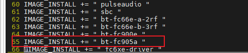

# Yocto 构建工具

[Yocto项目](https://www.yoctoproject.org/)本质是一个构建工具，其帮助开发者能够快速地、简单地设计一个基于Linux的系统。

以下主要是通过已有的i.MX 8M Plus EVK 的yocto镜像配方，构建i.MX 8M Plus EVK的完整镜像包。

 

Yocto-5文件目录

Yocto-5包含的Base目录（配方、源代码、编译包、镜像等）

- sources: 元数据所在的目录 
- build: bitbake命令执行的目录
- build/tmp: bitbake命令执行的目标目录 
- build/tmp/work: 配方任务的工作目录 
- build/tmp/deploy: bitbake输出的目录
- build/tmp/deploy/images: 完整或者部分镜像的目录

注：

1、这里使用的是公司提供的Yocto-5版本环境。

2、具体信息如下#vim /sources/poky/meta-poky/conf/distro/poky.conf

# 1.     Yocto方案编译

移远在Yocto平台做过适配的模组有fc2x、fc30r 、fc6xe 、fc80a，位于sources/meta-imx/meta-bsp/recipes-quectel-bt路径下，每个目录中有两个.bb文件对应driver和firmware编译配方，以fc80a为例：

添加编译模块：./poky/meta/recipes-core/images/core-image-minimal.bb

## 1.1.   编译驱动

第一步：只保留sources/meta-imx/meta-bsp/recipes-quectel-wifi/fc80a/fc80a-driver_0.1.bb，其它删除即可。

第二步：添加编译安装驱动模块

\#vim sources/poky/meta/recipes-core/images/core-image-minimal.bb

编辑如下

IMAGE_INSTALL += " json-c "

IMAGE_INSTALL += " libubox "

\+ IMAGE_INSTALL += " fc80a-driver "

第三步：编译

imx8qxpmek 平台

\# DISTRO=fsl-imx-xwayland MACHINE=imx8qxpmek source imx-setup-release.sh -b build

\# bitbake core-image-minimal

imx6平台

\#DISTRO=fsl-imx-x11 MACHINE=imx6qsabresd source imx-setup-release.sh -b build

\# bitbake core-image-minimal

## 1.2.   将固件和软件工具编译进镜像

（1）    添加编译模块：vim ./poky/meta/recipes-core/images/core-image-minimal.bb 添加

IMAGE_INSTALL += " bt-fc905a"

（2）    设置编译环境

source setup-environment build_imx8mpevk

（3）    编译镜像

bitbake core-image-minimal

（4）    镜像路径

build_imx8mpevk/tmp/deploy/images/imx8mpevk/core-image-minimal-imx8mpevk-20221010052735.rootfs.wic.bz2

## 编译内核

bitbake -c clean -f linux-imx

bitbake -c compile -f linux-imx

 单独编译Linux内核：

bitbake -c compile -f -v linux-imx

bitbake -c deploy -f -v linux-imx

linux

 内核目录：

imx-yocto-bsp/imx8mpevk_xwayland/tmp/work-shared/imx8mpevk/kernel-source

 单独编译 uboot

bitbake -c compile -f -v u-boot-imx

bitbake -c deploy -f -v u-boot-imx

编译内核模块：

bitbake linux-imx -c compile_kernelmodules -f -v

  编译menuconfig

bitbake -c menuconfig -v linux-imx

# 2.     验证yocto镜像

使用的是uuu工具进行下载。

一．将生成的镜像拷贝到电脑上，进入windows的cmd命令方式，通过如下命令方式烧写。

uuu -b emmc_all imx-boot-imx8mpevk-sd.bin-flash_evk core-image-minimal-imx8mpevk-20221011020439.rootfs.wic.bz2