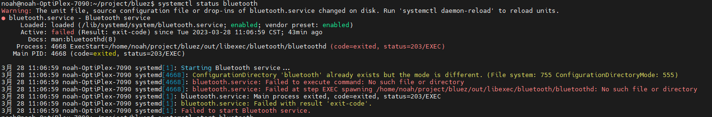
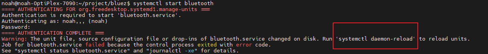
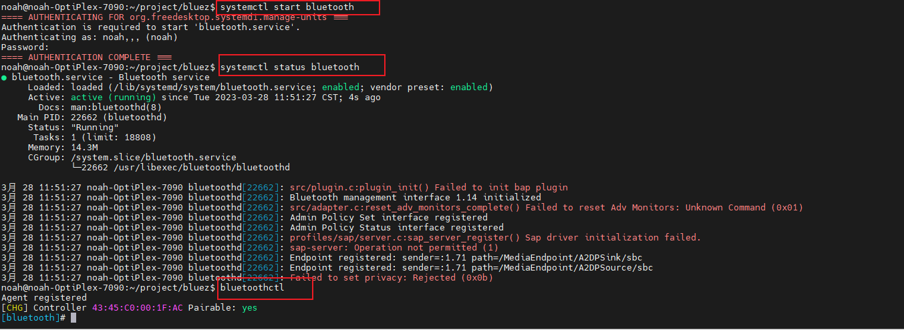
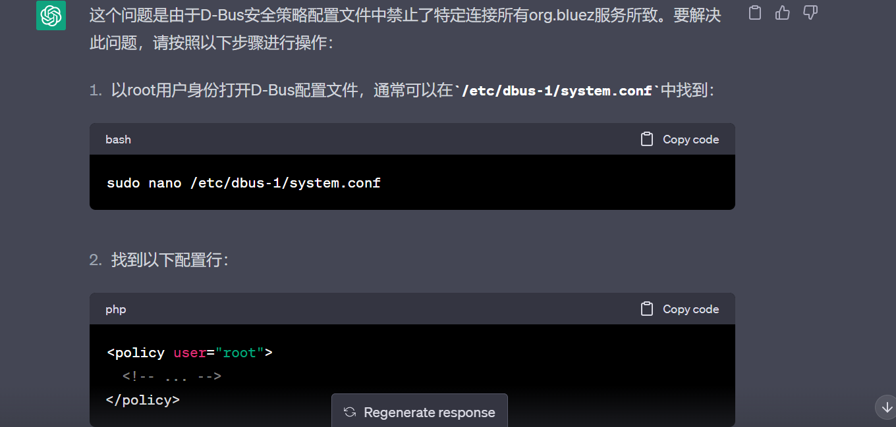
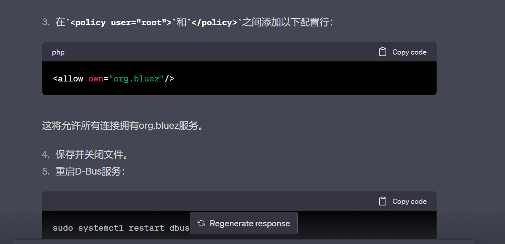

# bluez bluetoothctl开启失败 Waiting to connect to bluetoothd...

noah@noah-OptiPlex-7090:~/project/bluez$ bluetoothctl
**Waiting to connect to bluetoothd...**

解决方法

 systemctl status bluetooth 查看蓝牙状态

尝试启动蓝牙

 systemctl start bluetooth

提示我们重新加载

systemctl daemon-reload

重新加载后再次启动一下蓝牙后成功解决

# Failed to set power on: org.bluez.Error.Blocked

rfkill unblock bluetooth

 hciconfig hci0 up

# D-Bus setup failed: Connection ":1.248" is not allowed to own the service "org.bluez" due to security policies in the configuration file

sudo vim /etc/dbus-1/system.d/avahi-dbus.conf

<allow own="org.bluez"/>

