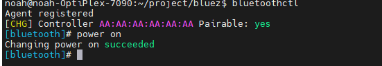
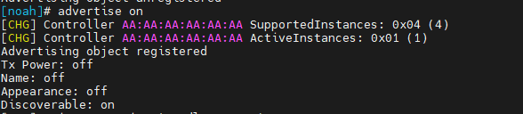
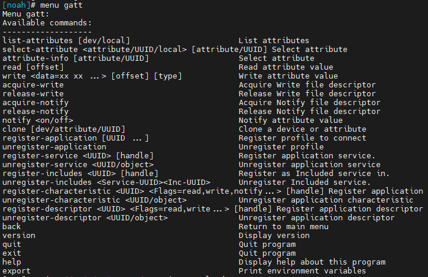

# bluez 送测指导

1. sudo ./hciattach /dev/ttyUSB0 bcm43xx -t120 3000000 flow     (bcm43XX/qcm/)

2. bluetoothctl 进入蓝牙

    

   

## 一些常用的蓝牙指令

power on：打开蓝牙总开关，同理power off就是关闭蓝牙总开关，下面的命令也是同理。
show：显示本地蓝牙适配器的信息。
discoverable on：设置经典蓝牙可被发现，开启后手机的蓝牙设置界面可以搜索到该蓝牙设备。
pair on：使能经典蓝牙的可配对。
system-alias：设置设备的蓝牙别名，即手机蓝牙设置界面扫描时看到的设备名。
agent NoInputNoOutput：设置配对能力级为无输入无输出，设置成该agent后经典蓝牙配对时设备无需输入配对码，手机上点击确定即可完成配对。
scan on：开启蓝牙扫描，如果设备支持双模蓝牙，那么会同时扫描经典蓝牙和低功耗蓝牙，扫描一段时间后可以通过scan off关闭扫描。
devices：列出当前可用列表，该列表包含了已配对的设备和刚扫描到的设备。
info：查看某一设备的具体信息。
connect：尝试连接设备。
disconnect：断开设备连接。
pair：发起配对。
advertise on：开启BLE广播。
remove：移除设备，如果是已配对的设备，绑定关系也会移除。
menu：进入子菜单，目前有advertise、scan、gatt三个子菜单，分别用于设置BLE广播信息、扫描过滤、GATT设置。
举例说明如何使用bluetoothctl连接蓝牙外设：

运行bluetoothctl，输入power on命令使能蓝牙。
蓝牙外设开机并使其广播，使用scan on命令开启扫描，等扫描到目标蓝牙外设后使用scan off命令停止扫描。
使用devices命令查看扫描到的设备地址，，复制该外设对应的蓝牙MAC地址xx:xx:xx:xx:xx:xx。
使用connect xx:xx:xx:xx:xx:xx命令连接蓝牙外设，有些外设首次连接需要配对，将connect改为pair即可。


备注：如需了解更多请直接输入help即可查看。


## 送测指导

show: 可查看本地的蓝牙信息，如蓝牙名称，mac地址等，方便后续测是。

### 蓝牙扫描

scan on：开启蓝牙扫描，如果设备支持双模蓝牙，那么会同时扫描经典蓝牙和低功耗蓝牙，扫描一段时间后可以通过scan off关闭扫描。

### 蓝牙广播

discoverable on：开启设备发现，然后我们在手机上就能搜索到指定的设备。

### 蓝牙配对

pair on：使能经典蓝牙的可配对。

蓝牙广播打开后，手机上直接点击配对。

后面直接根据提示输入yes即可。

### A2DP sink 

蓝牙配对成功之后可以直接测试a2dp sink。

### a2dp source


### HFP hf

蓝牙配对成功后可直接测试HFP hf


### BLE 扫描

scan on：开启蓝牙扫描，如果设备支持双模蓝牙，那么会同时扫描经典蓝牙和低功耗蓝牙，扫描一段时间后可以通过scan off关闭扫描。


### BLE 广播

advertise on：开启BLE广播

手机上使用nrf搜索对应mac地址




### ble client

手机端使用nrf connect 开启一个ADVERTISER服务


### ble server/client 收发

1. 在我们开启ble广播后，手机上使用nrf connect找到对应设备，点击连接。

2. menu gatt：进入gatt子菜单

   

   ```
   Menu gatt:
   Available commands:
   -------------------
   list-attributes [dev/local]                       List attributes
   select-attribute <attribute/UUID/local> [attribute/UUID] Select attribute
   attribute-info [attribute/UUID]                   Select attribute
   read [offset]                                     Read attribute value
   write <data=xx xx ...> [offset] [type]            Write attribute value
   acquire-write                                     Acquire Write file descriptor
   release-write                                     Release Write file descriptor
   acquire-notify                                    Acquire Notify file descriptor
   release-notify                                    Release Notify file descriptor
   notify <on/off>                                   Notify attribute value
   clone [dev/attribute/UUID]                        Clone a device or attribute
   register-application [UUID ...]                   Register profile to connect
   unregister-application                            Unregister profile
   register-service <UUID> [handle]                  Register application service.
   unregister-service <UUID/object>                  Unregister application service
   register-includes <UUID> [handle]                 Register as Included service in.
   unregister-includes <Service-UUID><Inc-UUID>      Unregister Included service.
   register-characteristic <UUID> <Flags=read,write,notify...> [handle] Register application characteristic
   unregister-characteristic <UUID/object>           Unregister application characteristic
   register-descriptor <UUID> <Flags=read,write...> [handle] Register application descriptor
   unregister-descriptor <UUID/object>               Unregister application descriptor
   back                                              Return to main menu
   version                                           Display version
   quit                                              Quit program
   exit                                              Quit program
   help                                              Display help about this program
   export                                            Print environment variables
   
   
   ```

3. list-attributes 显示设备
4. select-attribute <attribute/UUID/local> ： 根据UUID选择attribute handle

select-attribute  00002b29-0000-1000-8000-00805f9b34fb

