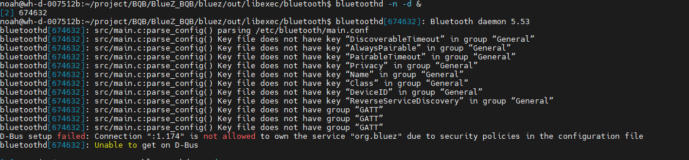
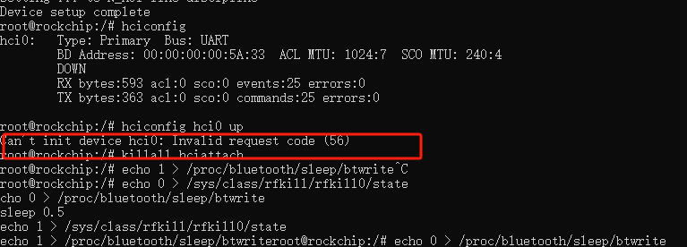
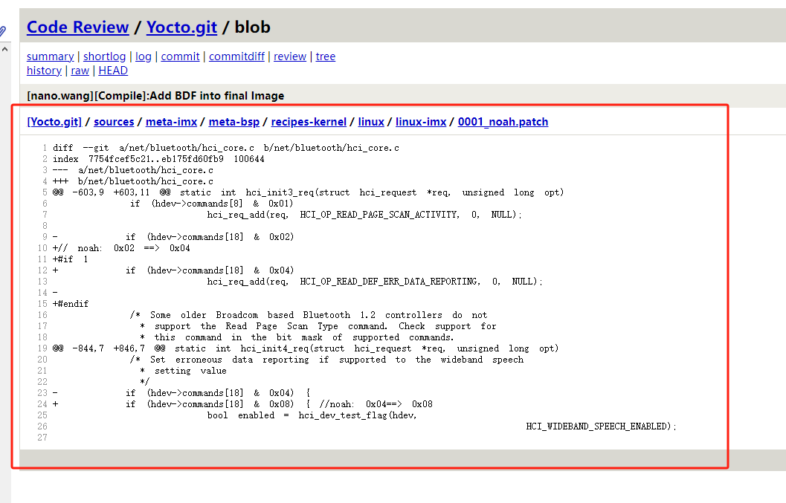

## D-Bus setup failed: Connection ":1.174" is not allowed to own the service "org.bluez" due to security policies in the configuration file



```
bluetoothd[674632]: src/main.c:parse_config() parsing /etc/bluetooth/main.conf
bluetoothd[674632]: src/main.c:parse_config() Key file does not have key “DiscoverableTimeout” in group “General”
bluetoothd[674632]: src/main.c:parse_config() Key file does not have key “AlwaysPairable” in group “General”
bluetoothd[674632]: src/main.c:parse_config() Key file does not have key “PairableTimeout” in group “General”
bluetoothd[674632]: src/main.c:parse_config() Key file does not have key “Privacy” in group “General”
bluetoothd[674632]: src/main.c:parse_config() Key file does not have key “Name” in group “General”
bluetoothd[674632]: src/main.c:parse_config() Key file does not have key “Class” in group “General”
bluetoothd[674632]: src/main.c:parse_config() Key file does not have key “DeviceID” in group “General”
bluetoothd[674632]: src/main.c:parse_config() Key file does not have key “ReverseServiceDiscovery” in group “General”
bluetoothd[674632]: src/main.c:parse_config() Key file does not have group “GATT”
bluetoothd[674632]: src/main.c:parse_config() Key file does not have group “GATT”
bluetoothd[674632]: src/main.c:parse_config() Key file does not have group “GATT”
D-Bus setup failed: Connection ":1.174" is not allowed to own the service "org.bluez" due to security policies in the configuration file
bluetoothd[674632]: Unable to get on D-Bus


```


下面这个是内核版本问题







