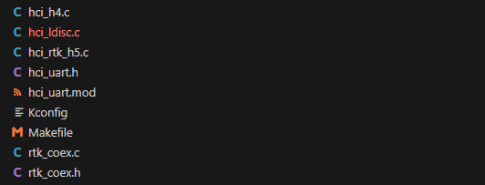

这里先用realtek独立出来的内核代码来分析流程


里面有这么几个文件，一一进行介绍



hci_uart.h是uart驱动的主要头文件，定义了一系列的结构体和接口

```C
#include <linux/version.h>
#include <net/bluetooth/bluetooth.h>
#include <net/bluetooth/hci_core.h>

/* #define HCI_VERSION_CODE KERNEL_VERSION(3, 14, 41) */
#define HCI_VERSION_CODE LINUX_VERSION_CODE

#ifndef N_HCI
#define N_HCI	15
#endif

#ifndef CONFIG_BT_HCIUART_H4
#define CONFIG_BT_HCIUART_H4
#endif

#define BTCOEX

/* Send host sleep notification to Controller */
#define WOBT_NOTIFY		0	/* 1  enable; 0  disable */

/* Send LE whitelist only for Background scan parameters */
#define WOBT_NOTIFY_BG_SCAN_LE_WHITELIST_ONLY	(0 * WOBT_NOTIFY)	/* 1  enable; 0  disable */

/* RTKBT Power-on Whitelist for sideband wake-up by LE Advertising from Remote.
* Note that it's necessary to apply TV FW Patch. */
#define RTKBT_TV_POWERON_WHITELIST	(0 * WOBT_NOTIFY)	/* 1  enable; 0  disable */

/* RTKBT Power-on Data Filter for Manufacturer field */
/* Note that please edit the datafilter in
 *   rtkbt_set_le_device_poweron_data_filter() of hci_ldisc.c */
#define RTKBT_TV_POWERON_DATA_FILTER	(0 * WOBT_NOTIFY)	/* 1  enable; 0  disable */

#define RTKBT_POWERKEY_WAKEUP

/* Ioctls */
#define HCIUARTSETPROTO		_IOW('U', 200, int)
#define HCIUARTGETPROTO		_IOR('U', 201, int)
#define HCIUARTGETDEVICE	_IOR('U', 202, int)
#define HCIUARTSETFLAGS		_IOW('U', 203, int)
#define HCIUARTGETFLAGS		_IOR('U', 204, int)

/* UART protocols */
#define HCI_UART_MAX_PROTO	6

#define HCI_UART_H4	0
#define HCI_UART_BCSP	1
#define HCI_UART_3WIRE	2
#define HCI_UART_H4DS	3
#define HCI_UART_LL	4
#define HCI_UART_ATH3K	5

#define HCI_UART_RAW_DEVICE	0
#define HCI_UART_RESET_ON_INIT	1
#define HCI_UART_CREATE_AMP	2
#define HCI_UART_INIT_PENDING	3
#define HCI_UART_EXT_CONFIG	4
#define HCI_UART_VND_DETECT	5

struct hci_uart;

struct hci_uart_proto {
	unsigned int id;
	int (*open)(struct hci_uart *hu);
	int (*close)(struct hci_uart *hu);
	int (*flush)(struct hci_uart *hu);
	int (*recv)(struct hci_uart *hu, void *data, int len);
	int (*enqueue)(struct hci_uart *hu, struct sk_buff *skb);
	struct sk_buff *(*dequeue)(struct hci_uart *hu);
};

struct hci_uart {
	struct tty_struct	*tty;
	struct hci_dev		*hdev;
	unsigned long		flags;
	unsigned long		hdev_flags;

	struct work_struct	write_work;
	struct workqueue_struct *hci_uart_wq;

	struct hci_uart_proto	*proto;
#if LINUX_VERSION_CODE >= KERNEL_VERSION(4, 7, 0)
	struct percpu_rw_semaphore proto_lock; /* Stop work for proto close */
#else
	struct rw_semaphore proto_lock;
#endif
	void			*priv;

	struct semaphore tx_sem;	/* semaphore for tx */

	struct sk_buff		*tx_skb;
	unsigned long		tx_state;

#if WOBT_NOTIFY
	struct notifier_block pm_notify_block;
	struct notifier_block shutdown_notifier;
#endif
};

/* HCI_UART proto flag bits */
#define HCI_UART_PROTO_SET	0
#define HCI_UART_REGISTERED	1
#define HCI_UART_PROTO_READY	2

/* TX states  */
#define HCI_UART_SENDING	1
#define HCI_UART_TX_WAKEUP	2

extern int hci_uart_register_proto(struct hci_uart_proto *p);
extern int hci_uart_unregister_proto(struct hci_uart_proto *p);
extern int hci_uart_tx_wakeup(struct hci_uart *hu);

#ifdef CONFIG_BT_HCIUART_H4
extern int h4_init(void);
extern int h4_deinit(void);
#endif

extern int h5_init(void);
extern int h5_deinit(void);

#if HCI_VERSION_CODE < KERNEL_VERSION(3, 13, 0)
extern int hci_uart_send_frame(struct sk_buff *skb);
#else
extern int hci_uart_send_frame(struct hci_dev *hdev, struct sk_buff *skb);
#endif

```

本文章用H4的uart进行介绍，驱动目录有一个hci_ldisc.c的文件，到最下方我们就能看到熟悉的module_init，这里调用了hci_uart_init方法，在里面注册hci_uart_ldisc之后，初始化H4接口，


```c
static struct tty_ldisc_ops hci_uart_ldisc = {
	.owner          = THIS_MODULE,
#if LINUX_VERSION_CODE >= KERNEL_VERSION(5, 14, 0)
	.num		= N_HCI,
#endif
#if LINUX_VERSION_CODE < KERNEL_VERSION(5, 13, 0)
	.magic          = TTY_LDISC_MAGIC,
#endif
	.name           = "n_hci",
	.open           = hci_uart_tty_open,
	.close          = hci_uart_tty_close,
	.read           = hci_uart_tty_read,
	.write          = hci_uart_tty_write,
	.ioctl          = hci_uart_tty_ioctl,
#if HCI_VERSION_CODE >= KERNEL_VERSION(4, 20, 0)
	.compat_ioctl   = hci_uart_tty_ioctl,
#endif
	.poll           = hci_uart_tty_poll,
	.receive_buf    = hci_uart_tty_receive,
	.write_wakeup   = hci_uart_tty_wakeup,
};

static int __init hci_uart_init(void)
{
	int err;

	BT_INFO("HCI UART driver ver %s", VERSION);

	/* Register the tty discipline */
#if HCI_VERSION_CODE >= KERNEL_VERSION(5, 14, 0)
	if ((err = tty_register_ldisc(&hci_uart_ldisc))) {
#else
	if ((err = tty_register_ldisc(N_HCI, &hci_uart_ldisc))) {
#endif
		BT_ERR("HCI line discipline registration failed. (%d)", err);
		return err;
	}
#ifdef CONFIG_BT_HCIUART_H4
	h4_init();
#endif
	/* Add realtek h5 support */
	h5_init();

#ifdef BTCOEX
	rtk_btcoex_init();
#endif

	return 0;
}
    ...
module_init(hci_uart_init);
module_exit(hci_uart_exit);

```


hci_h4.c

```c
static struct hci_uart_proto h4p = {
	.id		= HCI_UART_H4,
	.open		= h4_open,
	.close		= h4_close,
	.recv		= h4_recv,
	.enqueue	= h4_enqueue,
	.dequeue	= h4_dequeue,
	.flush		= h4_flush,
};

int __init h4_init(void)
{
	int err = hci_uart_register_proto(&h4p);

	if (!err)
		BT_INFO("HCI H4 protocol initialized");
	else
		BT_ERR("HCI H4 protocol registration failed");

	return err;
}
```

