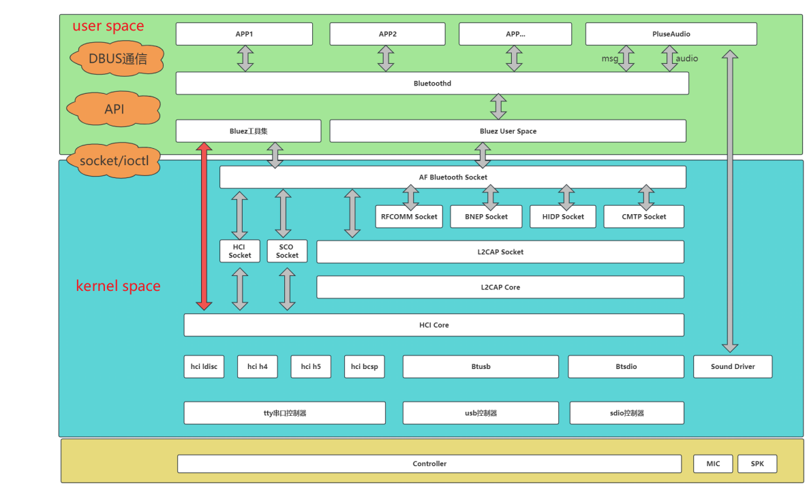
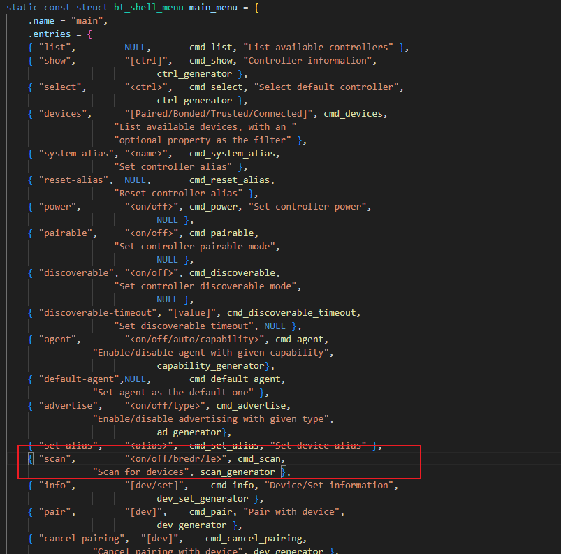

# bluez inquiry流程

贴一张bluez架构图方便理解




## user space

APP：上层应⽤程序
Pluseaudio/pipewire：A2DP的组件
Bluetoothd: 蓝⽛守护进程
Bluez: 包括Bluez tool跟Bluez lib

## kernel space

内核代码包含以下⼏部分
driver/bluetooth
net/bluetooth
include/net/bluetooth


## bluez inquiry 流程

接下来我们通过bluetoothctl工具来分析bluez 的inquiry流程

### bluez源码结构

**src：核心程序bluetoothd的源码位置。 其中还包括了shared文件夹，该文件夹编译生成了一个共享库，供bluetoothd和其他程序使用（shared库是重点）。**

**client：bluetoothctl程序的源码位置。**

mesh：mesh协议栈的源码位置，但是不包含proxy相关的功能。

tools：hciattach，hciconfig，hcitool等工具的源码目录，如果打开--enable-testing，--enable-test的话，在该目录中，还会有相关的*-tester执行程序。

monitor：btmon工具的源码位置，到目前5.66为止，这个工具已经很强大了，监控生成的hci数据，可以转化为支持ellisys软件打开的.pkt格式，也可以转化为支持wireshare软件打开的格式.cfa格式。

test：测试蓝牙功能的py脚本，通过dbus接口和bluetoothd进行通信。 dbus提供支持python和c语言的接口。

emulator：从字面意思可以推测出它是用来仿真的，通过阅读代码发现它是仿真controller的，通过btdev_create函数来创建一个虚拟的蓝牙controller设备。 kernel也是支持的，"/dev/vhci"这个设备被虚拟为一个虚拟的蓝牙设备。

lib：bluez的一些基础访问库的源码位置，shared库也引用了lib里面的函数定义。 编译生成libbluetooth-internal.la和libbluetooth.la。

**gdbus：dbus的源码仓库。(把dbus封装了一下，方便使用)**

ell：The Embedded Learning Library，对嵌入式系统的支持，需要在configure时指定使用ell库，方便编译出更少内存和flash的嵌入式平台的bluez的相关固件。

android：早期的android系统使用的是bluez的开源库，后面改为使用bludroid协议栈了。

peripheral：一个ble外围设备的demo，没有通过dbus和bluetoothd进行通信，而是自己实现了一套，使用了shared库的api。 默认不会编译，需要在configure的时候，--enable-test --enable-testing才会编译该目录的源码。

profiles：android平台的协议栈支持的一部分，配合和android目录一起使用。

plugins：貌似是为bluetoothd程序提供一些插件功能。

obexd：经典蓝牙的obex文件传输协议的源码实现。

unit：一些测试shared库的单元测试case，c代码辨析的。

attrib：gatttool工具的实现源码位置。

btio：bt_io_*的相关函数源码位置，bluetooth的io操作的基础库。


### inquiry入口

bluetoothctl程序里面打开蓝牙后，输入scan on即可开始扫描。



在cmd_scan里面就会去判断是打开scan还是关闭scan

```c
static void cmd_scan(int argc, char *argv[])
{
	dbus_bool_t enable;
	const char *method;
	const char *mode;

	if (!parse_argument(argc, argv, scan_arguments, "Mode", &enable,
								&mode))
		return bt_shell_noninteractive_quit(EXIT_FAILURE);

	if (check_default_ctrl() == FALSE)
		return bt_shell_noninteractive_quit(EXIT_FAILURE);

	if (enable == TRUE) {
		if (!g_strcmp0(mode, "")) {
			g_free(filter.transport);
			filter.transport = NULL;
			filter.set = false;
		} else {
			g_free(filter.transport);
			filter.transport = g_strdup(mode);
			filter.set = false;
		}

		set_discovery_filter(false);
		method = "StartDiscovery";      //这里就是dbus总线需要的信息
	} else
		method = "StopDiscovery";

	if (g_dbus_proxy_method_call(default_ctrl->proxy, method,
				NULL, start_discovery_reply,
				GUINT_TO_POINTER(enable), NULL) == FALSE) {     //进入gdbus目录的client.c执行g_dbus_proxy_method_call
		bt_shell_printf("Failed to %s discovery\n",
					enable == TRUE ? "start" : "stop");
		return bt_shell_noninteractive_quit(EXIT_FAILURE);
	}
}
```

这个g_dbus_proxy_method_call方法实际上是进行dbus通信，调用method对应的方法，这里就是StartDiscovery。

```c
gboolean g_dbus_proxy_method_call(GDBusProxy *proxy, const char *method,
				GDBusSetupFunction setup,
				GDBusReturnFunction function, void *user_data,
				GDBusDestroyFunction destroy)
{
	struct method_call_data *data;
	GDBusClient *client;
	DBusMessage *msg;
	DBusPendingCall *call;

	if (proxy == NULL || method == NULL)
		return FALSE;

	client = proxy->client;
	if (client == NULL)
		return FALSE;

	msg = dbus_message_new_method_call(client->service_name,
				proxy->obj_path, proxy->interface, method);   //"org.bluez","/org/bluez/hci0","org.bluez.Adapter1","StartDiscovery" 这里差不多就是这样
	if (msg == NULL)
		return FALSE;

	if (setup) {
		DBusMessageIter iter;

		dbus_message_iter_init_append(msg, &iter);
		setup(&iter, user_data);
	}

	if (!function)
		return g_dbus_send_message(client->dbus_conn, msg);

	data = g_try_new0(struct method_call_data, 1);
	if (data == NULL)
		return FALSE;

	data->function = function;
	data->user_data = user_data;
	data->destroy = destroy;


	if (g_dbus_send_message_with_reply(client->dbus_conn, msg,
					&call, METHOD_CALL_TIMEOUT) == FALSE) {
		dbus_message_unref(msg);
		g_free(data);
		return FALSE;
	}

	dbus_pending_call_set_notify(call, method_call_reply, data, g_free);
	dbus_pending_call_unref(call);

	dbus_message_unref(msg);

	return TRUE;
}
```

通过发送的dbus消息，可以知道下一步会进入到src/adapter.c里面去，能看到在src/adapter.c

```c
static const GDBusMethodTable adapter_methods[] = {
	{ GDBUS_ASYNC_METHOD("StartDiscovery", NULL, NULL, start_discovery) },
	{ GDBUS_METHOD("SetDiscoveryFilter",
				GDBUS_ARGS({ "properties", "a{sv}" }), NULL,
				set_discovery_filter) },
	{ GDBUS_ASYNC_METHOD("StopDiscovery", NULL, NULL, stop_discovery) },
	{ GDBUS_ASYNC_METHOD("RemoveDevice",
			GDBUS_ARGS({ "device", "o" }), NULL, remove_device) },
	{ GDBUS_METHOD("GetDiscoveryFilters", NULL,
			GDBUS_ARGS({ "filters", "as" }),
			get_discovery_filters) },
	{ GDBUS_EXPERIMENTAL_ASYNC_METHOD("ConnectDevice",
				GDBUS_ARGS({ "properties", "a{sv}" }), NULL,
				connect_device) },
	{ }
};//这段代码就可以看到StartDiscovery对应start_discovery

-->

static DBusMessage *start_discovery(DBusConnection *conn,
					DBusMessage *msg, void *user_data)
{
	struct btd_adapter *adapter = user_data;
	const char *sender = dbus_message_get_sender(msg);
	struct discovery_client *client;
	bool is_discovering;
	int err;

	DBG("sender %s", sender);

	if (!btd_adapter_get_powered(adapter))
		return btd_error_not_ready(msg);

	is_discovering = get_discovery_client(adapter, sender, &client);

	/*
	 * Every client can only start one discovery, if the client
	 * already started a discovery then return an error.
	 */
	if (is_discovering)
		return btd_error_busy(msg);

	/*
	 * If there was pre-set filter, just reconnect it to discovery_list,
	 * and trigger scan.
	 */
	if (client) {
		if (client->msg)
			return btd_error_busy(msg);

		adapter->set_filter_list = g_slist_remove(
					     adapter->set_filter_list, client);
		adapter->discovery_list = g_slist_prepend(
					      adapter->discovery_list, client);

		goto done;
	}

	client = g_new0(struct discovery_client, 1);

	client->adapter = adapter;
	client->owner = g_strdup(sender);
	client->discovery_filter = NULL;
	client->watch = g_dbus_add_disconnect_watch(dbus_conn, sender,
						discovery_disconnect, client,
						NULL);
	adapter->discovery_list = g_slist_prepend(adapter->discovery_list,
								client);

done:
	/*
	 * Just trigger the discovery here. In case an already running
	 * discovery in idle phase exists, it will be restarted right
	 * away.
	 */
	err = update_discovery_filter(adapter);     //这里触发发现
	if (!err)
		return dbus_message_new_method_return(msg);

	/* If the discovery has to be started wait it complete to reply */
	if (err == -EINPROGRESS) {
		client->msg = dbus_message_ref(msg);
		adapter->client = client;
		return NULL;
	}

	return btd_error_failed(msg, strerror(-err));
}

-->

static int update_discovery_filter(struct btd_adapter *adapter)
{
	struct mgmt_cp_start_service_discovery *sd_cp;

	DBG("");

	if (discovery_filter_to_mgmt_cp(adapter, &sd_cp)) {
		btd_error(adapter->dev_id,
				"discovery_filter_to_mgmt_cp returned error");
		return -ENOMEM;
	}

	/* Only attempt to overwrite current discoverable setting when not
	 * discoverable.
	 */
	if (!(adapter->current_settings & MGMT_SETTING_DISCOVERABLE)) {
		GSList *l;

		for (l = adapter->discovery_list; l; l = g_slist_next(l)) {
			struct discovery_client *client = l->data;

			if (!client->discovery_filter)
				continue;

			if (client->discovery_filter->discoverable) {
				set_discovery_discoverable(adapter, true);
				break;
			}
		}
	}

	/*
	 * If filters are equal, then don't update scan, except for when
	 * starting discovery.
	 */
	if (filters_equal(adapter->current_discovery_filter, sd_cp) &&
	    adapter->discovering != 0) {
		DBG("filters were equal, deciding to not restart the scan.");
		g_free(sd_cp);
		return 0;
	}

	g_free(adapter->current_discovery_filter);
	adapter->current_discovery_filter = sd_cp;

	trigger_start_discovery(adapter, 0);    //进入这个方法

	return -EINPROGRESS;
}

-->

static void trigger_start_discovery(struct btd_adapter *adapter, guint delay)
{

	DBG("");

	cancel_passive_scanning(adapter);

	if (adapter->discovery_idle_timeout > 0) {
		timeout_remove(adapter->discovery_idle_timeout);
		adapter->discovery_idle_timeout = 0;
	}

	/*
	 * If the controller got powered down in between, then ensure
	 * that we do not keep trying to restart discovery.
	 *
	 * This is safe-guard and should actually never trigger.
	 */
	if (!btd_adapter_get_powered(adapter))
		return;

	adapter->discovery_idle_timeout = timeout_add_seconds(delay,
					start_discovery_timeout, adapter, NULL);  //这里会跳转到start_discovery_timeout执行
}

-->

static bool start_discovery_timeout(gpointer user_data)
{
	struct btd_adapter *adapter = user_data;
	struct mgmt_cp_start_service_discovery *sd_cp;
	uint8_t new_type;

	DBG("");

	adapter->discovery_idle_timeout = 0;

	/* If we're doing filtered discovery, it must be quickly restarted */
	adapter->no_scan_restart_delay = !!adapter->current_discovery_filter;

	DBG("adapter->current_discovery_filter == %d",
	    !!adapter->current_discovery_filter);

	new_type = get_scan_type(adapter);

	if (adapter->discovery_enable == 0x01) {
		struct mgmt_cp_stop_discovery cp;

		/*
		 * If we're asked to start regular discovery, and there is an
		 * already running regular discovery and it has the same type,
		 * then just keep it.
		 */
		if (!adapter->current_discovery_filter &&
		    !adapter->filtered_discovery &&
		    adapter->discovery_type == new_type) {
			if (adapter->discovering)
				return FALSE;

			adapter->discovering = true;
			g_dbus_emit_property_changed(dbus_conn, adapter->path,
					ADAPTER_INTERFACE, "Discovering");
			return FALSE;
		}

		/*
		 * Otherwise the current discovery must be stopped. So
		 * queue up a stop discovery command.
		 *
		 * This can happen if a passive scanning for Low Energy
		 * devices is ongoing, or scan type is changed between
		 * regular and filtered, or filter was updated.
		 */
		cp.type = adapter->discovery_type;
		mgmt_send(adapter->mgmt, MGMT_OP_STOP_DISCOVERY,
					adapter->dev_id, sizeof(cp), &cp,
					NULL, NULL, NULL);

		/* Don't even bother to try to quickly start discovery
		 * just after stopping it, it would fail with status
		 * MGMT_BUSY. Instead discovering_callback will take
		 * care of that.
		 */
		return FALSE;

	}

	/* Regular discovery is required */
	if (!adapter->current_discovery_filter) {
		struct mgmt_cp_start_discovery cp;

		cp.type = new_type;
		mgmt_send(adapter->mgmt, 
                  ,
					adapter->dev_id, sizeof(cp), &cp,
					start_discovery_complete, adapter,
					NULL);

		return FALSE;
	}

	/* Filtered discovery is required */
	sd_cp = adapter->current_discovery_filter;

	DBG("sending MGMT_OP_START_SERVICE_DISCOVERY %d, %d, %d",
				sd_cp->rssi, sd_cp->type,
				btohs(sd_cp->uuid_count));

	mgmt_send(adapter->mgmt, MGMT_OP_START_SERVICE_DISCOVERY,
		  adapter->dev_id, sizeof(*sd_cp) +
		  btohs(sd_cp->uuid_count) * 16,
		  sd_cp, start_discovery_complete, adapter, NULL);

	return FALSE;
}

```

上面的函数里面就可以看到mgmt_send了，这个函数会通过io下发命令到内核层


### kernel层

mgmt_handlers

  --> start_discovery() 

​    --> start_discovery_internal()

​      --> generic_cmd_complete()

​        --> mgmt_cmd_complete()

​         --> hci_send_to_channel()

```C
static struct hci_mgmt_chan chan = {
	.channel	= HCI_CHANNEL_CONTROL,
	.handler_count	= ARRAY_SIZE(mgmt_handlers),
	.handlers	= mgmt_handlers,
	.hdev_init	= mgmt_init_hdev,
};     //mgmt_handlers这个对应的就是对于上层传递的处理

int mgmt_init(void)
{mgmt_chan
	return hci_mgmt_chan_register(&chan);   //注册mgmt_chan
}

//通过查看mgmt_handlers可以知道会调用到那个方法
	{ start_discovery,         MGMT_START_DISCOVERY_SIZE },
	{ stop_discovery,          MGMT_STOP_DISCOVERY_SIZE },

static int start_discovery(struct sock *sk, struct hci_dev *hdev,
			   void *data, u16 len)
{
	return start_discovery_internal(sk, hdev, MGMT_OP_START_DISCOVERY,
					data, len);
}

static int start_discovery_internal(struct sock *sk, struct hci_dev *hdev,
				    u16 op, void *data, u16 len)
{
	struct mgmt_cp_start_discovery *cp = data;
	struct mgmt_pending_cmd *cmd;
	u8 status;
	int err;

	BT_DBG("%s", hdev->name);

	hci_dev_lock(hdev);

	if (!hdev_is_powered(hdev)) {
		err = mgmt_cmd_complete(sk, hdev->id, op,
					MGMT_STATUS_NOT_POWERED,
					&cp->type, sizeof(cp->type));
		goto failed;
	}

	if (hdev->discovery.state != DISCOVERY_STOPPED ||
	    hci_dev_test_flag(hdev, HCI_PERIODIC_INQ)) {
		err = mgmt_cmd_complete(sk, hdev->id, op, MGMT_STATUS_BUSY,
					&cp->type, sizeof(cp->type));
		goto failed;
	}

	if (!discovery_type_is_valid(hdev, cp->type, &status)) {
		err = mgmt_cmd_complete(sk, hdev->id, op, status,
					&cp->type, sizeof(cp->type));
		goto failed;
	}

	/* Clear the discovery filter first to free any previously
	 * allocated memory for the UUID list.
	 */
	hci_discovery_filter_clear(hdev);

	hdev->discovery.type = cp->type;
	hdev->discovery.report_invalid_rssi = false;
	if (op == MGMT_OP_START_LIMITED_DISCOVERY)
		hdev->discovery.limited = true;
	else
		hdev->discovery.limited = false;

	cmd = mgmt_pending_add(sk, op, hdev, data, len);   //这里添加到列表
	if (!cmd) {
		err = -ENOMEM;
		goto failed;
	}

	cmd->cmd_complete = generic_cmd_complete;     //

	hci_discovery_set_state(hdev, DISCOVERY_STARTING);
	queue_work(hdev->req_workqueue, &hdev->discov_update);
	err = 0;

failed:
	hci_dev_unlock(hdev);
	return err;
}

static int generic_cmd_complete(struct mgmt_pending_cmd *cmd, u8 status)
{
	return mgmt_cmd_complete(cmd->sk, cmd->index, cmd->opcode, status,
				 cmd->param, cmd->param_len);
}


//mgmt_util.c
int mgmt_cmd_complete(struct sock *sk, u16 index, u16 cmd, u8 status,
		      void *rp, size_t rp_len)
{
	struct sk_buff *skb, *mskb;
	struct mgmt_hdr *hdr;
	struct mgmt_ev_cmd_complete *ev;
	int err;

	BT_DBG("sock %p", sk);

	skb = alloc_skb(sizeof(*hdr) + sizeof(*ev) + rp_len, GFP_KERNEL);
	if (!skb)
		return -ENOMEM;

	hdr = skb_put(skb, sizeof(*hdr));

	hdr->opcode = cpu_to_le16(MGMT_EV_CMD_COMPLETE);
	hdr->index = cpu_to_le16(index);
	hdr->len = cpu_to_le16(sizeof(*ev) + rp_len);

	ev = skb_put(skb, sizeof(*ev) + rp_len);
	ev->opcode = cpu_to_le16(cmd);
	ev->status = status;

	if (rp)
		memcpy(ev->data, rp, rp_len);

	mskb = create_monitor_ctrl_event(hdr->index, hci_sock_get_cookie(sk),
					 MGMT_EV_CMD_COMPLETE,
					 sizeof(*ev) + rp_len, ev);
	if (mskb)
		skb->tstamp = mskb->tstamp;
	else
		__net_timestamp(skb);

	err = sock_queue_rcv_skb(sk, skb);
	if (err < 0)
		kfree_skb(skb);

	if (mskb) {
		hci_send_to_channel(HCI_CHANNEL_MONITOR, mskb,
				    HCI_SOCK_TRUSTED, NULL);
		kfree_skb(mskb);
	}

	return err;
}

```


### event事件上报

hci_inquiry_result_evt()

  --> mgmt_device_found()

​    --> mgmt_event()

​     --> mgmt_send_event()

​       --> hci_send_to_channel()

​         --> __hci_send_to_channel()

```c
//hci_event.c hci_event_packet()
case HCI_EV_INQUIRY_RESULT:
		hci_inquiry_result_evt(hdev, skb);
		break;

static void hci_inquiry_result_evt(struct hci_dev *hdev, struct sk_buff *skb)
{
	struct inquiry_data data;
	struct inquiry_info *info = (void *) (skb->data + 1);
	int num_rsp = *((__u8 *) skb->data);

	BT_DBG("%s num_rsp %d", hdev->name, num_rsp);

	if (!num_rsp || skb->len < num_rsp * sizeof(*info) + 1)
		return;

	if (hci_dev_test_flag(hdev, HCI_PERIODIC_INQ))
		return;

	hci_dev_lock(hdev);

	for (; num_rsp; num_rsp--, info++) {
		u32 flags;

		bacpy(&data.bdaddr, &info->bdaddr);
		data.pscan_rep_mode	= info->pscan_rep_mode;
		data.pscan_period_mode	= info->pscan_period_mode;
		data.pscan_mode		= info->pscan_mode;
		memcpy(data.dev_class, info->dev_class, 3);
		data.clock_offset	= info->clock_offset;
		data.rssi		= HCI_RSSI_INVALID;
		data.ssp_mode		= 0x00;

		flags = hci_inquiry_cache_update(hdev, &data, false);

		mgmt_device_found(hdev, &info->bdaddr, ACL_LINK, 0x00,
				  info->dev_class, HCI_RSSI_INVALID,
				  flags, NULL, 0, NULL, 0);
	}

	hci_dev_unlock(hdev);
}

//mgmt.c
void mgmt_device_found(struct hci_dev *hdev, bdaddr_t *bdaddr, u8 link_type,
		       u8 addr_type, u8 *dev_class, s8 rssi, u32 flags,
		       u8 *eir, u16 eir_len, u8 *scan_rsp, u8 scan_rsp_len)
{
	char buf[512];
	struct mgmt_ev_device_found *ev = (void *)buf;
	size_t ev_size;

	/* Don't send events for a non-kernel initiated discovery. With
	 * LE one exception is if we have pend_le_reports > 0 in which
	 * case we're doing passive scanning and want these events.
	 */
	if (!hci_discovery_active(hdev)) {
		if (link_type == ACL_LINK)
			return;
		if (link_type == LE_LINK && list_empty(&hdev->pend_le_reports))
			return;
	}

	if (hdev->discovery.result_filtering) {
		/* We are using service discovery */
		if (!is_filter_match(hdev, rssi, eir, eir_len, scan_rsp,
				     scan_rsp_len))
			return;
	}

	if (hdev->discovery.limited) {
		/* Check for limited discoverable bit */
		if (dev_class) {
			if (!(dev_class[1] & 0x20))
				return;
		} else {
			u8 *flags = eir_get_data(eir, eir_len, EIR_FLAGS, NULL);
			if (!flags || !(flags[0] & LE_AD_LIMITED))
				return;
		}
	}

	/* Make sure that the buffer is big enough. The 5 extra bytes
	 * are for the potential CoD field.
	 */
	if (sizeof(*ev) + eir_len + scan_rsp_len + 5 > sizeof(buf))
		return;

	memset(buf, 0, sizeof(buf));

	/* In case of device discovery with BR/EDR devices (pre 1.2), the
	 * RSSI value was reported as 0 when not available. This behavior
	 * is kept when using device discovery. This is required for full
	 * backwards compatibility with the API.
	 *
	 * However when using service discovery, the value 127 will be
	 * returned when the RSSI is not available.
	 */
	if (rssi == HCI_RSSI_INVALID && !hdev->discovery.report_invalid_rssi &&
	    link_type == ACL_LINK)
		rssi = 0;

	bacpy(&ev->addr.bdaddr, bdaddr);
	ev->addr.type = link_to_bdaddr(link_type, addr_type);
	ev->rssi = rssi;
	ev->flags = cpu_to_le32(flags);

	if (eir_len > 0)
		/* Copy EIR or advertising data into event */
		memcpy(ev->eir, eir, eir_len);

	if (dev_class && !eir_get_data(ev->eir, eir_len, EIR_CLASS_OF_DEV,
				       NULL))
		eir_len = eir_append_data(ev->eir, eir_len, EIR_CLASS_OF_DEV,
					  dev_class, 3);

	if (scan_rsp_len > 0)
		/* Append scan response data to event */
		memcpy(ev->eir + eir_len, scan_rsp, scan_rsp_len);

	ev->eir_len = cpu_to_le16(eir_len + scan_rsp_len);
	ev_size = sizeof(*ev) + eir_len + scan_rsp_len;

	mgmt_event(MGMT_EV_DEVICE_FOUND, hdev, ev, ev_size, NULL);
}

static int mgmt_event(u16 event, struct hci_dev *hdev, void *data, u16 len,
		      struct sock *skip_sk)
{
	return mgmt_send_event(event, hdev, HCI_CHANNEL_CONTROL, data, len,
			       HCI_SOCK_TRUSTED, skip_sk);
}

//mgmt_util.c
int mgmt_send_event(u16 event, struct hci_dev *hdev, unsigned short channel,
		    void *data, u16 data_len, int flag, struct sock *skip_sk)
{
	struct sk_buff *skb;
	struct mgmt_hdr *hdr;

	skb = alloc_skb(sizeof(*hdr) + data_len, GFP_KERNEL);
	if (!skb)
		return -ENOMEM;

	hdr = skb_put(skb, sizeof(*hdr));
	hdr->opcode = cpu_to_le16(event);
	if (hdev)
		hdr->index = cpu_to_le16(hdev->id);
	else
		hdr->index = cpu_to_le16(MGMT_INDEX_NONE);
	hdr->len = cpu_to_le16(data_len);

	if (data)
		skb_put_data(skb, data, data_len);

	/* Time stamp */
	__net_timestamp(skb);

	hci_send_to_channel(channel, skb, flag, skip_sk);

	if (channel == HCI_CHANNEL_CONTROL)
		hci_send_monitor_ctrl_event(hdev, event, data, data_len,
					    skb_get_ktime(skb), flag, skip_sk);

	kfree_skb(skb);
	return 0;
}

--> hci_send_to_channel(channel, skb, flag, skip_sk);
void hci_send_to_channel(unsigned short channel, struct sk_buff *skb,
			 int flag, struct sock *skip_sk)
{
	read_lock(&hci_sk_list.lock);
	__hci_send_to_channel(channel, skb, flag, skip_sk);
	read_unlock(&hci_sk_list.lock);
}

/* Send frame to sockets with specific channel */
static void __hci_send_to_channel(unsigned short channel, struct sk_buff *skb,
				  int flag, struct sock *skip_sk)
{
	struct sock *sk;

	BT_DBG("channel %u len %d", channel, skb->len);

	sk_for_each(sk, &hci_sk_list.head) {
		struct sk_buff *nskb;

		/* Ignore socket without the flag set */
		if (!hci_sock_test_flag(sk, flag))
			continue;

		/* Skip the original socket */
		if (sk == skip_sk)
			continue;

		if (sk->sk_state != BT_BOUND)
			continue;

		if (hci_pi(sk)->channel != channel)
			continue;

		nskb = skb_clone(skb, GFP_ATOMIC);
		if (!nskb)
			continue;

		if (sock_queue_rcv_skb(sk, nskb))
			kfree_skb(nskb);
	}

}
```


### user space 处理event事件

can_read_data

  --> process_notify()

​    --> device_found_callback()

​      --> btd_adapter_device_found()   -->dbus

```C
struct mgmt *mgmt_new(int fd)
{
	struct mgmt *mgmt;
...

	if (!io_set_read_handler(mgmt->io, can_read_data, mgmt, NULL)) {
		queue_destroy(mgmt->notify_list, NULL);
		queue_destroy(mgmt->pending_list, NULL);
		queue_destroy(mgmt->reply_queue, NULL);
		queue_destroy(mgmt->request_queue, NULL);
		io_destroy(mgmt->io);
		free(mgmt->buf);
		free(mgmt);
		return NULL;
	}
...
	return mgmt_ref(mgmt);
}

static bool can_read_data(struct io *io, void *user_data)   //这个方法在mgmt_new里面注册
{
	struct mgmt *mgmt = user_data;
	struct mgmt_hdr *hdr;
	struct mgmt_ev_cmd_complete *cc;
	struct mgmt_ev_cmd_status *cs;
	ssize_t bytes_read;
	uint16_t opcode, event, index, length;

	bytes_read = read(mgmt->fd, mgmt->buf, mgmt->len);
	if (bytes_read < 0)
		return false;

	if (bytes_read < MGMT_HDR_SIZE)
		return true;

	hdr = mgmt->buf;
	event = btohs(hdr->opcode);
	index = btohs(hdr->index);
	length = btohs(hdr->len);

	if (bytes_read < length + MGMT_HDR_SIZE)
		return true;

	mgmt_ref(mgmt);

	switch (event) {
	case MGMT_EV_CMD_COMPLETE:
		cc = mgmt->buf + MGMT_HDR_SIZE;
		opcode = btohs(cc->opcode);

		DBG(mgmt, "[0x%04x] command 0x%04x complete: 0x%02x",
						index, opcode, cc->status);

		request_complete(mgmt, cc->status, opcode, index, length - 3,
						mgmt->buf + MGMT_HDR_SIZE + 3);
		break;
	case MGMT_EV_CMD_STATUS:
		cs = mgmt->buf + MGMT_HDR_SIZE;
		opcode = btohs(cs->opcode);

		DBG(mgmt, "[0x%04x] command 0x%02x status: 0x%02x",
						index, opcode, cs->status);

		request_complete(mgmt, cs->status, opcode, index, 0, NULL);
		break;
	default:
		DBG(mgmt, "[0x%04x] event 0x%04x", index, event);

		process_notify(mgmt, event, index, length,
						mgmt->buf + MGMT_HDR_SIZE);
		break;
	}

	mgmt_unref(mgmt);

	return true;
}

static void process_notify(struct mgmt *mgmt, uint16_t event, uint16_t index,
					uint16_t length, const void *param)
{
	struct event_index match = { .event = event, .index = index,
					.length = length, .param = param };

	mgmt->in_notify = true;

	queue_foreach(mgmt->notify_list, notify_handler, &match);  //通过notify_handler到达对应的方法

	mgmt->in_notify = false;

	if (mgmt->need_notify_cleanup) {
		queue_remove_all(mgmt->notify_list, match_notify_removed,
							NULL, destroy_notify);
		mgmt->need_notify_cleanup = false;
	}
}


mgmt_register(adapter->mgmt, MGMT_EV_DEVICE_FOUND,
                    adapter->dev_id,
                    device_found_callback,
                    adapter, NULL);    //如果有MGMT_EV_DEVICE_FOUND事件返回，就会调用device_found_callback
//adapter.c
static void device_found_callback(uint16_t index, uint16_t length,
					const void *param, void *user_data)
{
	const struct mgmt_ev_device_found *ev = param;
	struct btd_adapter *adapter = user_data;
	const uint8_t *eir;
	uint16_t eir_len;
	uint32_t flags;
	char addr[18];

	if (length < sizeof(*ev)) {
		btd_error(adapter->dev_id,
			"Too short device found event (%u bytes)", length);
		return;
	}

	eir_len = btohs(ev->eir_len);
	if (length != sizeof(*ev) + eir_len) {
		btd_error(adapter->dev_id,
				"Device found event size mismatch (%u != %zu)",
					length, sizeof(*ev) + eir_len);
		return;
	}

	if (eir_len == 0)
		eir = NULL;
	else
		eir = ev->eir;

	flags = le32_to_cpu(ev->flags);

	ba2str(&ev->addr.bdaddr, addr);
	DBG("hci%u addr %s, rssi %d flags 0x%04x eir_len %u",
			index, addr, ev->rssi, flags, eir_len);

	btd_adapter_device_found(adapter, &ev->addr.bdaddr,
					ev->addr.type, ev->rssi, flags,
					eir, eir_len, false);
}


//   client/mgmt.c
static void device_found(uint16_t index, uint16_t len, const void *param,
							void *user_data)
{
	const struct mgmt_ev_device_found *ev = param;
	struct mgmt *mgmt = user_data;
	uint16_t eir_len;
	uint32_t flags;

	if (len < sizeof(*ev)) {
		error("Too short device_found length (%u bytes)", len);
		return;
	}

	flags = btohl(ev->flags);

	eir_len = get_le16(&ev->eir_len);
	if (len != sizeof(*ev) + eir_len) {
		error("dev_found: expected %zu bytes, got %u bytes",
						sizeof(*ev) + eir_len, len);
		return;
	}

	if (discovery) {
		char addr[18], *name;

		ba2str(&ev->addr.bdaddr, addr);
		print("hci%u dev_found: %s type %s rssi %d "
			"flags 0x%04x ", index, addr,
			typestr(ev->addr.type), ev->rssi, flags);

		if (ev->addr.type != BDADDR_BREDR)
			print("AD flags 0x%02x ",
					eir_get_flags(ev->eir, eir_len));

		name = eir_get_name(ev->eir, eir_len);
		if (name)
			print("name %s", name);
		else
			print("eir_len %u", eir_len);

		free(name);
	}

	if (discovery && (flags & MGMT_DEV_FOUND_CONFIRM_NAME)) {
		struct mgmt_cp_confirm_name cp;

		memset(&cp, 0, sizeof(cp));
		memcpy(&cp.addr, &ev->addr, sizeof(cp.addr));
		if (resolve_names)
			cp.name_known = 0;
		else
			cp.name_known = 1;

		mgmt_reply(mgmt, MGMT_OP_CONFIRM_NAME, index, sizeof(cp), &cp,
						confirm_name_rsp, NULL, NULL);
	}
}
```


