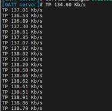

**要求：两台SG368Z**

 

**一、DEVICE A**：

（1）加载蓝牙

```
mount -o remount rw /
sleep 0.5
echo 0 > /sys/class/rfkill/rfkill0/state
echo 0 > /proc/bluetooth/sleep/btwrite
sleep 0.5
echo 1 > /sys/class/rfkill/rfkill0/state
echo 1 > /proc/bluetooth/sleep/btwrite
sleep 0.5
rmmod hci_uart
sleep 0.5
insmod /usr/lib/modules/hci_uart.ko
sleep 0.5
killall rtk_hciattach
sleep 0.5
rtk_hciattach -n -s 115200 ttyS1 rtk_h5 &
```


 General setup  --->

       [ ] POSIX Message Queues  -> [*] POSIX Message Queues 

（2）设置连接间隔（如果不支持扩展数据长度，可以设置最小值6，如果支持扩展长度，范围6~24都可以试一下，试过18最快。）

echo 6 > /sys/kernel/debug/bluetooth/hci0/conn_min_interval

echo 6 > /sys/kernel/debug/bluetooth/hci0/conn_max_interval

（3）开广播

```
/usr/libexec/bluetooth/bluetoothd -n &

bluetoothctl power on
sleep 2
bluetoothctl power off
sleep 1
hciconfig hci0 down
sleep 1
btmgmt -i hci0 name "Quec_TP1"
sleep 0.5
btmgmt -i hci0 connectable on
sleep 0.5
btmgmt -i hci0 advertising on
sleep 0.5
btmgmt -i hci0 le on
sleep 0.5
btmgmt -i hci0 power on
```


（4）运行gatt server

btgatt-server -r -m 517 -i hci0

  insmod /usr/lib/modules/rtk_btusb.ko

**二、DEVICE B:**

（1）加载蓝牙

```
mount -o remount rw /
sleep 0.5
echo 0 > /sys/class/rfkill/rfkill0/state
echo 0 > /proc/bluetooth/sleep/btwrite
sleep 0.5
echo 1 > /sys/class/rfkill/rfkill0/state
echo 1 > /proc/bluetooth/sleep/btwrite
sleep 0.5
rmmod hci_uart
sleep 0.5
insmod /usr/lib/modules/hci_uart.ko
sleep 0.5
killall rtk_hciattach
sleep 0.5
rtk_hciattach -n -s 115200 ttyS1 rtk_h5 &
```


（3）启用连接

```
/usr/libexec/bluetooth/bluetoothd -n &

bluetoothctl power on
sleep 2
bluetoothctl power off
sleep 1
hciconfig hci0 down
sleep 1
btmgmt -i hci0 name "Quec_TP2"
sleep 0.5
btmgmt -i hci0 connectable on
sleep 0.5
btmgmt -i hci0 le on
sleep 0.5
btmgmt -i hci0 power on
```

40B7FCAD2D78

（3）运行gatt client

btgatt-client -d 6B:C1:B5:D6:D8:44 -m 517 (MAC地址为**PC A** 蓝牙地址，可通过hciconfig查看)

（4）输入测试数据

send_img -w 0x0012 /data/test.png

send_img -w 0x0012 /data/bt_capture.pcm

send_img -w 0x0012 /data/123.jpg

send_img -s 0x0012 /data/123.jpg


write-value -w 0x0012 0x11 0x12 0x13 0x11 0x12 0x13 0x11 0x12 0x13 0x11 0x12 0x13 0x11 0x12 0x13 0x11 0x12 0x13 0x11 0x12 0x13 0x11 0x12 0x13 0x11 0x12 0x13 0x11 0x12 0x13 0x11 0x12 0x13 0x11 0x12 0x13 0x11 0x12 0x13 0x11 0x12 0x13 0x11 0x12 0x13 0x11 0x12 0x13 0x11 0x12 0x13 0x11 0x12 0x13 0x11 0x12 0x13 0x11 0x12 0x13 0x11 0x12 0x13 0x11 0x12 0x13 0x11 0x12 0x13 0x11 0x12 0x13 0x11 0x12 0x13 0x11 0x12 0x13 0x11 0x12 0x13 0x11 0x12 0x13 0x11 0x12 0x13 0x11 0x12 0x13 0x11 0x12 0x13 0x11 0x12 0x13 0x11 0x12 0x13 0x11 0x12 0x13 0x11 0x12 0x13 0x11 0x12 0x13 0x11 0x12 0x13 0x11 0x12 0x13 0x11 0x12 0x13 0x11 0x12 0x13 0x11 0x12 0x13 0x11 0x12 0x13 0x11 0x12 0x13 0x11 0x12 0x13 0x11 0x12 0x13 0x11 0x12 0x13 0x11 0x12 0x13 0x11 0x12 0x13 0x11 0x12 0x13 0x11 0x12 0x13 0x11 0x12 0x13 0x11 0x12 0x13 0x11 0x12 0x13 0x11 0x12 0x13 0x11 0x12 0x13 0x11 0x12 0x13 0x11 0x12 0x13 0x11 0x12 0x13 0x11 0x12 0x13 0x11 0x12 0x13 0x11 0x12 0x13 0x11 0x12 0x13 0x11 0x12 0x13 0x11 0x12 0x13 0x11 0x12 0x13 0x11 0x12 0x13 0x11 0x12 0x13 0x11 0x12 0x13 0x11 0x12 0x13 0x11 0x12 0x13 0x11 0x12 0x13 0x11 0x12 0x13 0x11 0x12 0x13 0x11 0x12 0x13 0x11 0x12 0x13 0x11 0x12 0x13 0x11 0x12 0x13 0x11 0x12 0x13 0x11 0x12 0x13 0x11 0x12 0x13 0x11 0x12 0x13 0x11 0x12 0x13 0x11 0x12 0x13 0x11 0x12 0x13 0x11 0x12 0x13 0x11 0x12 0x13 0x11 0x12 0x13 0x11 0x12 0x13 0x11 0x12 0x13 0x11 0x12 0x13 0x11 0x12 0x13 0x11 0x12 0x13 0x11 0x12 0x13 0x11 0x12 0x13 0x11 0x12 0x13 0x11 0x12 0x13 0x11 0x12 0x13 0x11 0x12 0x13 0x11 0x12 0x13 0x11 0x12 0x13 0x11 0x12 0x13 0x11 0x12 0x13 0x11 0x12 0x13 0x11 0x12 0x13 0x11 0x12 0x13 0x11 0x12 0x13 0x11 0x12 0x13 0x11 0x12 0x13 0x11 0x12 0x13 0x11 0x12 0x13 0x11 0x12 0x13 0x11 0x12 0x13 0x11 0x12 0x13 0x11 0x12 0x13 0x11 0x12 0x13 0x11 0x12 0x13 0x11 0x12 0x13 0x11 0x12 0x13 0x11 0x12 0x13 0x11 0x12 0x13 0x11 0x12 0x13 0x11 0x12 0x13 0x11 0x12 0x13 0x11 0x12 0x13 0x11 0x12 0x13 0x11 0x12 0x13 0x11 0x12 0x13 0x11 0x12 0x13 0x11 0x12 0x13 0x11 0x12 0x13 0x11 0x12 0x13 0x11 0x12 0x13 0x11 0x12 0x13 0x11 0x12 0x13 0x11 0x12 0x13 0x11 0x12 0x13 0x11 0x12 0x13 0x11 0x12 0x13 0x11 0x12 0x13 0x11 0x12 0x13 0x11 0x12 0x13 0x11 0x12 0x13 0x11 0x12 0x13 0x11 0x12 0x13 0x11 0x12 0x13 0x11 0x12 0x13 0x11 0x12 0x13 0x11 0x12 0x13 0x11 0x12 0x13 0x11 0x12 0x13 0x11 0x12 0x13 0x11 0x12 0x13 0x11 0x12 0x13 0x11 0x12 0x13 0x11 0x12 0x13 0x11 0x12 0x13 0x11 0x12 0x13 0x11 0x12 0x13 0x11 0x12 0x13 0x11 0x12 0x13 0x11 0x12 0x13 0x11 0x12 0x13 0x11 0x12 0x13 0x11 0x12 0x13 0x11 0x12 

 

**三、****获取BLE****传输速率：**

Server端可显示速率



 

**四、2M PHY**设置方法：

**server**和client连接成功后

```
PC A设置2M PHY：（标注部分参考handle填充，如24为0x18 0x00; 10为0x0a 0x00）
#hcitool con
Connections:	
        < LE 90:A6:BF:E3:97:8E handle 8 state 1 lm CENTRAL
#hcitool cmd 0x08 0x32 0x18 0x00 0x00 0x02 0x02 0x0 0x0
PC B设置2M PHY：（标注部分参考handle填充，如16为0x10 0x00; 10为0x0a 0x00）
#hcitool con
Connections:	
        < LE 90:A6:BF:E3:97:8E handle 10 state 1 lm CENTRAL
#hcitool cmd 0x08 0x32 0x10 0x00 0x00 0x02 0x02 0x0 0x0
```


 确认是否生效方法：

执行btmon后，如果PC A/B分别设置2M PHY以后，会出现如下log。

 ```
 dbtmon 
 @ RAW Open: hcitool (privileged) version 2.22                                                                                                                                   {0x0002} 2194.064528
 < HCI Command: LE Set PHY (0x08|0x0032) plen 7                                                                                                                                      #253 2194.064604
         Handle: 16 Address: 90:A6:BF:E3:97:8E (OUI 90-A6-BF)
         All PHYs preference: 0x00
         TX PHYs preference: 0x02
           LE 2M
         RX PHYs preference: 0x02
           LE 2M
         PHY options preference: Reserved (0x0000)
 > HCI Event: Command Status (0x0f) plen 4                                                                                                                                           #254 2194.069285
       LE Set PHY (0x08|0x0032) ncmd 1
         Status: Success (0x00)
 > HCI Event: LE Meta Event (0x3e) plen 6                                                                                                                                            #255 2194.069287
       LE PHY Update Complete (0x0c)
         Status: Success (0x00)
         Handle: 16 Address: 90:A6:BF:E3:97:8E (OUI 90-A6-BF)
         TX PHY: LE 2M (0x02)
         RX PHY: LE 2M (0x02)
 @ RAW Close: hcitool                                                                                                                                                            {0x0002} 2194.069393
 ```


 

 