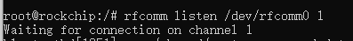
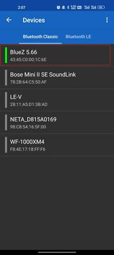
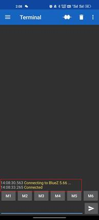
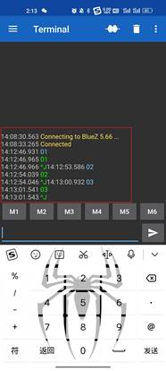
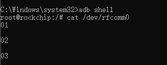
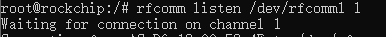

```shell
#realtek
mount -o remount rw /
/etc/init.d/S50pipewire start
sleep 0.5
echo 0 > /sys/class/rfkill/rfkill0/state
echo 0 > /proc/bluetooth/sleep/btwrite
sleep 0.5
echo 1 > /sys/class/rfkill/rfkill0/state
echo 1 > /proc/bluetooth/sleep/btwrite
sleep 0.5
insmod /usr/lib/modules/hci_uart.ko
sleep 0.5
rtk_hciattach -n -s 115200 ttyS1 rtk_h5 &


#加载蓝牙守护进程，这里要加-C这个参数，不然后面会报错：
/usr/libexec/bluetooth/bluetoothd -n -C &

hciconfig hci0 up

#查询当前蓝牙服务：
sdptool browse local

#添加spp服务：
#执行
sdptool add SP #出现Serial Port service registered，表示已经添加成功

#进入bluetoothctl配对手机：
bluetoothctl
power on
scan on
scan off
pair XX:XX:XX:XX:XX:XX
```


然后退出bluetoothctl，执行rfcomm listen /dev/rfcomm0 1，如果已被使用，则执行rfcomm release 0(执行该命令会有数据回显，既手机收到开发板发来的相同数据，若要关闭回显需要加上参数-r，开启raw mode)



手机上打开Serial Bluetooth Terminal，左上角设置—>Devices,选择开发板



 

新建一个adb窗口，读取端口数据，手机发送数据以后，可以在终端读到

cat /dev/rfcomm0

 

 

如果需要连接多设备：

可以新建一个adb窗口，再配对第二个手机

bluetoothctl

scan on

scan off

pair XX:XX:XX:XX:XX:XX

然后退出bluetoothctl，执行rfcomm listen /dev/rfcomm1 1



然后打开第二个手机的Serial Bluetooth Terminal连接开发板，连接完成以后通过命令cat /dev/rfcomm1可以看到手机测发来的数据