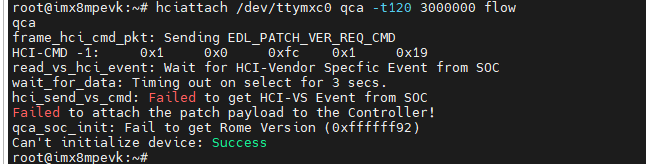
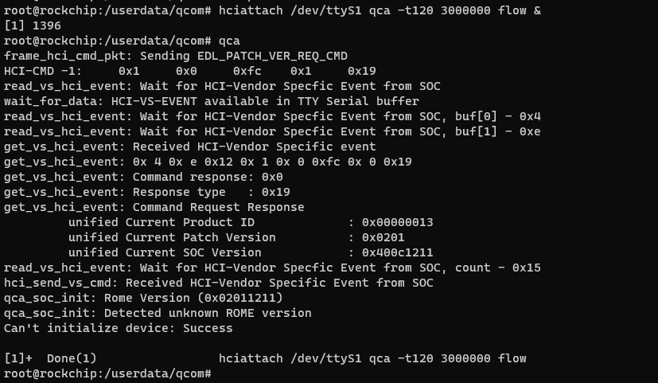
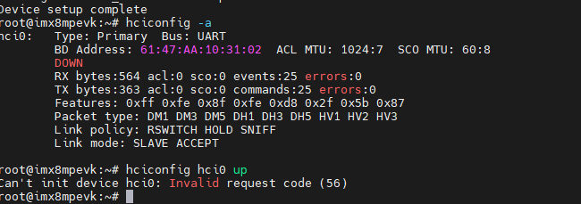
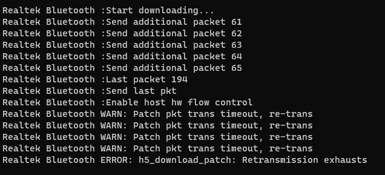
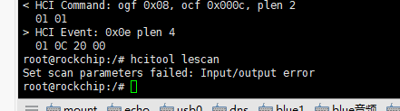

# 接口不通，响应超时

一般是模组问题引起，换一块模组尝试一下

# 高通patch未合入，芯片型号不识别

# Can't init device hci0: Invalid request code (56)

ubuntu 内核版本问题，从5.15换到5.4后解决

# bluetooth挂了

Failed to set power off: org.freedesktop.DBus.Error.NoReply

bluez 编译报错 ell

## Can't init device hci0: Operation not permitted (1)

hciconfig hci0 up使用这个报错

需要加sudo 权限

## Realtek Bluetooth ERROR: h5_download_patch: Retransmission exhausts

在EC20 852R陪测版本遇到，固件版本问题，更新固件后解决。

## Set scan parameters failed: Input/output error

执行 hcitool cmd 0x03 0x0003 可解决

