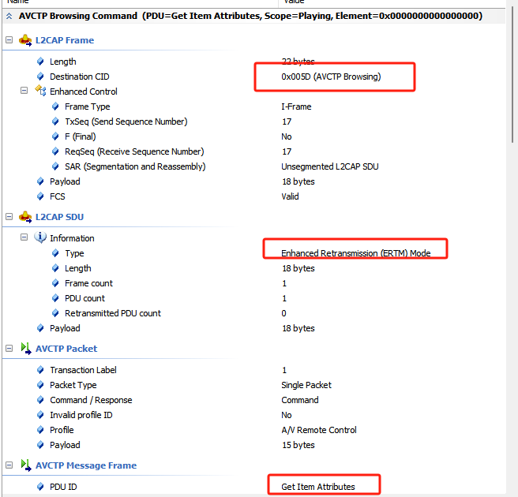

项目上遇到了一个播放音乐断连问题，记录一下

linux内核版本是4.19，偏低

bluez为5.66

在播放一段时间音乐后，就会出现断连甚至系统崩溃的现象，查看btsnoop，获取歌词信息就是通过AVCTP Browsing channel获取的，这个L2CAP ERTM模式，ERTM模式在linux 4.19上稳定导致的这个问题，代码里面改一下这个模式就行。




修改方案：

方案1：会出现没歌词的情况

```c
---
 profiles/audio/avctp.c |  5 +++--
 profiles/audio/avrcp.c | 12 ++++++------
 2 files changed, 9 insertions(+), 8 deletions(-)

diff --git a/profiles/audio/avctp.c b/profiles/audio/avctp.c
index 6f64f162b..12a998212 100644
--- a/profiles/audio/avctp.c
+++ b/profiles/audio/avctp.c
@@ -1651,8 +1651,9 @@ int avctp_register(struct btd_adapter *adapter, bool central, bool *browsing)
 		return -1;
 	}
 
-	server->browsing_io = avctp_server_socket(src, central, BT_IO_MODE_ERTM,
-							AVCTP_BROWSING_PSM);
+	//server->browsing_io = avctp_server_socket(src, central, BT_IO_MODE_ERTM,
+	//						AVCTP_BROWSING_PSM);
+	server->browsing_io = NULL;
 	if (browsing)
 		*browsing = server->browsing_io ? true : false;
 
diff --git a/profiles/audio/avrcp.c b/profiles/audio/avrcp.c
index 80f34c7a7..86929440d 100644
--- a/profiles/audio/avrcp.c
+++ b/profiles/audio/avrcp.c
@@ -4162,10 +4162,10 @@ static void target_init(struct avrcp *session)
 	if (session->controller == NULL)
 		avrcp_get_capabilities(session);
 
-	if (!(target->features & AVRCP_FEATURE_BROWSING))
-		return;
+	// if (!(target->features & AVRCP_FEATURE_BROWSING))
+	// 	return;
 
-	avrcp_connect_browsing(session);
+	// avrcp_connect_browsing(session);
 }
 
 static void controller_init(struct avrcp *session)
@@ -4200,10 +4200,10 @@ static void controller_init(struct avrcp *session)
 	if (controller->version < 0x0104)
 		return;
 
-	if (!(controller->features & AVRCP_FEATURE_BROWSING))
-		return;
+	// if (!(controller->features & AVRCP_FEATURE_BROWSING))
+	// 	return;
 
-	avrcp_connect_browsing(session);
+	// avrcp_connect_browsing(session);
 }
 
 static void session_init_control(struct avrcp *session)
-- 
2.25.1


```

方案2，基于没歌词优化把BT_IO_MODE_ERTM这个模式改为BT_IO_MODE_BASIC

```c
int avctp_register(struct btd_adapter *adapter, bool central, bool *browsing)
{
	...
-	server->browsing_io = avctp_server_socket(src, central, BT_IO_MODE_ERTM,
-							AVCTP_BROWSING_PSM);
+	server->browsing_io = avctp_server_socket(src, central, BT_IO_MODE_BASIC,
+							AVCTP_BROWSING_PSM);
	...
}


int avctp_connect_browsing(struct avctp *session)
{
...
	io = bt_io_connect(avctp_connect_browsing_cb, session, NULL, &err,
		BT_IO_OPT_SOURCE_BDADDR, src,
		BT_IO_OPT_DEST_BDADDR,
		device_get_address(session->device),
		BT_IO_OPT_SEC_LEVEL, BT_IO_SEC_MEDIUM,
		BT_IO_OPT_PSM, AVCTP_BROWSING_PSM,
		BT_IO_OPT_MODE, BT_IO_MODE_BASIC, 
		BT_IO_OPT_INVALID);    //  BT_IO_MODE_ERTM改为BT_IO_MODE_BASIC
...
}
```

L2CAP 一共有记下几个操作模式
• Basic L2CAP Mode（(equivalent to L2CAP specification in Bluetooth v1.1) 默认模式， 在未选择
其他模式的情况下， 用此模式。
• Flow Control Mode， 此模式下不会进行重传， 但是丢失的数据能够被检测到， 并报告丢失。
• Retransmission Mode， 此模式确保数据包都能成功的传输给对端设备。
• Enhanced Retransmission Mode， 此模式和重传模式类似， 加入了 Poll-bit 等提高恢复效率。
• Streaming Mode， 此模式是为了真实的实时传输， 数据包被编号但是不需要 ACK 确认。 设
定一个超时定时器， 一旦定时器超时就将超时数据冲掉。
• LE Credit Based Flow Control Mode， 被用于 LE 设备通讯。
• Enhanced Credit BasedFlow Control Mode  


