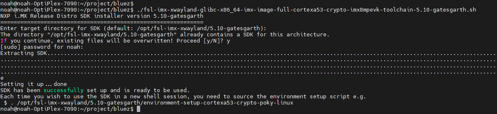
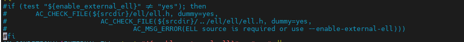

# imx8 bluez移植

## 交叉编译环境

需要下载 fsl-imx-xwayland-glibc-x86_64-imx-image-full-cortexa53-crypto-imx8mpevk-toolchain-5.10-gatesgarth.sh 

执行./ fsl-imx-xwayland-glibc-x86_64-imx-image-full-cortexa53-crypto-imx8mpevk-toolchain-5.10-gatesgarth.sh

完成后执行

. /opt/fsl-imx-xwayland/5.10-gatesgarth/environment-setup-cortexa53-crypto-poky-linux

或者

`source /opt/fsl-imx-xwayland/5.10-gatesgarth/environment-setup-cortexa53-crypto-poky-linux`

## bluez编译

有bluez芯片平台patch需要先合入patch。

在bluez目录下执行。

./bootstrap-configure --disable-android --disable-midi --prefix=$PWD/out --host=aarch64-poky-linux CC=aarch64-poky-linux-gcc CFLAGS="--sysroot=/opt/fsl-imx-xwayland/5.10-gatesgarth/sysroots/cortexa53-crypto-poky-linux"

这里可能会ell编译报错，我们直接把报错的地方给屏蔽。

vim configure.ac

make & sudo make install  (这里不使用sudo 可能会报错)。

## bluez移植

make install成功后，把out目录直接copy到imx8上。

把对应的firmware copy到对应目录。

运行

./hciattach /dev/ttymxc0 bcm43xx -t120 3000000 flow

hciattach /dev/ttyS1 qca -t120 3000000 flow

进入bluetoothctl界面，开启蓝牙。

