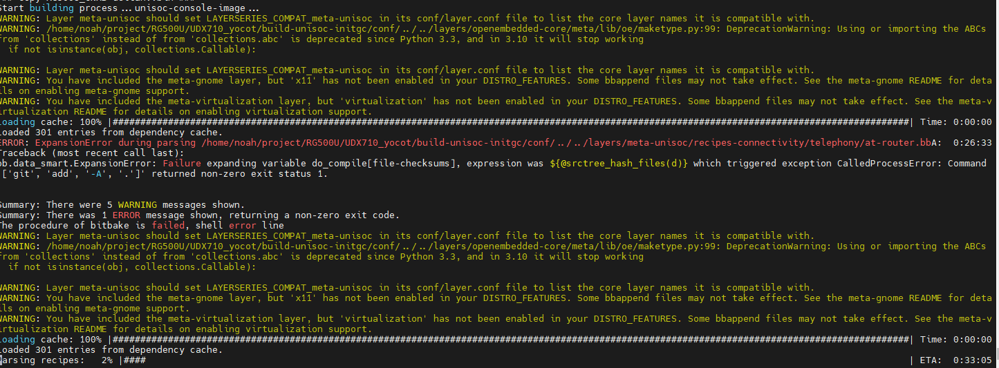

```
Traceback (most recent call last):
bb.data_smart.ExpansionError: Failure expanding variable do_compile[file-checksums], expression was ${@srctree_hash_files(d)} which triggered exception CalledProcessError: Command '['git', 'add', '-A', '.']' returned non-zero exit status 1.

```




尝试了执行 git add -A .不行