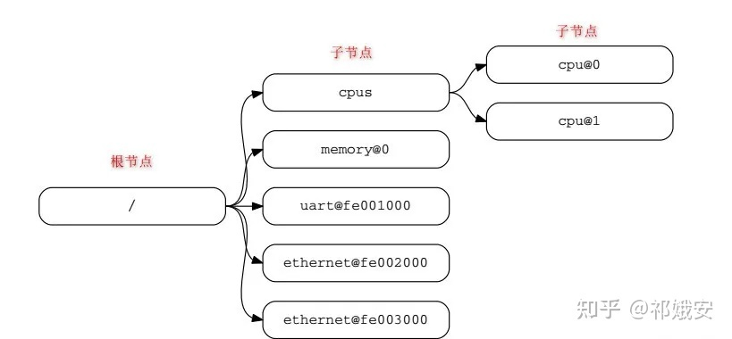

# Linux设备树

设备树是一种描述硬件的数据结构，，它起源于 OpenFirmware (OF)。在Linux 2.6中，ARM架构的板极硬件细节过多地被硬编码在arch/arm/plat-xxx和arch/arm/mach-xxx，采用Device Tree后，许多硬件的细节可以直接透过它传递给Linux，而不再需要在kernel中进行大量的冗余编码。
Device Tree由一系列被命名的结点（node）和属性（property）组成，而结点本身可包含子结点。所谓属性，其实就是成对出现的name和value。在Device Tree中，可描述的信息包括（原先这些信息大多被hard code到kernel中）：

- CPU的数量和类别
- 内存基地址和大小
- 总线和桥
- 外设连接
- 中断控制器和中断使用情况
- GPIO控制器和GPIO使用情况
- Clock控制器和Clock使用情况

# Device Tree组成和结构

整个Device Tree牵涉面比较广，即增加了新的用于描述设备硬件信息的文本格式，又增加了编译这一文本的工具，同时Bootloader也需要支持将编译后的Device Tree传递给Linux内核。

## DTS (device tree source)

.dts文件是一种ASCII 文本格式的Device Tree描述，此文本格式非常人性化，适合人类的阅读习惯。基本上，在ARM Linux在，一个.dts文件对应一个ARM的machine，一般放置在内核的arch/arm/boot/dts/目录。由于一个SoC可能对应多个machine（一个SoC可以对应多个产品和电路板），势必这些.dts文件需包含许多共同的部分，Linux内核为了简化，把SoC公用的部分或者多个machine共同的部分一般提炼为.dtsi，类似于C语言的头文件。其他的machine对应的.dts就include这个.dtsi。譬如，对于VEXPRESS而言，vexpress-v2m.dtsi就被vexpress-v2p-ca9.dts所引用， vexpress-v2p-ca9.dts有如下一行：
/include/ "vexpress-v2m.dtsi"
当然，和C语言的头文件类似，.dtsi也可以include其他的.dtsi，譬如几乎所有的ARM SoC的.dtsi都引用了skeleton.dtsi。

```c

#include <dt-bindings/gpio/gpio.h>
#include <dt-bindings/pwm/pwm.h>
#include <dt-bindings/pinctrl/rockchip.h>
#include <dt-bindings/input/rk-input.h>
#include <dt-bindings/display/drm_mipi_dsi.h>
#include <dt-bindings/sensor-dev.h>
#include <dt-bindings/display/media-bus-format.h>

/ {
    ...
    wireless_wlan: wireless-wlan {
        compatible = "wlan-platdata";
        rockchip,grf = <&grf>;
        clocks = <&rk809 1>;
        clock-names = "clk_wifi";
        wifi_chip_type = "rtl8821cs";
        status = "disabled";
    };

    wireless_bluetooth: wireless-bluetooth {
        compatible = "bluetooth-platdata";
        clocks = <&rk809 1>;
        clock-names = "ext_clock";
        //wifi-bt-power-toggle;
        uart_rts_gpios = <&gpio2 RK_PB5 GPIO_ACTIVE_LOW>;
        pinctrl-names = "default", "rts_gpio";
        pinctrl-0 = <&uart1m0_rtsn>;
        pinctrl-1 = <&uart1_gpios>;
        BT,reset_gpio    = <&gpio0 RK_PC5  GPIO_ACTIVE_HIGH>;
    //  BT,wake_gpio     = <&gpio3 RK_PA1 GPIO_ACTIVE_HIGH>;
    //  BT,wake_host_irq = <&gpio3 RK_PA2 GPIO_ACTIVE_HIGH>;
        status = "disabled";
    };
...

```

## 设备节点

在设备树中节点命名格式如下：

```text
node-name@unit-address
```

**node-name：**是设备节点的名称，为ASCII字符串，节点名字应该能够清晰的描述出节点的功能，比如“uart1”就表示这个节点是UART1外设；**unit-address：**一般表示设备的地址或寄存器首地址，如果某个节点没有地址或者寄存器的话 “unit-address” 可以不要；注：根节点没有node-name 或者 unit-address，它被定义为 /。

设备节点的例子如下图：



**cpu 和 ethernet依靠不同的unit-address 分辨不同的CPU；可见，node-name相同的情况下，可以通过不同的unit-address定义不同的设备节点。**

### **设备节点的标准属性**

#### **2.2.1.1 compatible 属性**

compatible 属性也叫做 “兼容性” 属性，这是非常重要的一个属性！compatible 属性的值是一个字符串列表， compatible 属性用于将设备和驱动绑定起来。字符串列表用于选择设备所要使用的驱动程序。compatible 属性值的推荐格式：

```text
"manufacturer,model"
```

- ① manufacturer : 表示厂商；
- ② model : 一般是模块对应的驱动名字。

例如：

```text
compatible = "fsl,mpc8641", "ns16550";
```

上面的compatible有两个属性，分别是 "fsl,mpc8641" 和 "ns16550"；其中 "fsl,mpc8641" 的厂商是 fsl；设备首先会使用第一个属性值在 Linux 内核里面查找，看看能不能找到与之匹配的驱动文件；

如果没找到，就使用第二个属性值查找，以此类推，直到查到到对应的驱动程序 或者 查找完整个 Linux 内核也没有对应的驱动程序为止。

> 注：一般驱动程序文件都会有一个 OF 匹配表，此 OF 匹配表保存着一些 compatible 值，如果设备节点的 compatible 属性值和 OF 匹配表中的任何一个值相等，那么就表示设备可以使用这个驱动。


