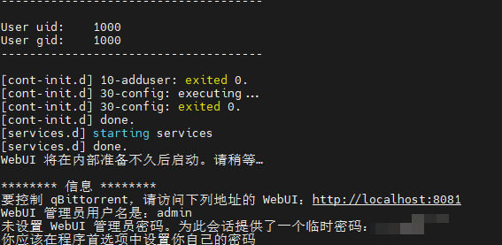

## docker常用命令

docker start jellyfin   # 启动名为 jellyfin 的容器
docker stop jellyfin    # 停止名为 jellyfin 的容器
docker rm jellyfin      # 删除名为 jellyfin 的容器
docker ps               # 查看当前正在运行的容器
docker ps -a            # 查看所有容器，包括已停止的


## 种子下载

ubuntu部署qbittorrent 

```sh
docker run  -itd \
    --name=qbittorrentee  \
    -e WEBUIPORT=8081  \
    -e PUID=1000 \
    -e PGID=1000 \
    -e TZ=Asia/Shanghai \
    -p 6881:6881  \
    -p 6881:6881/udp  \
    -p 8081:8081  \
    -v /home/badogyang/project/docker/config  \
    -v /home/badogyang/Downloads  \
    --restart unless-stopped  \
    superng6/qbittorrentee:latest
    
# 运行起来后通过下面这条命令看密码
docker logs -f qbittorrentee

```



badogyang 密码常用


## 家庭影院：jellyfin

二、配置 Jellyfin
打开控制台，输入以下指令拉取 Jellyfin 镜像到本地：

docker pull jellyfin/jellyfin

在控制台执行以下指令，运行一个 Jellyfin 容器：

```
docker run -d  \
	--name=jellyfin \
	-p 8096:8096 \
	-p 8920:8920 \
	-v /srv/jellyfin/config:/config \
	-v /srv/jellyfin/cache:/cache \
	-v /home/badogyang/media:/media \
	--restart unless-stopped \
	linuxserver/jellyfin:latest
```


