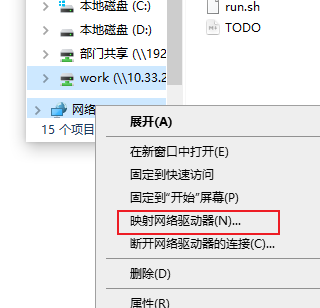

# samba 服务器配置

## 配置Samba后可以直接在window操作linux文件

  31 sudo apt-get install samba

  32 samba

  33 sudo cp /etc/samba/smb.conf /etc/samba/smb.conf.bak

  34 ls /etc/samba

  35 sudo vim /etc/samba/smb.conf

​    在最后加上

```
[work]
  comment = samba home directory
  path = /home/noah/
  public = yes
  browseable = yes
  public = yes
  writeable = yes
  read only = no
  valid users = noah
  create mask = 0777
  directory mask = 0777
  \#force user = nobody
  \#force group = nogroup
  available = yes
```

  36 sudo smbpasswd -a noah(用户名)

  37 sudo service smbd restart

  38 ifconfig  查看ip地址

## 映射网络驱动器



