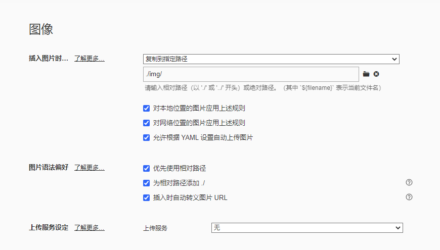

# realtek

```
rtwpriv wlan0 bt_efuse_file /home/root/8723ds_bt.map
rtwpriv wlan0 efuse_bt_mask /home/root/RTL8723DS_bt_efuse_mask.mask    


```


# GIT


```shell
刘晓丽 9-27 19:49:31
git stash 暂时保存本地修改
git pull --rebase 更新服务器最新代码
git stash pop 将本地修改与服务器最新代码合并
git add . (点表示添加所有修改 或者只添加对应的文件 只复制对应的文件)
git commit  添加提交信息 （git commit -s -m "bugID:xin.yang_apk_Bluetooth_fix:描述"）
git branch -a 查看当前在的分支 
git push origin HEAD:refs/for/分支  推送到服务器（git push origin HEAD:refs/for/sprdr_int）

 git push -u origin master #推送远程分支

刘晓丽 9-27 19:50:54
git log  或者 git log -2 (数字表示最近的几次提交) 查看提交记录
git reset --soft commitid 回退到commiid的那次提交 

刘晓丽 9-27 20:16:29
git commit --amend 


git commit -s -m "KGWKF-601:xin.yang_apk_Settings_fix:【重庆团队】【KG5K】【Bluetooth】更多连接方式菜单的二级小标题下蓝牙未翻译"
```


# ADB

``` shell
adb shell dumpsys activity activities  #查看当前运行Activity

adb shell dumpsys window w |findstr \/ |findstr name=   #当前应用包名

adb shell "dumpsys window | grep mCurrentFocus"

adb disable-verity

adb shell rm /product/app/DtsAudio/DtsAudio.apk

adb shell pm list packages -f | grep  com.transsion.dtsaudio   # 定位文件

 adb shell pm disable-user com.transsion.dtsaudio   # 禁用
 
 adb pull /data/misc/bluetooth/logs   # HCIlog
```


## bash

```bash
find . -name "*.java" |  xargs grep "OS_Theme_Light_Dialog_Alert"

tar -xvf * # x为解压 c为压缩
grep -r "" ./  # 查找当前目录下的符合""的文件内容

./hciattach /dev/ttymxc0 bcm43xx -t120 3000000 flow

ssh-keygen -R 10.33.12.195  #更新ssh

当前行：

:s/foo/bar/g
全文：

:%s/foo/bar/g
选区，在Visual模式下选择区域后输入:，Vim即可自动补全为 :'<,'>。

:'<,'>s/foo/bar/g
2-11行：

:5,12s/foo/bar/g

  15  insmod /lib/modules/5.4.70-2.3.0+g4f2631b/extra/qca2066/wlan.ko
   16  ls
   17  ifconfig
   18  hostapd_cli status
   19  killall hostapd
   20  hostapd -B /etc/wifi/hostapd-wlan1.conf
   21  udhcpd -Sf /etc/udhcpd.conf &
   22  ifconfig wlan0 192.168.0.1
   23  udhcpd -Sf /etc/udhcpd.conf &
   
   26  hostapd_cli status
   
   
   ldconfig -p | grep lib_name  #快速查找库文件
   
   ./quecdiag UDT=yes PORT=2390 IOType=SERIAL QDARTIOType=ethernet BT-DEVICE=/dev/ttymxc0 BT-BAUDRATE=115200
   uuu_imx_android_flash.bat -f imx8mp -a -e -u trusty-dual
   
#1、加载驱动：
insmod /lib/modules/5.4.70-2.3.0+g4f2631b/extra/qca2066/wlan.ko country_code=CN
2、修改wpa_supplicant.conf如下参数（连接开放热点）：
network={
#Open
        ssid="WiFiLab-AP-test"  //WiFi热点名
        key_mgmt=NONE
}
#3、开启STA模式： 连接热点
wpa_supplicant -Dnl80211 -i wlan0 -c /etc/wifi/wpa_supplicant.conf -B -dd -f /tmp/wpa.log & 
udhcpc -i wlan0 &  //分配IP

#4、开启iperf

> /tmp/iperf.log & //建议将打印结果写入文件中

#5、手机连接打流没问题后可以开启蓝牙功能 
   
#刷机
./imx-make.sh -j8 2>&1 | tee build-log.txt
uuu_imx_android_flash.bat -f imx8mp -a -e -u trusty-dual

```


# 资源服务器

## **展锐**

展讯CRP 相关

网址： http://spcss.unisoc.com:2008/cqweb/

账号：Quectel_WiFi

密码：QFzb8hL6%k


CQ User Name: quectel_wifi
New Password: $IBumYcAZn6I3Nnfb*9u

isupport系统


网址： https://unisupport.unisoc.com/file/index?fileid=28853
账号：Quectel_Wifi
密码： Quectel_WIFI


展讯FTP

访问地址：sftp://ftp.unisoc.com

账号：Quectel_WiFi

密码：34G10N2v

01010a28000000ffff0000


## **高通**

https://support-qualcomm.force.com/s/case/5004V00001G6wg1QAB/af20qca6564a-how-to-use-bt-wake-host?tabset-f6ef8=eef4b

[Cases (force.com)](https://support-qualcomm.force.com/s/case/Case/Default)

账号：[qingzong.ma@quectel.com](qingzong.ma@quectel.com)

密码：Quectel12345678


## **gerrit**

http://192.168.23.98:8888/

[QCOM9X07_EC20_FCS940R · Gerrit Code Review](http://192.168.23.98:8888/admin/repos/QCOM9X07_EC20_FCS940R)

noah.yang

Xj/ZXM2cpn3yELDNsjlIDX+RZN4qplItKlFuELiV4A


 Signed-off-by: noah.yang <noah.yang@quectel.com>


git push origin HEAD:refs/for/master

ssh://192.168.23.98:39418/Yocto


## CYW

https://sso.infineon.com/as/authorization.oauth2?client_id=CaseManagementPortalProd&redirect_uri=https%3A%2F%2Fmycases.infineon.com%2Fsignin-oidc-callback&response_type=code&scope=openid%20profile%20email%20address&state=OpenIdConnect.AuthenticationProperties%3DX07PmfF-b5QAbNdA6IKt89v8dICtLiugQZk-gfAeezP-lk6udzzhq87xh_fuMxeBA4FKMr3kufy_b-NjkFqj8QZo9aOdiCfs0P2IqvRnBn1soOUF7KnyYxHKfo11nAfGYAS7cAoykFSkpZw0v17FvTTZc1cOIh2B8nZlf_YrdO19LQTcpd5YES3-lz0MSg9Fsw-9id_G3gW9nWlyXIY9yhpD7rvYFRrdJ9reRsyRugxt1R6r8ttOsSsy_nhfwCWTWce-ON6qsz2QAHEGTu8_zbXZW1oRPFddZmq_Mhm-zc3WSae2AMWYV8C5VlDwTStny-taq2e9FCCRISzoiFi825tdz4jcmcUxENQVeRLUyQwq3o4LSrXbSzWwyvCTq8Fi&nonce=638133512644696421.ZjIyNmNkNGYtZjYyMy00MGVhLThiMTAtMmNmMDc3ODk2NmE4NDBhOTA0OTgtYzE3Yy00NzlhLWEzMWItZTAzMTY0OWRlODk1&ui_locales=en-US&x-client-SKU=ID_NET461&x-client-ver=5.3.0.0


[Home  · Customer Self-Service (infineon.com)](https://mycases.infineon.com/)

zhongjun.yu@quectel.com
Quectel&4482


NXP 

asdfG520!!!


http://192.168.25.198:8001/Pages/WarehouseManagement/InWarehouseTable.aspx

用户名 ：研发    密码：123456


# realtek

https://anchor.realtek.com/File2

Account： macky.xu@quectel.com
Password:  Quectel@123


## 设备mac

 E0:9D:FA:10:24:5F XE27

44:71:47:1f:ea:b4

74:15:75:30:9b:5d   YT

00:1A:7D:DA:71:11 dongle


## start.sh

echo 503 > /sys/class/gpio/export 
echo out > /sys/class/gpio/gpio503/direction
echo 0 > /sys/class/gpio/gpio503/value
echo 1 > /sys/class/gpio/gpio503/value


echo 22 > /sys/class/gpio/export
echo 23 > /sys/class/gpio/export

echo out > /sys/class/gpio/gpio22/direction

echo out > /sys/class/gpio/gpio23/direction

echo 0 > /sys/class/gpio/gpio22/value

echo 0 > /sys/class/gpio/gpio23/value

  54 cd expo
  55 cd gpio22/
  56 echo out > /sys/class/gpio/gpio22/direction
  57 cat direction
  58 cat value
  59 echo 0 > value
  60 cat value
  61 cd ../gpio23
  62 echo out >direction
  63 cat direction
  64 cat value
  65 echo 0 > value


fc66e-a-2rf  fc66e-b-3rf  fc80a  fc900e  fc905a


    [noah.yang][FC905A]: FC905A test for BT
    <Change Type>: FC905A for test
    <Root Cause>:
    <Jira ID>: STBTWIFI-1321
    <RN Content>: N
    
    <<< Test Notes >>>
    <Test-Proposal>: N
    <Stress-Test>: N


将bin文件转化为nvm:

NvmUtility.py htnv32.bin -o htnv32.nvm

将nvm转化为bin: 

NvmUtility.py –BT htnv32.nvm -o htnv32.bin


sed -i 's/IO_ftrylockfile/IO_EOF_SEEN/' lib/*.c 

echo "#define _IO_IN_BACKUP 0x100" >> lib/stdio-impl.h


source oe-core/build/conf/set_bb_env.sh
bitbake -c compile -f -v linux-quic




