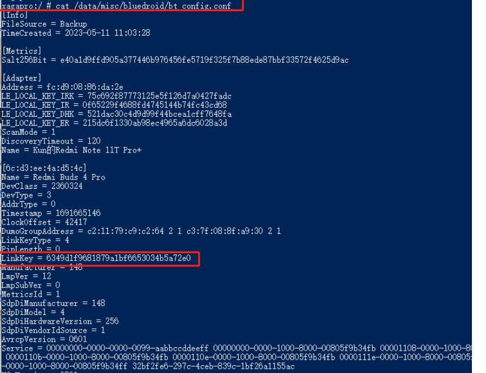

# 啥都记


## RK3568

```
--- a/kernel/arch/arm64/configs/rockchip_linux_defconfig
+++ b/kernel/arch/arm64/configs/rockchip_linux_defconfig
@@ -128,11 +128,11 @@ CONFIG_NETFILTER_XT_MATCH_STATE=y
 CONFIG_BT=y
 CONFIG_BT_RFCOMM=y
 CONFIG_BT_HIDP=y
-CONFIG_BT_HCIBTUSB=y
-CONFIG_BT_HCIUART=y
-CONFIG_BT_HCIUART_H4=y
-CONFIG_BT_HCIUART_ATH3K=y
-CONFIG_BT_HCIBFUSB=y
+#CONFIG_BT_HCIBTUSB=y
+#CONFIG_BT_HCIUART=y
+#CONFIG_BT_HCIUART_H4=y
+#CONFIG_BT_HCIUART_ATH3K=y
+#CONFIG_BT_HCIBFUSB=y
 CONFIG_BT_HCIVHCI=y
 CONFIG_BT_MRVL=y
 CONFIG_BT_MRVL_SDIO=y
```


```shell
CONFIG_BT=y    #蓝牙支持.蓝牙目前已经基本取代红外线,成为嵌入式设备/智能设备/笔记本的标配近距离(小于10米)通信设备.在Linux上通常使用来自BlueZ的hciconfig和bluetoothd工具操作蓝牙通信.
CONFIG_BT_RFCOMM=y    #虚拟串口协议(RFCOMM)是一个面向连接的流传输协议,提供RS232控制和状态信号,从而模拟串口的功能.它被用于支持拨号网络,OBEX(Object Exchange),以及某些蓝牙程序(例如文件传输).
CONFIG_BT_RFCOMM_TTY=y    #允许在RFCOMM通道上模拟TTY终端
CONFIG_BT_BNEP=y    #蓝牙网络封装协议(Bluetooth Network Encapsulation Protocol)可以在蓝牙上运行其他网络协议(TCP/IP). Bluetooth PAN(Personal Area Network)需要它的支持.
CONFIG_BT_BNEP_MC_FILTER=y    #组播支持
CONFIG_BT_BNEP_PROTO_FILTER=y    协议过滤器支持
CONFIG_BT_HIDP=y    人机接口设备协议(Human Interface Device Protocol)用于支持各种人机接口设备(比如鼠标/键盘/耳机等).
CONFIG_BT_HCIBTUSB=y    使用USB接口的蓝牙设备支持
CONFIG_BT_HCIUART=y    使用串口的蓝牙设备支持.此外,基于UART的蓝牙PCMCIA和CF设备也需要此模块的支持.
CONFIG_BT_HCIUART_H4=y    大多数使用UART接口的蓝牙设备(包括PCMCIA和CF卡)都使用这个协议.
CONFIG_BT_HCIUART_BCSP=y    基于CSR(Cambridge Silicon Radio)公司的BlueCore系列芯片的蓝牙设备(包括PCMCIA和CF卡)支持
CONFIG_BT_HCIUART_ATH3K=y    基于Atheros AR300x系列芯片的蓝牙设备支持
CONFIG_BT_HCIBCM203X=y    
CONFIG_BT_ATH3K=y    
```


​          


mac地址读取

```
1. 使用wl工具读取otp地址，显示为地址aa:bb:cc:dd:ee:ff，该地址是通过wl工具成功写入的。
root@mdm9607-perf:~# wlarm_le otpraw 3056 80
OTP RAM Read:
bit 3056: 0x50 0x4f 0x10 0x06 0xff 0xee 0xdd 0xcc
bit 3120: 0xbb 0xaa
2. 使用cybluetool读同一个模组，烧录fw前，地址为AA:AA:AA:AA:AA:AA
 [0E 0A ]: 01 09 10 00 AA AA AA AA AA AA
 event = 0x0E (14,"Command Complete")
 Num_HCI_Command_Packets = 0x1 (1)
 Command_Opcode = 0x1009 (4105, "Read_BD_ADDR")
 Status = 0x0 (0, "Success", "Success")
 BD_ADDR = "AAAAAAAAAAAA"
3. 烧录fw后，同一模组，地址为 43:45:C0:00:A1:EF
 07/10/23 17:43:20.865 com8 <c Read_BD_ADDR
 HCI Command Complete Event
 com8@115200
 [0E 0A ]: 01 09 10 00 EF A1 00 C0 45 43
 event = 0x0E (14,"Command Complete")
 Num_HCI_Command_Packets = 0x1 (1)
 Command_Opcode = 0x1009 (4105, "Read_BD_ADDR")
 Status = 0x0 (0, "Success", "Success")
 BD_ADDR = "4345C000A1EF"
```


# SG368Z

```
./buildroot/package/rockchip/rkwifibt/rkwifibt.mk
external/rkwifibt/realtek/

```


# 认证

```

insmod /usr/lib/modules/3.18.20/extra/hci_uart.ko
echo 0 > /sys/class/rfkill/rfkill1/state
echo 1 > /sys/class/rfkill/rfkill1/state
rtk_hciattach -n -s 115200 ttyHS6 rtk_h5 &   

/usr/lib/bluez5/bluetooth/bluetoothd -n -d &


bluetoothctl
[bluetooth]# power on
[bluetooth]# agent NoInputNoOutput //可以设置其他 IO caps, 如 KeyboardDisplay
[bluetooth]# default-agent
[bluetooth]# discoverable on //开发可被发现
[bluetooth]# scan on //扫描到对应的设备后，使用 scan off 关闭 scan。
[bluetooth]# pair e0:08:71:1a:de:31 //配对远端设备，也可在手机上搜索到设备之后点击配对，注意需要使用苹果设备，安卓的目前无法配对。
```


```
vim rtk_hciattach/hciattach_rtk.c

static int rtb_config(int fd, int proto, int speed, struct termios *ti)
{
    int final_speed = 0;
    int ret = 0;
    int max_patch_size = 0;

    rtb_cfg.proto = proto;
    rtb_cfg.uart_flow_ctrl = 0;
```


```sh
define RKWIFIBT_REALTEK_BT_INSTALL
    mkdir -p $(TARGET_DIR)/system/bin
    $(INSTALL) -D -m 0755 $(@D)/realtek/rtk_hciattach/rtk_hciattach $(TARGET_DIR)/usr/bin/rtk_hciattach
    $(INSTALL) -D -m 0755 $(@D)/bin/$(RKWIFIBT_ARCH)/* $(TARGET_DIR)/usr/bin/
    $(INSTALL) -D -m 0755 $(@D)/bin/$(RKWIFIBT_ARCH)/rtlbtmp_skt $(TARGET_DIR)/system/bin
    $(INSTALL) -D -m 0644 $(@D)/realtek/$(BR2_PACKAGE_RKWIFIBT_CHIPNAME)/* $(TARGET_DIR)/lib/firmware/rtlbt/
    $(INSTALL) -D -m 0644 $(@D)/realtek/wifi-conf/PHY_REG_PG.txt $(TARGET_DIR)/lib/firmware/
    $(INSTALL) -D -m 0644 $(@D)/realtek/wifi-conf/TXPWR_LMT.txt $(TARGET_DIR)/lib/firmware/
    $(INSTALL) -D -m 0755 $(@D)/realtek/script/* $(TARGET_DIR)/etc/wifi/
    -$(INSTALL) -D -m 0644 $(@D)/realtek/$(BR2_PACKAGE_RKWIFIBT_CHIPNAME)/mp_* $(TARGET_DIR)/lib/firmware/rtlbt/
    -$(INSTALL) -D -m 0644 $(@D)/realtek/$(BR2_PACKAGE_RKWIFIBT_CHIPNAME)/mp_* $(TARGET_DIR)/lib/firmware/
    $(INSTALL) -D -m 0755 $(@D)/bt_realtek* $(TARGET_DIR)/usr/bin/
    $(INSTALL) -D -m 0644 $(@D)/realtek/bluetooth_uart_driver/hci_uart.ko $(TARGET_DIR)/usr/lib/modules/hci_uart.ko
    $(INSTALL) -D -m 0755 $(@D)/bt_load_rtk_firmware $(TARGET_DIR)/usr/bin/
    $(SED) 's/BT_TTY_DEV/\/dev\/$(BT_TTY_DEV)/g' $(TARGET_DIR)/usr/bin/bt_load_rtk_firmware
    $(INSTALL) -D -m 0755 $(TARGET_DIR)/usr/bin/bt_load_rtk_firmware $(TARGET_DIR)/usr/bin/bt_pcba_test
    $(INSTALL) -D -m 0755 $(TARGET_DIR)/usr/bin/bt_load_rtk_firmware $(TARGET_DIR)/usr/bin/bt_init.sh
endef

```


```
source build-quec.sh
source envsetup.sh  // 选择67是64bit 选择68是32bit，我们开发过程一般选择67
rm -rf /home/noah/project/RK3568/RK3568/buildroot/output/rockchip_rk3568/build/bluez5_utils-5.66
buildconfig FC66EBAAMD R01A01_factory_betaV01
rm -rbuildroot/output/rockchip_rk3568/images/
rm -rf rockdev/*.img
build-all-image
```


```
添加bluez hostname patch, 修复bluez无蓝牙名称问题

<Change Type>: update
<Root Cause>: NA
<Jira ID>: NA
<RN Content>:N

<<< Test Notes >>>
<Test-Proposal>:N
<Stress-Test>:N

[noah.yang][FCS950R BT AT code

<Change Type>:  Inner requirements.
<Root Cause>: FCS950R BT AT code.
<Jira ID>: NA
<RN Content>:N

<<< Test Notes >>>
<Test-Proposal>:N
<Stress-Test>:N


```

# linkkey

