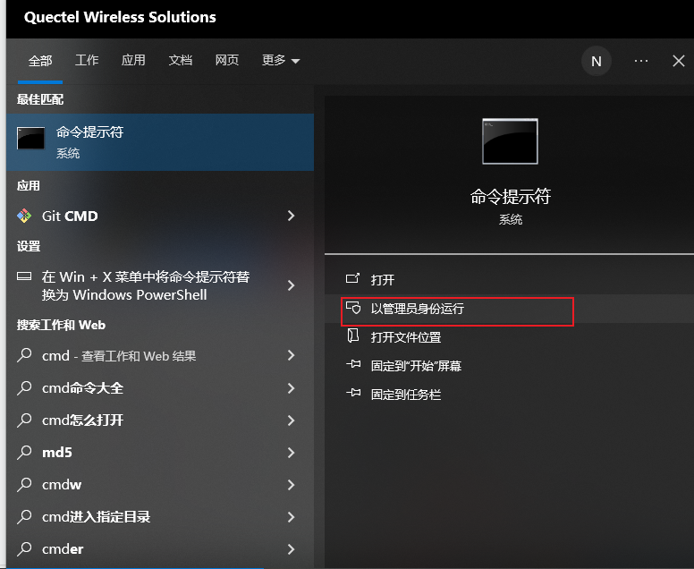
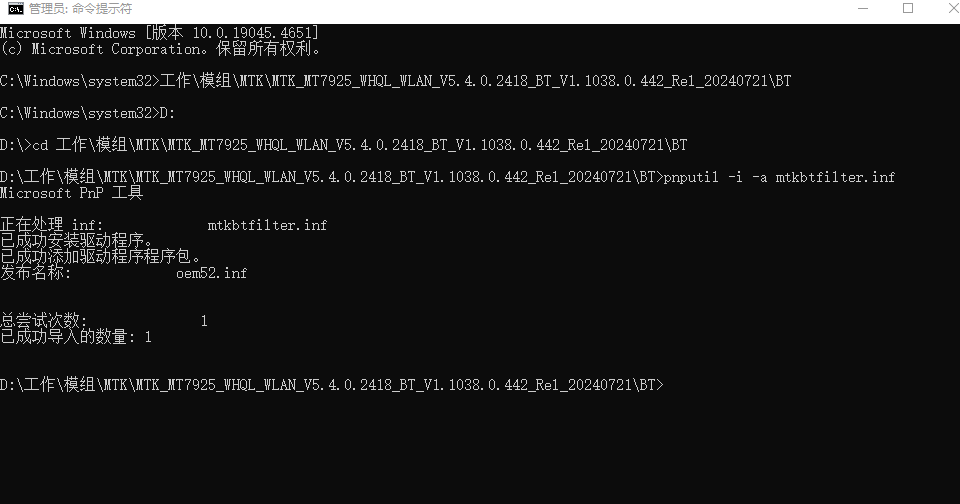

MTK
MediaTek On-Line (MOL) / MediaTek Document Center (DCC): https://online.mediatek.com
soni.rao@QUECTEL.COM Admin098765
eService: https://sso.mediatek.com/eservice-portal/ssoLogin
File Exchange (FEX 2.0): https://transfer.mediatek.com
soni.rao@QUECTEL.COM Admin123456

win+s 快捷键输入cmd，选择以管理员身份运行

进入蓝牙驱动目录，或者直接pnputil -i -a后把mtkbtfilter.inf文件拖动到窗口

执行 pnputil -i -a mtkbtfilter.inf

