sco over hci


sco over pcm


展锐的ini配置

g_wbs_nv_117 = 0x0000

#[5.02]__/L=2
g_wbs_nv_118 = 0x1855

#[5.03]__/L=2
g_nbv_nv_117 = 0x0000

#[5.04]__/L=2
g_nbv_nv_118 = 0x1855


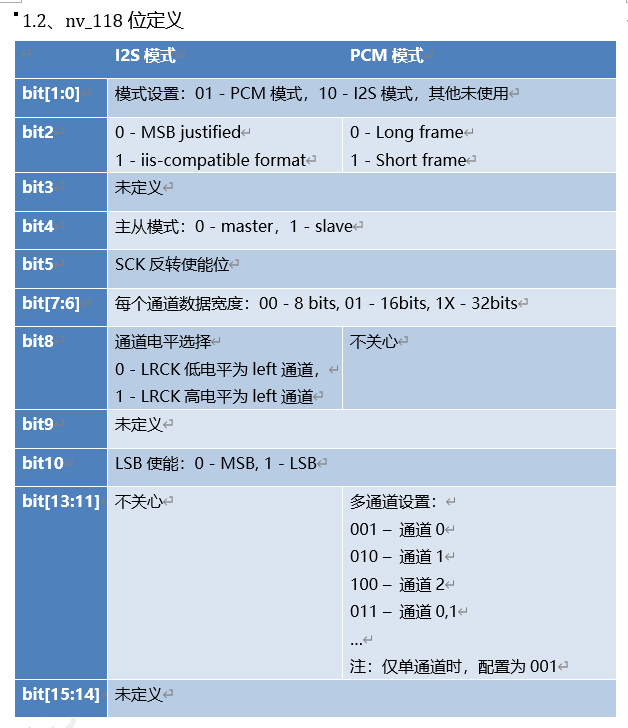

## 高通的配置

高通的HFP配置通过bin文件，首先把bin文件转换为nvm文本文件，在里面进行更新，更新配置好之后，再转换为bin文件。

### 206x等芯片（TAG44）

7:   0x10  ==> 0001 0000

35: 0x10  ==> 0001 0000

52: 0x8f  ==> 1000 1111

56: 0x01  ==> 1000 1111

59: 0x01  ==> 1000 1111

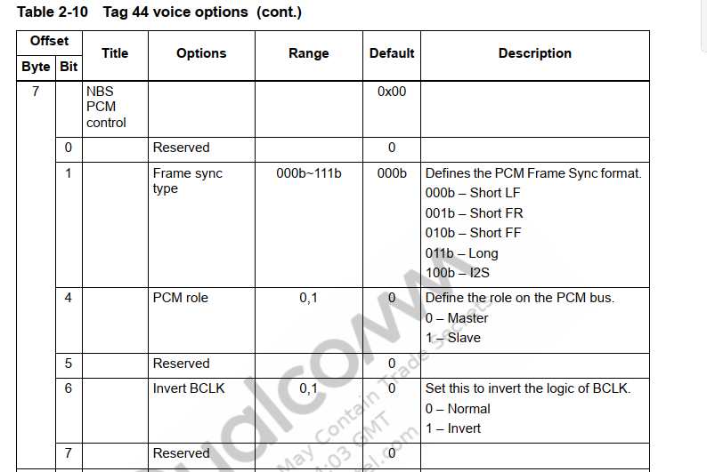

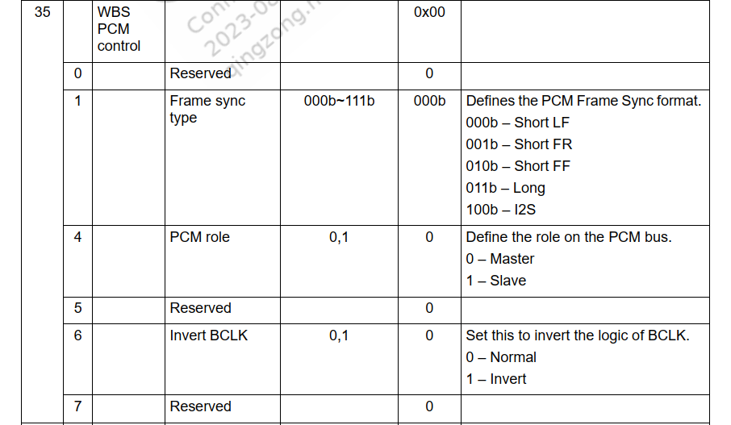

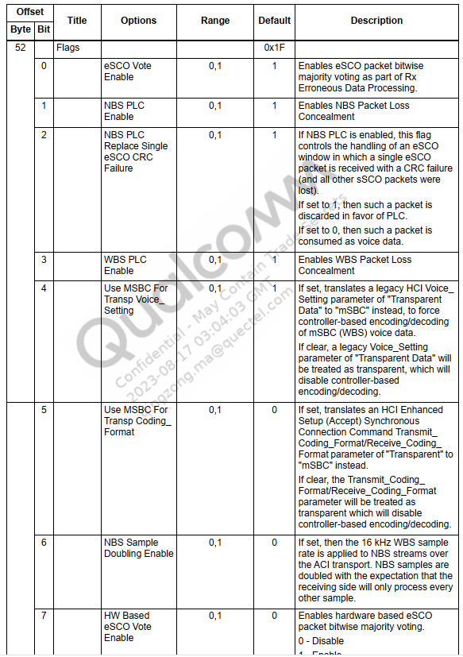

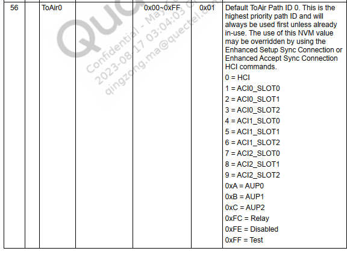

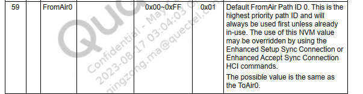


音频配置，不配置这个会导致通话没有声音

[Tag54]

TagNum = 157
TagLength = 4
TagValue = 00 00 00 00

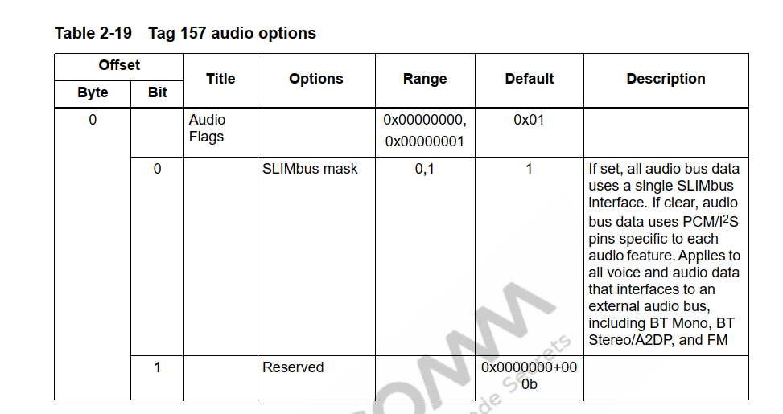

### 9377等芯片(TAG44)

9:   0x10  ==> 0001 0000

33: 0x10  ==> 0001 0000


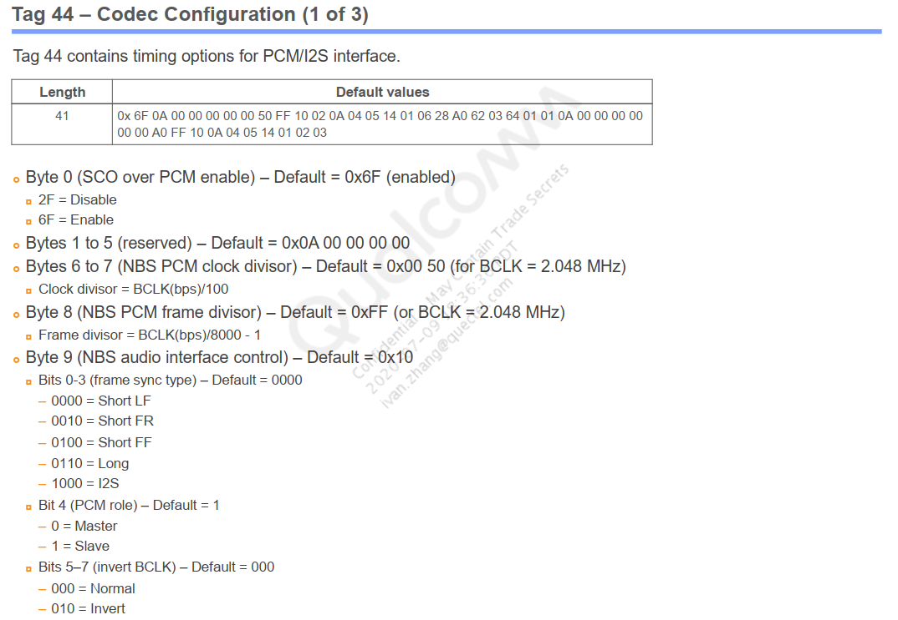

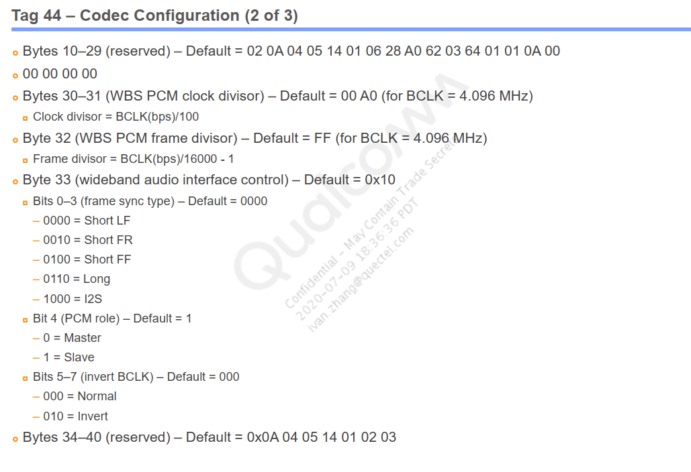

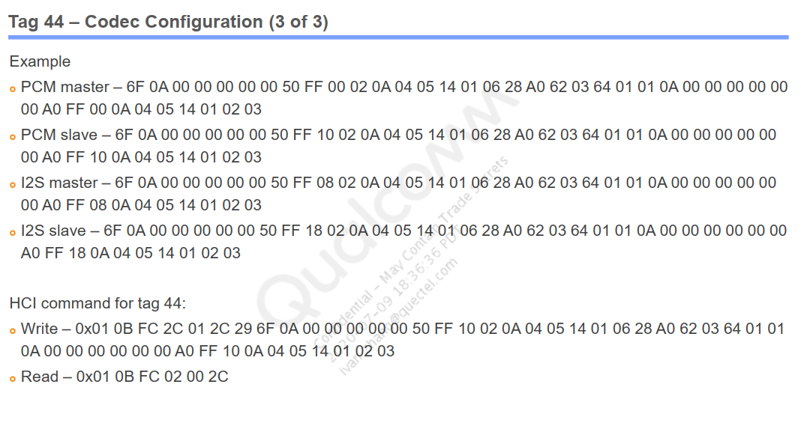


realtek的配置

config

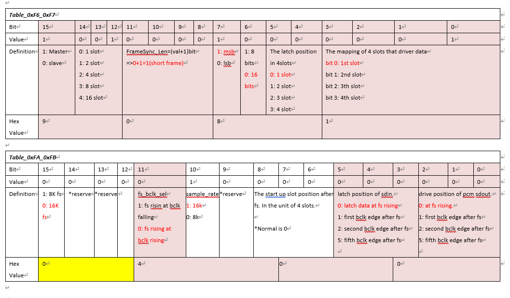

这里注意大小端

9081在二进制里面实际上是8190


？未开放

```
1.	Frame-sync frequency(由PCM master 决定,在PCM I/F Setting 3 里面设置)
2.	Frame-sync起始位置，长度，比如：frame-sync rises at bclk falling还是bclk rising，长度1 bclk or 2 bclks..... (由PCM master 决定, 在PCM I/F Setting 3 里面设置)
3.	Drive/Latch data的起始位置(这里主要指: lat_pos, drv_pos, lat_offset)
4.	bit clock (可以推算出2个frame-sync之间的slots数量)
5.	MSB first还是LSB first
6.	Who is the PCM master
一般需要设定如上的参数，对齐以上参数一般就没什么问题了
```


主控PCM配置

```c
  bt_sound: bt-sound {
    status = "okay";
    compatible = "simple-audio-card";
    simple-audio-card,format = "dsp_a";
    simple-audio-card,bitclock-inversion = <1>;
    simple-audio-card,mclk-fs = <256>;
    simple-audio-card,name = "rockchip,bt";
    //simple-audio-card,bitclock-master = <&sound2_master>;
    //simple-audio-card,frame-master = <&sound2_master>;
    simple-audio-card,cpu {
      sound-dai = <&i2s2_2ch>;
    };
    //sound2_master:simple-audio-card,codec {
    //  sound-dai = <&bt_sco>;
    //};
    simple-audio-card,codec {
      sound-dai = <&bt_sco>;
    };

  };

```


