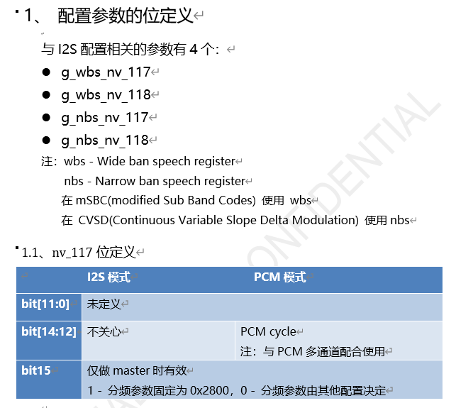

sco over hci


sco over pcm


展锐的ini配置




高通的配置


realtek的配置

？未开放

```
1.	Frame-sync frequency(由PCM master 决定,在PCM I/F Setting 3 里面设置)
2.	Frame-sync起始位置，长度，比如：frame-sync rises at bclk falling还是bclk rising，长度1 bclk or 2 bclks..... (由PCM master 决定, 在PCM I/F Setting 3 里面设置)
3.	Drive/Latch data的起始位置(这里主要指: lat_pos, drv_pos, lat_offset)
4.	bit clock (可以推算出2个frame-sync之间的slots数量)
5.	MSB first还是LSB first
6.	Who is the PCM master
一般需要设定如上的参数，对齐以上参数一般就没什么问题了
```


主控PCM配置

```c
  bt_sound: bt-sound {
    status = "okay";
    compatible = "simple-audio-card";
    simple-audio-card,format = "dsp_a";
    simple-audio-card,bitclock-inversion = <1>;
    simple-audio-card,mclk-fs = <256>;
    simple-audio-card,name = "rockchip,bt";
    //simple-audio-card,bitclock-master = <&sound2_master>;
    //simple-audio-card,frame-master = <&sound2_master>;
    simple-audio-card,cpu {
      sound-dai = <&i2s2_2ch>;
    };
    //sound2_master:simple-audio-card,codec {
    //  sound-dai = <&bt_sco>;
    //};
    simple-audio-card,codec {
      sound-dai = <&bt_sco>;
    };

  };

```


