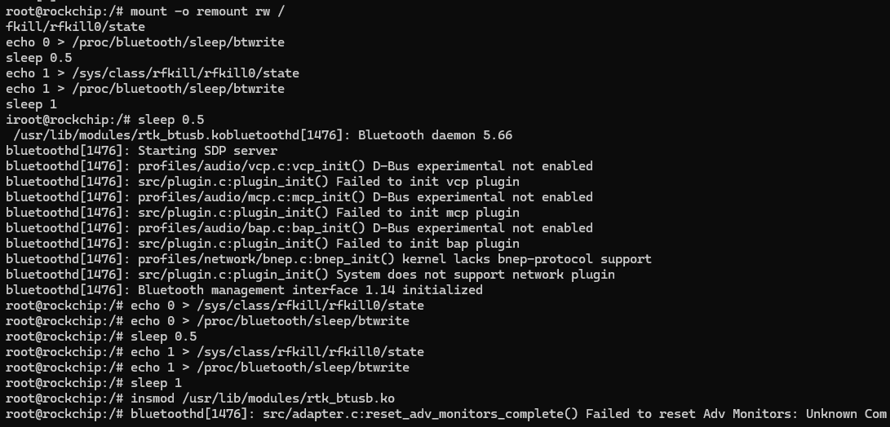
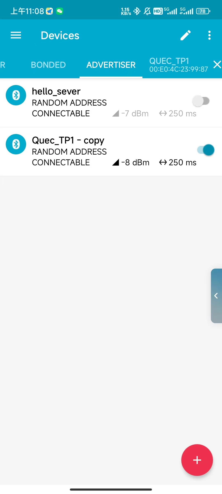
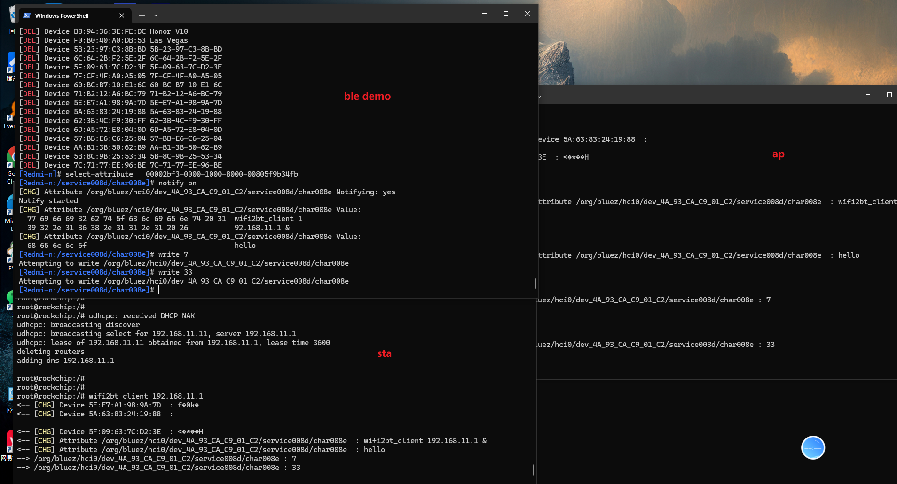

## gateway B

执行如下命令开启ap，等待sta连接

```
#halow Server端开启AP
create_ap_halow.sh
sleep 3

#halow Server端开启服务端
wifi2bt_server &
```


## gateway A

执行如下命令加载蓝牙驱动并连接蓝牙

### 加载蓝牙驱动

```shell
/usr/libexec/bluetooth/bluetoothd -n &
mount -o remount rw /
sleep 0.5
echo 0 > /sys/class/rfkill/rfkill0/state
echo 0 > /proc/bluetooth/sleep/btwrite
sleep 0.5
echo 1 > /sys/class/rfkill/rfkill0/state
echo 1 > /proc/bluetooth/sleep/btwrite
sleep 1
insmod /usr/lib/modules/rtk_btusb.ko
```



### 手机打开nrf_connect建立一个gatt server



### 连接蓝牙

```shell
bluetoothctl
 power on
 scan on
 scan off #扫描到对应设备后结束扫描
 devices  #查看扫描设备信息
 connect xx:xx:xx:xx:xx:xx  #连接ble设备
 menu gatt #进入gatt菜单
 list-attributes #查看属性列表
 select-attribute 00002bf3-0000-1000-8000-00805f9b34fb  #选择uuid
 notify on #打开通知  这一步之后就可以进行数据的接收和发送
```


### 开启sta，连接ap

新开一个adb终端执行如下命令

```shell
#halow Client端开启STA
create_sta_halow.sh
sleep 3

#halow Client端开启客户端
wifi2bt_client 192.168.11.1 &
```


最终效果截图

