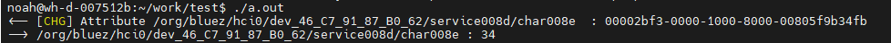

文档使用一块FCU743R模组进行操作


## bluez patch

把patch0001-bluetoothctl-add-ble-message-queue.patch放到SG368Z源码路径buildroot/package/bluez5_utils/下

```c
From ed0603bba3ec9fb3425251b75d8642c5bf921026 Mon Sep 17 00:00:00 2001
From: "noah.yang" <noah.yang@quectel.com>
Date: Fri, 5 Jul 2024 09:23:58 +0800
Subject: [PATCH] bluetoothctl add ble message queue

Signed-off-by: noah.yang <noah.yang@quectel.com>
---
 Makefile.tools |  2 +-
 client/gatt.c  | 56 ++++++++++++++++++++++++++++++++++++++++++++++++++
 client/gatt.h  | 10 ++++++++-
 client/main.c  | 46 +++++++++++++++++++++++++++++++++++++++++
 4 files changed, 112 insertions(+), 2 deletions(-)

diff --git a/Makefile.tools b/Makefile.tools
index 4bc355c34..bf5bded8d 100644
--- a/Makefile.tools
+++ b/Makefile.tools
@@ -13,7 +13,7 @@ client_bluetoothctl_SOURCES = client/main.c \
 					client/admin.h client/admin.c \
 					client/player.h client/player.c
 client_bluetoothctl_LDADD = gdbus/libgdbus-internal.la src/libshared-glib.la \
-				$(GLIB_LIBS) $(DBUS_LIBS) -lreadline
+				$(GLIB_LIBS) $(DBUS_LIBS) -lrt -lreadline
 endif
 
 if ZSH_COMPLETIONS
diff --git a/client/gatt.c b/client/gatt.c
index 8f2920269..e62a716d5 100644
--- a/client/gatt.c
+++ b/client/gatt.c
@@ -23,6 +23,8 @@
 #include <string.h>
 #include <sys/types.h>
 #include <sys/socket.h>
+#include <sys/stat.h>        /* For mode constants */
+#include <mqueue.h>
 
 #include <glib.h>
 
@@ -819,6 +821,8 @@ void gatt_write_attribute(GDBusProxy *proxy, int argc, char *argv[])
 	const char *iface;
 	struct write_attribute_data data;
 
+	struct bt_queue_data bt_data;
+
 	memset(&data, 0, sizeof(data));
 
 	iface = g_dbus_proxy_get_interface(proxy);
@@ -840,6 +844,16 @@ void gatt_write_attribute(GDBusProxy *proxy, int argc, char *argv[])
 			data.type = argv[3];
 
 		write_attribute(proxy, &data);
+
+		bt_data.len = strlen(argv[1]);
+		bt_data.is_write = TRUE;
+		bt_data.type = 0;
+		memset(bt_data.data, 0, sizeof(bt_data.data));
+		memcpy(bt_data.data, argv[1], bt_data.len);
+		memset(bt_data.devices_info, 0, sizeof(bt_data.devices_info));
+		memcpy(bt_data.devices_info, g_dbus_proxy_get_path(proxy), strlen(g_dbus_proxy_get_path(proxy)));
+		send_data(&bt_data);
+
 		return;
 	}
 
@@ -3236,3 +3250,45 @@ void gatt_clone_attribute(GDBusProxy *proxy, int argc, char *argv[])
 
 	return bt_shell_noninteractive_quit(EXIT_FAILURE);
 }
+
+void send_data(struct bt_queue_data *data)
+{
+	mqd_t mqd;
+	const char *queueName = "/bluetooth_to_wifi_halow_message";
+
+	//unsigned char bt_data[1024] = {0};
+	// 准备要发送的消息
+	unsigned int priority = 0; // 消息优先级
+
+	struct mq_attr attr;
+
+	//1. 消息队列属性设置
+	attr.mq_maxmsg = 100;
+	attr.mq_msgsize = 4096;
+	attr.mq_flags = 0;
+	attr.mq_curmsgs = 0;
+
+	// 创建消息队列
+	mqd = mq_open(queueName, O_CREAT | O_WRONLY, 0644, &attr);
+	if (mqd == (mqd_t)-1) {
+		perror("mq_open");
+		exit(EXIT_FAILURE);
+	}
+
+	if(mq_getattr(mqd, &attr) == -1){
+
+		perror("mq_getattr error");
+		exit(1);
+	}
+
+	//sprintf(bt_message, "<-- %s %s : %s TYPE: byte", label, name, bt_data);
+	// 发送消息
+	if (mq_send(mqd, (char *)data, sizeof(struct bt_queue_data), priority) == -1) {
+		perror("mq_send");
+		mq_close(mqd);
+		mq_unlink(queueName);
+		exit(EXIT_FAILURE);
+	}
+
+	mq_close(mqd);
+}
diff --git a/client/gatt.h b/client/gatt.h
index fc2b8a8a6..22103a761 100644
--- a/client/gatt.h
+++ b/client/gatt.h
@@ -7,7 +7,15 @@
  *
  *
  */
-
+struct bt_queue_data
+{
+	int is_write;
+	unsigned int len;
+	int type;
+	char devices_info[1024];
+	char data[517];
+};
+void send_data(struct bt_queue_data *data);
 void gatt_add_service(GDBusProxy *proxy);
 void gatt_remove_service(GDBusProxy *proxy);
 
diff --git a/client/main.c b/client/main.c
index 2816e880f..3c111c55f 100644
--- a/client/main.c
+++ b/client/main.c
@@ -171,6 +171,7 @@ static void print_fixed_iter(const char *label, const char *name,
 	dbus_int16_t *vals16;
 	unsigned char *byte;
 	int len;
+	struct bt_queue_data bt_data;
 
 	switch (dbus_message_iter_get_arg_type(iter)) {
 	case DBUS_TYPE_BOOLEAN:
@@ -182,6 +183,15 @@ static void print_fixed_iter(const char *label, const char *name,
 		bt_shell_printf("%s%s:\n", label, name);
 		bt_shell_hexdump((void *)valbool, len * sizeof(*valbool));
 
+		bt_data.len = len * sizeof(*valbool);
+		bt_data.is_write = FALSE;
+		bt_data.type = DBUS_TYPE_BOOLEAN;
+		memset(bt_data.data, 0, sizeof(bt_data.data));
+		memcpy(bt_data.data, (void *)valbool, bt_data.len);
+		memset(bt_data.devices_info, 0, sizeof(bt_data.devices_info));
+		memcpy(bt_data.devices_info, label, strlen(label));
+		send_data(&bt_data);
+
 		break;
 	case DBUS_TYPE_UINT32:
 		dbus_message_iter_get_fixed_array(iter, &valu32, &len);
@@ -191,6 +201,15 @@ static void print_fixed_iter(const char *label, const char *name,
 
 		bt_shell_printf("%s%s:\n", label, name);
 		bt_shell_hexdump((void *)valu32, len * sizeof(*valu32));
+		
+		bt_data.len = len * sizeof(*valu32);
+		bt_data.is_write = FALSE;
+		bt_data.type = DBUS_TYPE_UINT32;
+		memset(bt_data.data, 0, sizeof(bt_data.data));
+		memcpy(bt_data.data, (void *)valu32, bt_data.len);
+		memset(bt_data.devices_info, 0, sizeof(bt_data.devices_info));
+		memcpy(bt_data.devices_info, label, strlen(label));
+		send_data(&bt_data);
 
 		break;
 	case DBUS_TYPE_UINT16:
@@ -201,6 +220,15 @@ static void print_fixed_iter(const char *label, const char *name,
 
 		bt_shell_printf("%s%s:\n", label, name);
 		bt_shell_hexdump((void *)valu16, len * sizeof(*valu16));
+		
+		bt_data.len = len * sizeof(*valu16);
+		bt_data.is_write = FALSE;
+		bt_data.type = DBUS_TYPE_UINT16;
+		memset(bt_data.data, 0, sizeof(bt_data.data));
+		memcpy(bt_data.data, (void *)valu16, bt_data.len);
+		memset(bt_data.devices_info, 0, sizeof(bt_data.devices_info));
+		memcpy(bt_data.devices_info, label, strlen(label));
+		send_data(&bt_data);
 
 		break;
 	case DBUS_TYPE_INT16:
@@ -211,6 +239,15 @@ static void print_fixed_iter(const char *label, const char *name,
 
 		bt_shell_printf("%s%s:\n", label, name);
 		bt_shell_hexdump((void *)vals16, len * sizeof(*vals16));
+		
+		bt_data.len = len * sizeof(*vals16);
+		bt_data.is_write = FALSE;
+		bt_data.type = DBUS_TYPE_INT16;
+		memset(bt_data.data, 0, sizeof(bt_data.data));
+		memcpy(bt_data.data, (void *)vals16, bt_data.len);
+		memset(bt_data.devices_info, 0, sizeof(bt_data.devices_info));
+		memcpy(bt_data.devices_info, label, strlen(label));
+		send_data(&bt_data);
 
 		break;
 	case DBUS_TYPE_BYTE:
@@ -221,6 +258,15 @@ static void print_fixed_iter(const char *label, const char *name,
 
 		bt_shell_printf("%s%s:\n", label, name);
 		bt_shell_hexdump((void *)byte, len * sizeof(*byte));
+		
+		bt_data.len = len * sizeof(*byte);
+		bt_data.is_write = FALSE;
+		bt_data.type = DBUS_TYPE_BYTE;
+		memset(bt_data.data, 0, sizeof(bt_data.data));
+		memcpy(bt_data.data, byte, bt_data.len);
+		memset(bt_data.devices_info, 0, sizeof(bt_data.devices_info));
+		memcpy(bt_data.devices_info, label, strlen(label));
+		send_data(&bt_data);
 
 		break;
 	default:
-- 
2.25.1


```

## 打开SG368Z内核消息队列配置项

```c
diff --git a/kernel/init/Kconfig b/kernel/init/Kconfig
index 0e0d8f2128..464bbfce86 100644
--- a/kernel/init/Kconfig
+++ b/kernel/init/Kconfig
@@ -292,6 +292,7 @@ config SYSVIPC_SYSCTL

 config POSIX_MQUEUE
        bool "POSIX Message Queues"
+       default y
        depends on NET
        ---help---
          POSIX variant of message queues is a part of IPC. In POSIX message
```

或者直接make menuconfig，选中POSIX Message Queues

```
 General setup  --->

       [ ] POSIX Message Queues  -> [*] POSIX Message Queues 

```

修改envsetup_bt脚本

```shell
diff --git a/envsetup_bt.sh b/envsetup_bt.sh
index e383336718..d05b0e72df 100755
--- a/envsetup_bt.sh
+++ b/envsetup_bt.sh
@@ -148,6 +148,9 @@ function get_platform()
        elif [ "${PRODUCT_NAME}" = "FC906AFMAC" ] || \
                [ "${PRODUCT_NAME}" = "FCU906AFMAC" ]; then
                        BT_VENDOR_CYWFMAC=y
+       elif [ "${PRODUCT_NAME}" = "FGH100MAAMD" ]; then
+                       PRODUCT_NAME=FCU743RAAMD
+                       BT_VENDOR_RTK=y
     elif [ "${PRODUCT_NAME}" = "FCS851UAAMD" ] || \
         [ "${PRODUCT_NAME}" = "FCS851UABMD" ] || \
         [ "${PRODUCT_NAME}" = "FCS851UBAAMD" ] || \

```


## 编译版本


makekernel

make bluez5_utils-dirclean

make bluez5_utils-rebuild

build-all-image


## 蓝牙端操作


```shell
/usr/libexec/bluetooth/bluetoothd -n &
mount -o remount rw /
sleep 0.5
echo 0 > /sys/class/rfkill/rfkill0/state
echo 0 > /proc/bluetooth/sleep/btwrite
sleep 0.5
echo 1 > /sys/class/rfkill/rfkill0/state
echo 1 > /proc/bluetooth/sleep/btwrite

insmod /usr/lib/modules/rtk_btusb.ko

bluetoothctl
  power on
  scan on #扫描到ble设备后关闭扫描
  scan off
  connect xx:xx:xx:xx:xx:xx #连接成功后使用menu gatt进入gatt操作菜单
  
  menu gatt
  list-attributes   #显示远端设备的service
  select-attribute 00002bf3-0000-1000-8000-00805f9b34fb  #选择某个UUID
  notify on  #打开通知
  write 7   #写入数据到gatt server,这里会同步发出一条消息队列出去，可以用后面receiver.c的示例进行接收，同样，当接收到远端发过来的消息后，也会同步发出一条带有接收数据的消息队列
  
```


## receiver.c示例代码

特别注意，使用消息队列编译是需要加上-lrt

***gcc receiver.c -lrt***

```c
#include <stdio.h>  
#include <stdlib.h>  
#include <string.h>  
#include <mqueue.h>  
#include <sys/stat.h>  
#include <fcntl.h>  
  
struct bt_queue_data
{
	int is_write;
	unsigned int len;
	int type;
	char devices_info[1024];
	char data[517];
};

int main() {   
    const char *queueName = "/bluetooth_to_wifi_halow_message";  
    struct bt_queue_data bt_data; 
    unsigned int priority = 0;  
    struct mq_attr attr;

  //1. 打开消息队列
    mqd_t mq_id = mq_open(queueName, O_RDONLY);
    if(mq_id == -1){
        perror("mq_open");  
        exit(EXIT_FAILURE); 
    }
    if(mq_getattr(mq_id, &attr) == -1){
        
        perror("mq_getattr error"); 
        exit(1);
    }
  
    // 接收消息  
    while (1)
    {
        //memset(buffer, 0, sizeof(buffer));
        if (mq_receive(mq_id, (char*)&bt_data, 10000, &priority) == -1) {  
            perror("mq_receive");  
            mq_close(mq_id);  
            exit(EXIT_FAILURE);  
        }  

        if (bt_data.is_write == 1) 
        {
            printf("--> %s : %s \n", bt_data.devices_info, bt_data.data); 
        } else 
        {
             printf("<-- %s : %s \n", bt_data.devices_info, bt_data.data);
        }
    }
  
    // 关闭消息队列  
    mq_close(mq_id);  

    return 0;  
}

```


输出示例

```
<-- [CHG] Attribute /org/bluez/hci0/dev_46_C7_91_87_B0_62/service008d/char008e  : 00002bf3-0000-1000-8000-00805f9b34fb
--> /org/bluez/hci0/dev_46_C7_91_87_B0_62/service008d/char008e : 34

```


