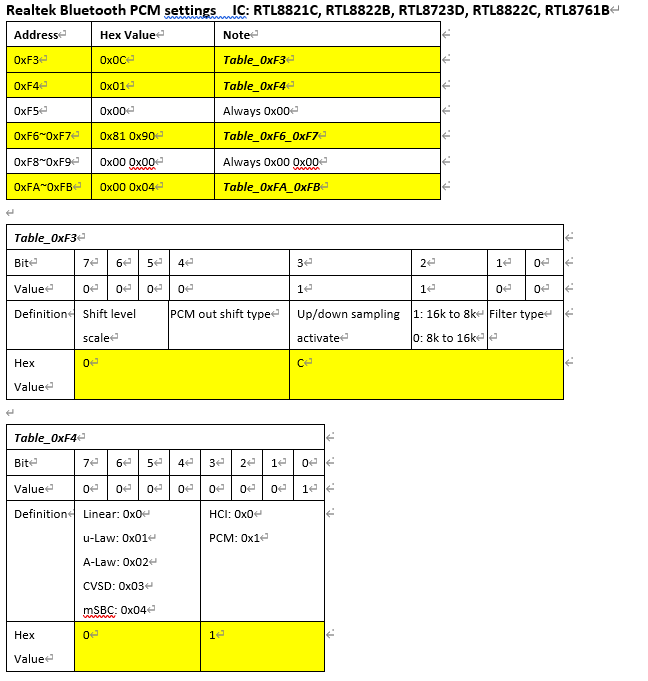
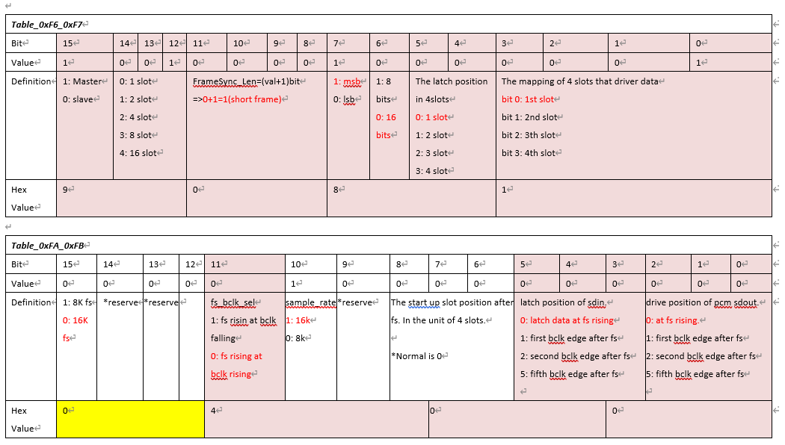
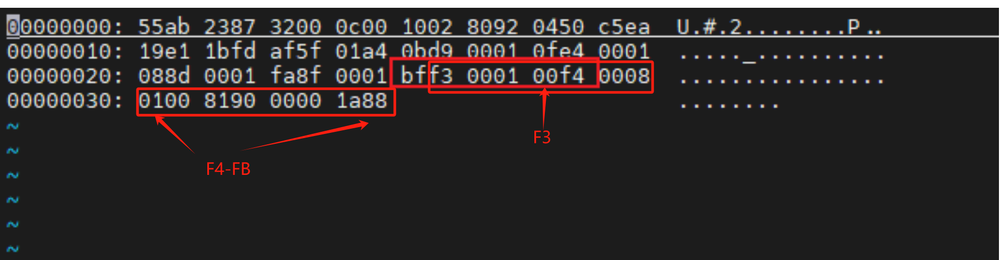
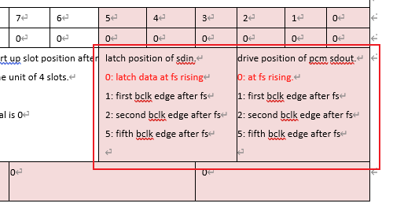

## 主控PCM配置

realtek主控需要做slave，方便调试

```c
  bt_sound: bt-sound {
    status = "okay";
    compatible = "simple-audio-card";
    simple-audio-card,format = "dsp_a";
    //simple-audio-card,bitclock-inversion = <1>;
    simple-audio-card,mclk-fs = <256>;
    simple-audio-card,name = "rockchip,bt";
    simple-audio-card,bitclock-master = <&sound2_master>;
    simple-audio-card,frame-master = <&sound2_master>;
    simple-audio-card,cpu {
      sound-dai = <&i2s2_2ch>;
    };
    sound2_master:simple-audio-card,codec {
      sound-dai = <&bt_sco>;
    };
    //simple-audio-card,codec {
    //  sound-dai = <&bt_sco>;
    //};

  };

  bt_sco: bt-sco {
    compatible = "delta,dfbmcs320";
    #sound-dai-cells = <0>;
    status = "okay";
  };

  test-power {
    status = "okay";
  };
```


## realtek config的配置







这里注意大小端

9081在二进制里面实际上是  offset addr 0xF6=81、offset addr 0xF7 = 90




### 重点

HFP通话杂音重点调试offset 0xFA也就是in/out这一项，也就是配置表里面的这一部分，调试过程中这些参数都尝试一下，一般都会解决。



