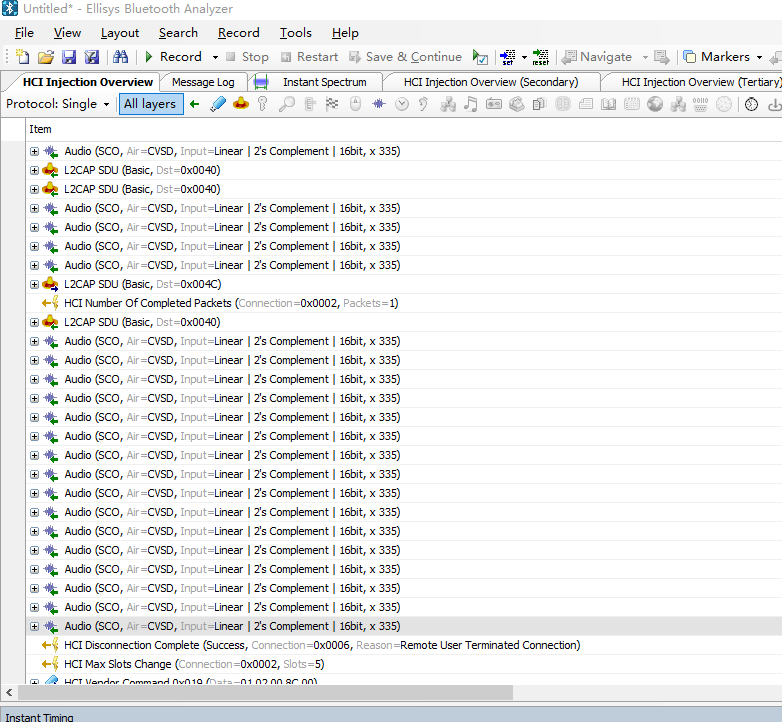
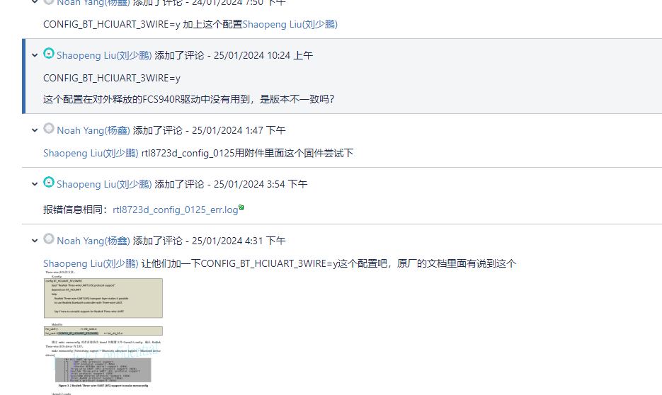
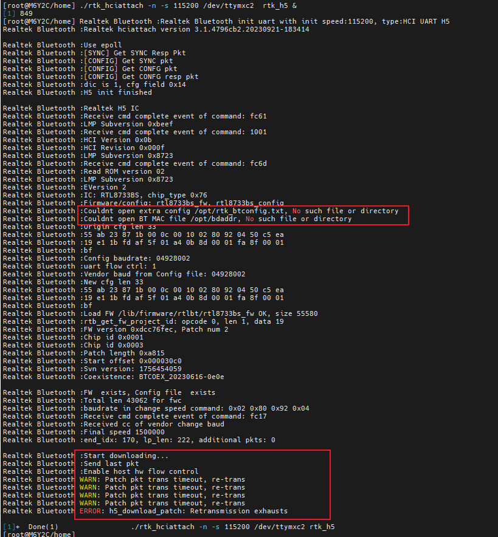

HFP

蓝牙固件需要模式是sco over hci，需要改成走PCM，原厂改，需要提供如下信息

1.	Frame-sync frequency(由PCM master 决定,在PCM I/F Setting 3 里面设置)
2.	Frame-sync起始位置，长度，比如：frame-sync rises at bclk falling还是bclk rising，长度1 bclk or 2 bclks..... (由PCM master 决定, 在PCM I/F Setting 3 里面设置)
3.	Drive/Latch data的起始位置(这里主要指: lat_pos, drv_pos, lat_offset)
4.	bit clock (可以推算出2个frame-sync之间的slots数量)
5.	MSB first还是LSB first
6.	Who is the PCM master
这些参数

默认




硬件流控相关

```
Realtek Bluetooth :Start downloading...
Realtek Bluetooth :Send additional packet 32
Realtek Bluetooth :Send additional packet 33
Realtek Bluetooth :Send additional packet 34
Realtek Bluetooth :Last packet 163
Realtek Bluetooth :Send last pkt
Realtek Bluetooth :Enable host hw flow control
Realtek Bluetooth :h5_hci_reset: Issue hci reset cmd
Realtek Bluetooth ERROR: Out-of-order packet arrived, got(6)expected(7)
Realtek Bluetooth ERROR: Out-of-order packet arrived, got(6)expected(7)
Realtek Bluetooth ERROR: Out-of-order packet arrived, got(6)expected(7)
Realtek Bluetooth ERROR: Out-of-order packet arrived, got(6)expected(7)
Realtek Bluetooth ERROR: Out-of-order packet arrived, got(6)expected(7)
Realtek Bluetooth ERROR: Out-of-order packet arrived, got(6)expected(7)
Realtek Bluetooth ERROR: Out-of-order packet arrived, got(6)expected(7)
Realtek Bluetooth ERROR: Out-of-order packet arrived, got(6)expected(7)
Realtek Bluetooth ERROR: Out-of-order packet arrived, got(6)expected(7)
Realtek Bluetooth ERROR: Out-of-order packet arrived, got(6)expected(7)
Realtek Bluetooth ERROR: Out-of-order packet arrived, got(6)expected(7)
Realtek Bluetooth WARN: OP_HCI_RESET Transmission timeout
Realtek Bluetooth ERROR: Out-of-order packet arrived, got(6)expected(7)
Realtek Bluetooth ERROR: Out-of-order packet arrived, got(6)expected(7)
Realtek Bluetooth ERROR: Out-of-order packet arrived, got(6)expected(7)
Realtek Bluetooth ERROR: Out-of-order packet arrived, got(6)expected(7)
Realtek Bluetooth ERROR: Out-of-order packet arrived, got(6)expected(7)
Realtek Bluetooth ERROR: Out-of-order packet arrived, got(6)expected(7)
Realtek Bluetooth ERROR: Out-of-order packet arrived, got(6)expected(7)
Realtek Bluetooth ERROR: Out-of-order packet arrived, got(6)expected(7)
Realtek Bluetooth ERROR: Out-of-order packet arrived, got(6)expected(7)
Realtek Bluetooth ERROR: Out-of-order packet arrived, got(6)expected(7)
Realtek Bluetooth ERROR: Out-of-order packet arrived, got(6)expected(7)
Realtek Bluetooth ERROR: Out-of-order packet arrived, got(6)expected(7)
Realtek Bluetooth WARN: OP_HCI_RESET Transmission timeout
Realtek Bluetooth ERROR: Retransmission exhausts
```

[[FAE-105483\] 【路行通】RV1106-linux-kernel 5.10.110-蓝牙功能启动失败 - Software_JIRA (quectel.com)](https://ticket.quectel.com/browse/FAE-105483)




---


HFP问题追溯

23年12月份开始向realtek提FCS850R HFP问题，24年1月中寄设备给原厂分析调试，24年2月模组做master后850R和950R调试ok，之后就一直调试无进展


realtek在分析问题的时候，必须要有客户，我们自己本地调试的问题优先级放的比较低，不会投入很多资源。


也是流控问题

