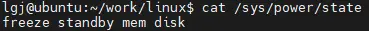
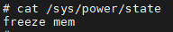

```
root@rockchip:/# cat /sys/power/state
freeze mem

echo freeze > /sys/power/state
echo mem > /sys/power/state
```

## 系统休眠介绍

　　在日常工作中经常会有以下情形，当我们正在使用电脑编写代码时，需要临时去开个会或处理一些紧急问题，此时就需要暂停编码工作。电脑在一段时间无操作后，将会关闭大部分硬件的电源，并进入睡眠模式，以降低功耗。当我们回来以后，通过操作键盘或鼠标，则又可以唤醒电脑，并继续先前未完成的工作。

　　同样当不需要使用手机时，它将会关闭屏幕进入待机状态，此时系统会保存进程上下文，并关闭外设和cpu电源。当需要再次使用手机时，又可通过按键等方式唤醒系统，然后恢复先前保存的上下文。

　　以上都是系统休眠的一些典型案例，由于休眠需要保存当前执行上下文，且在唤醒时恢复这些上下文，因此与关机相比，休眠唤醒需要处理更多的流程。如休眠时需要先关闭哪些设备，后关闭哪些设备，休眠过程中如何处理中断，以及如何唤醒已休眠的系统等。

## ２　休眠方式

　　与cpuilde类似，系统休眠也有深有浅，其中睡的越深功耗越低，相应的唤醒延迟越大，睡的越浅功耗越高，而其唤醒延迟也越小。根据睡眠状态由浅到深，Linux当前一共支持freeze、standby、mem和disk四种休眠方式，其特点如下：
（1）freeze（suspend to idle）：这种方式会冻结系统中的进程，挂起所有需要挂起的设备，然后将cpu切换为idle进程，使其进入idle状态。它不会将cpu从内核中移除，因此一旦被唤醒只需从idle状态退出，恢复挂起的设备和被冻结的进程即可

（2）standby（suspend to standby）：这种方式除了执行所有freeze相关的流程外，还会将secondary cpu从内核中移除，然后primary cpu进入standby睡眠模式。standby模式睡眠较浅，不会对cpu断电，因此在睡眠时不需要保存cpu上下文。当其一旦被唤醒，cpu就能马上投入工作，并依次恢复系统运行

（3）mem（suspend to mem）：相对于standby方式，这种方式下primary cpu需要先将cpu上下文保存到内存中，然后将自身断电。因此它不能直接被唤醒，而是需要先通过其它模块为其上电，然后再执行恢复cpu上下文以及其它模块的工作。由于这种方式，内核整个都已经睡着了，因此也不会有访问ddr的需求，因此也可以将ddr设置为自刷新模式，以进一步降低功耗

（4）disk（suspend to disk或hibernate）：这是最深的一种睡眠模式，与suspend to mem将系统相关上下文保存到ddr中不同，它将系统上下文保存到磁盘中。由于所有上下文都已经保存到磁盘中，因此不仅外设、cpu可以下电，而且此时ddr也可以被断电

　　更进一步，为了更好地节能，SOC一般会将芯片上的电源分为多个power domain，其中aon domain在一般的休眠流程中不会被断电（如唤醒时需要该domain的支持）。而在hibernate时，由于可以从磁盘中的信息恢复整个系统，因此包含aon domain在内的整个系统都会被断电。当需要恢复系统时，则只需为其重新上电，然后从disk中恢复执行系统状态即可

　　当然系统并不需要支持以上所有休眠方式，如一般的架构都会支持freeze和mem方式，而standby和disk方式则可根据需求确定是否要支持。

　　我们可通过命令cat /sys/power/state查看系统支持的休眠方式，如在我的ubuntu系统中，支持所有四种休眠模式，其查询结果如下：



　　而在qemu模拟的arm64系统中，只支持freeze和mem两种休眠方式，其相应的查询结果如下：



由于hibernate休眠方式相对比较特殊，因此除了特别提及以外，后面的介绍将主要围绕suspend to ram进行。