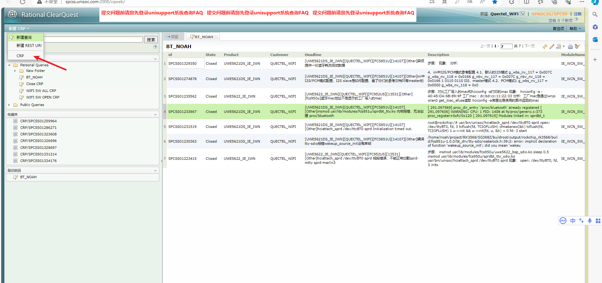
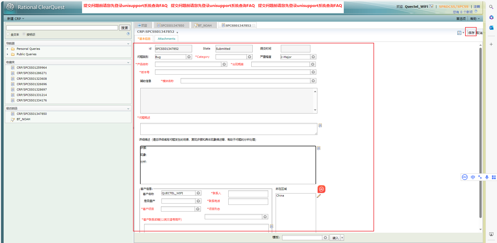
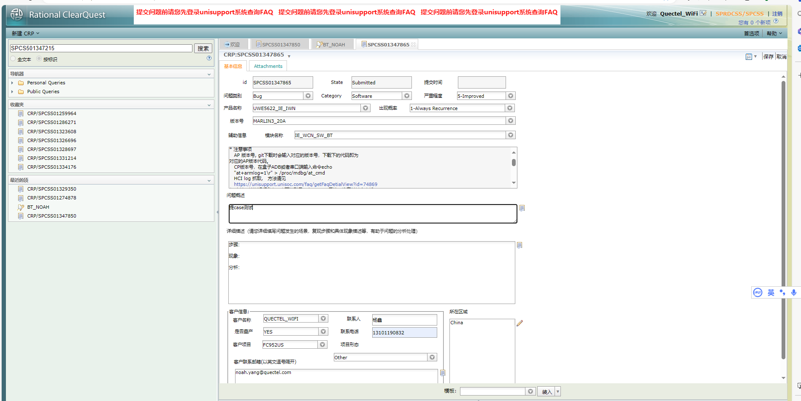
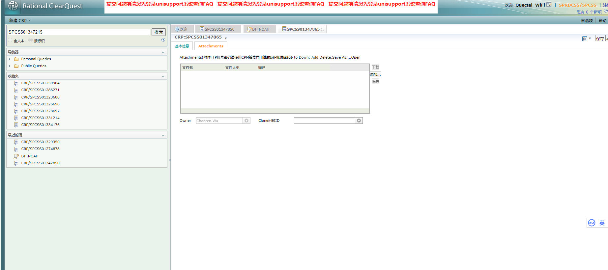
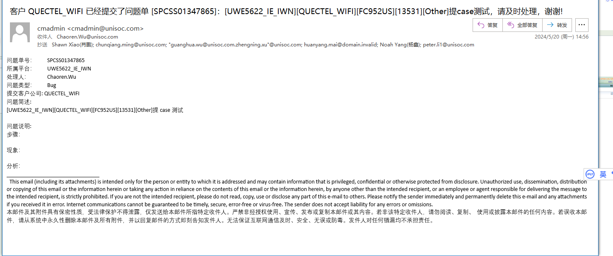
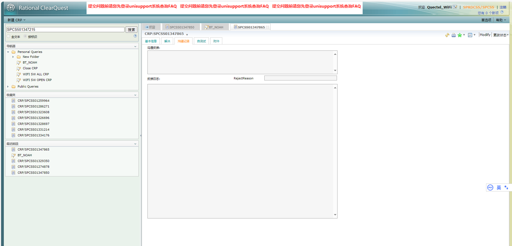
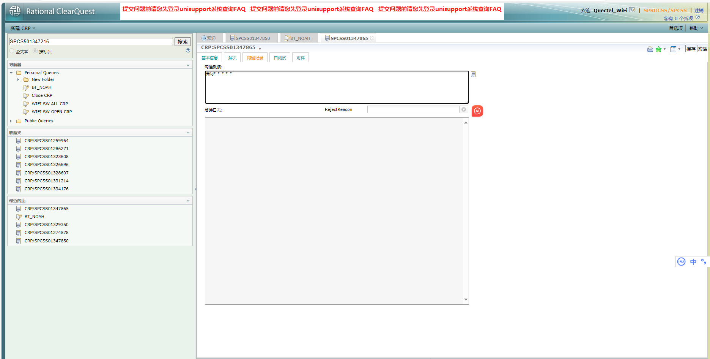
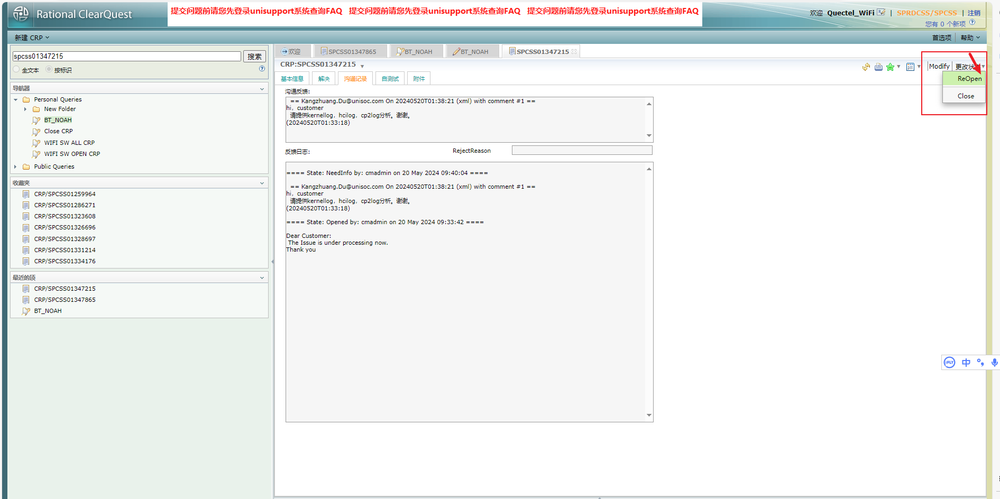
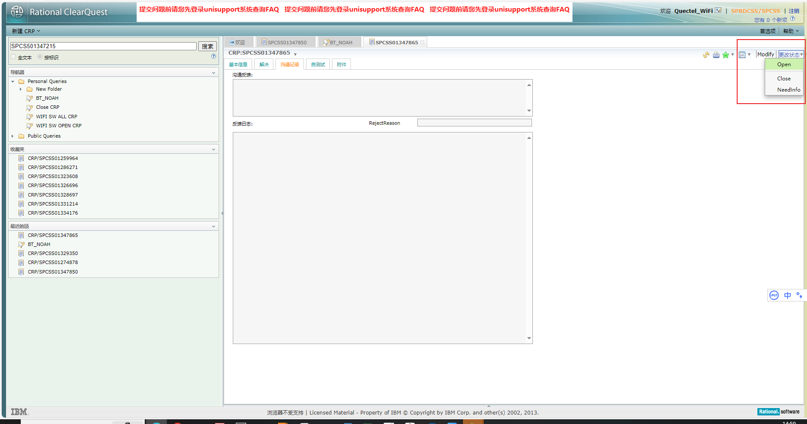
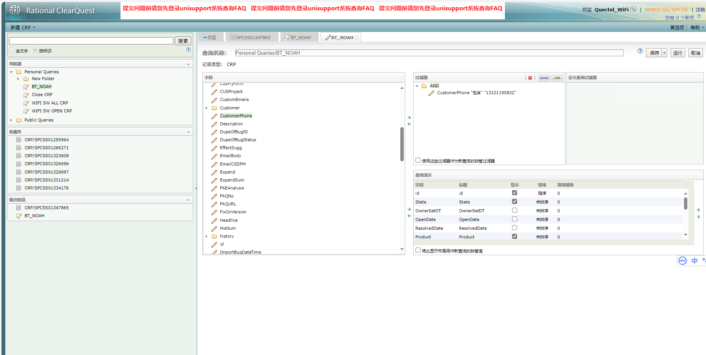

[IBM Rational ClearQuest-SPRDCSS/SPCSS (unisoc.com)](http://spcss.unisoc.com:2008/cqweb/)

```
网址： http://spcss.unisoc.com:2008/cqweb/

CQ User Name: quectel_wifi
New Password: $IBumYcAZn6I3Nnfb*9u
```









添加log附件



记录CQ号点击右上角保存按钮即可提交case


提交后邮件也可以接收到提交成功的邮件






**进入沟通页面一开始是不可以进行沟通的，需要先点击modify才可以进行编辑。**



如果不能直接点击modify，需要先更改状态，reopen此单



还可以在这里进行其他的open close等操作




建立查询

