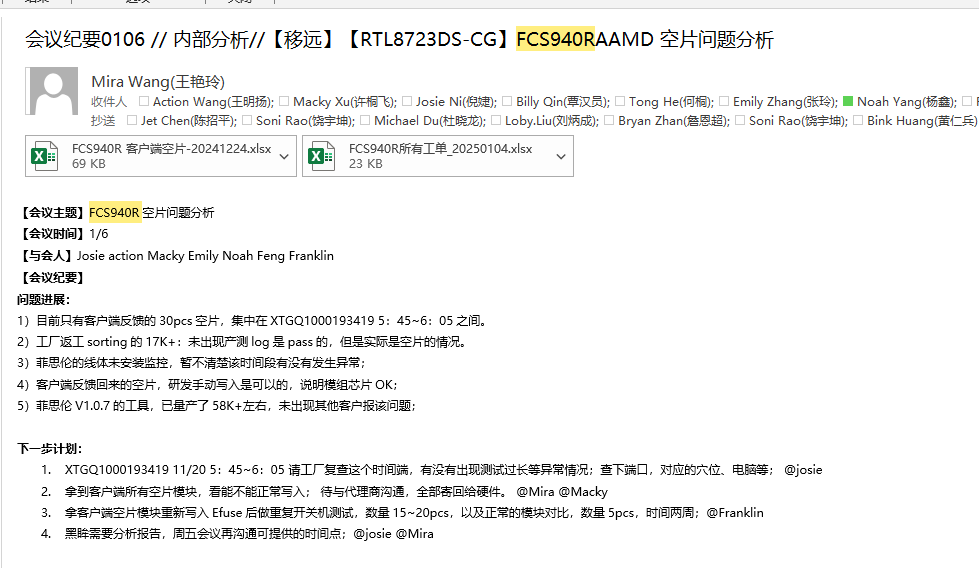

1. FCS940R 空片问题需要跟踪

2. FME175T 现在产测已引入，如果还有手动写号，目前已经有一键写号脚本，只需要把脚本文件放入写号文件目录执行python脚本即可

3. [[FAE-153858\] China Taipei-肯懋-BT [FME164Q]compile the bluez source code failure - Software_JIRA](https://ticket.quectel.com/browse/FAE-153858?jql=text ~ "China Taipei-肯懋-BT") 这个bluez编译报错问题在等FAE更新验证结果，ubuntu24.04+bluez5.79，可能版本过高了，有些库对应不上

