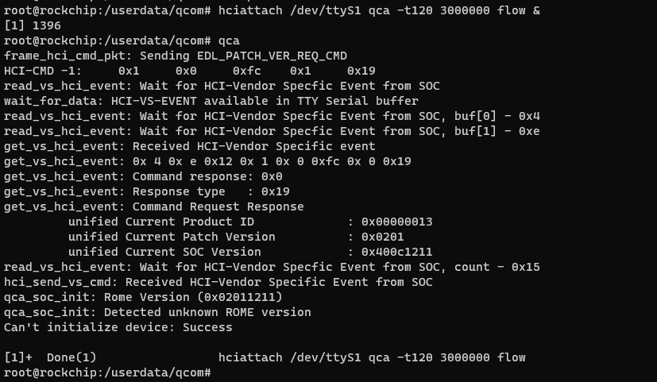
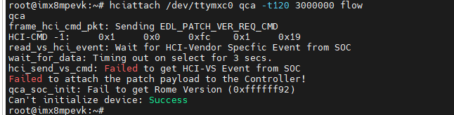
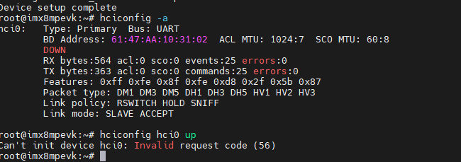
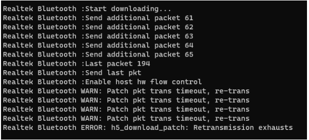
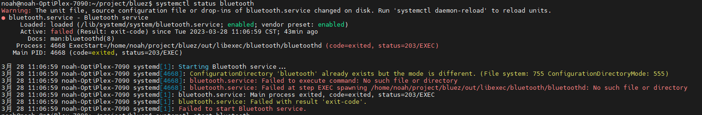
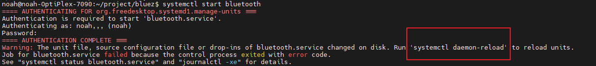
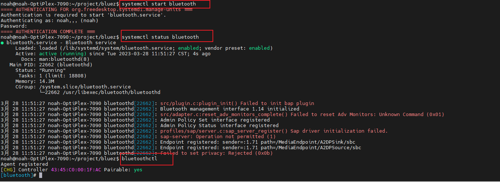
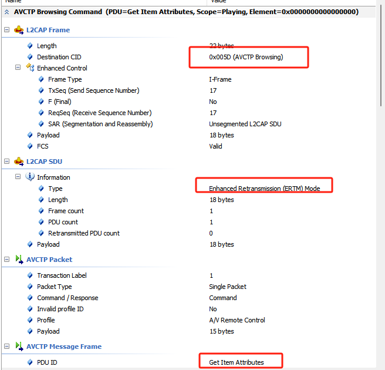
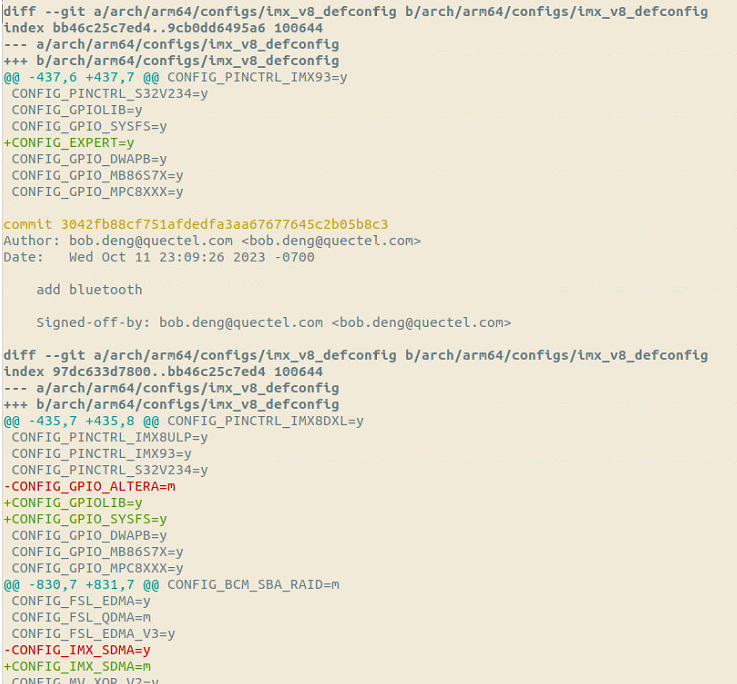

# 通用

## 耗流问题排查

1. 对比芯片原厂耗流数据，如无太大差异，协商走评审流程。
2. 如有竞品模组，可以使用和竞品模组做对比测试，看耗流。
3. 本地复测，看是不是还这么高。
4. 排查wifi_en有没有下电。
5. 硬件确认下焊接状态，是否有漏电问题。

## 模组拉距问题

1. 确认测试环境是否有干扰
2. 确认硬件性能是否正常
3. 模组是否校准
4. 原厂数据对比
5. 这些都没问题，多测几块模组，确认是否是单片模组问题

## HFP无法测试、

暂时了解到测试那边测hfp，只需要听到通话对方声音，且声音正常就算pass

当前SG368Z hfp还有问题，用以下步骤可满足测试的要求，但只能听到通话对方声音，不能进行通话。

```shell
#步骤1
mount -o remount rw /
/etc/init.d/S46ofono stop
sleep 0.5
echo 0 > /sys/class/rfkill/rfkill0/state
sleep 0.5
echo 1 > /sys/class/rfkill/rfkill0/state
sleep 0.5
insmod /usr/lib/modules/hci_uart.ko
sleep 0.5
rtk_hciattach -n -s 115200 ttyS1 rtk_h5 &

#步骤2
/usr/libexec/bluetooth/bluetoothd -n -d &

#步骤3
pulseaudio -D  --exit-idle-time=-1  --log-target=file:/tmp/pulse.log
ofonod --debug=DEBUG --plugin=hfp_bluez5 &

#步骤4
bluetoothctl

#步骤5
pactl list sinks
pactl set-default-sink 2

amixer -c 0 cset numid=1 3

#步骤6     hfp需要
pactl list cards
pactl set-card-profile bluez_card.44_71_47_1F_EA_B4 headset_audio_gateway
arecord -Dhw:0,0 -d 60 -f cd -r 44100 -c 2 -t wav test.wav   #必须执行这一步才不会有电流声
arecord -D bluealsa:HCI=hci0,DEV=44:71:47:1F:EA:B4,PROFILE=sco /as.wav
```


## wifi/bt coex

1. wifi/bt共存问题看天线隔离度，隔离度足够好，可以用频分方式；隔离度差用时分。
2. 

# 模组


## 高通问题

### 高通patch未合入，芯片型号不识别

需要在bluez代码里面合入高通patch，合入方式(patch文件在内部BT仓库里面):

git am 0001-hciattach-add-support-for-qualcomm-chip.patch




## 展锐

### CP2 log如何抓取

```
抓取CP2 日志，请尝试如下方法：

开机后输入如下命令，
touch /data/unisoc_cp2log_config.txt
chmod 777 /data/unisoc_cp2log_config.txt
echo "wcn_cp2_log_limit_size=500M;\n" > /data/unisoc_cp2log_config.txt
echo "wcn_cp2_file_max_num=20;\n" >> /data/unisoc_cp2log_config.txt
echo "wcn_cp2_file_cover_old=true;\n" >> /data/unisoc_cp2log_config.txt
echo "wcn_cp2_log_path="/data/unisoc_dbg";\n" >> /data/unisoc_cp2log_config.txt
以上命令输入一次即可

以下命令请在每次开机后输入
rm /data/unisoc_dbg/*
mkdir /data/unisoc_dbg
chmod 777 /data/unisoc_dbg
touch unisoc_cp2log_0.txt
chmod 777 /data/unisoc_dbg/*
echo "at+armlog=1\r" > /proc/mdbg/at_cmd
echo "at+armlog=1\r" > /proc/mdbg/at_cmd
echo "at+armlog=1\r" > /proc/mdbg/at_cmd


cat /dev/slog_wcn0 >/data/cp2.log   #以上方法不行的话尝试一下执行这个命令，还是不行提CQ给展锐，要求展锐排查。目前来看，android抓取cp2 log容易一些，如果问题在android系统上也有，最好使用android，展锐内部一般都是使用android来进行分析
```


## realtek问题

### EC20R AT指令测试执行顺序

本地测试的时候，需要按照如下步骤，开启蓝牙测试，然后打开蓝牙，读取efuse mask，raltek里面写入mac地址需要倒序写入进去。

```
[2023-09-13_16:52:37:974]at+qwificfg="fcs945r",0,1

[2023-09-13_16:52:41:215]OK
[2023-09-13_16:52:45:610]at+qwificfg="fcs945r",0,0

[2023-09-13_16:52:46:585]OK
[2023-09-13_16:52:48:700]at+qwificfg="fcs945r_ble",0

[2023-09-13_16:52:50:695]OK
[2023-09-13_16:52:51:641]at+qwificfg="fcs945r_ble",1

[2023-09-13_16:52:54:237]send cmd:enable uart5:/dev/ttyHS6
[2023-09-13_16:52:54:237]enable[Success:0]


[2023-09-13_16:52:54:237]OK
[2023-09-13_16:53:00:733]at+qwificfg="fcs945r_ble",9,0

[2023-09-13_16:53:00:778]wlan0    bt_efuse_file:BT efuse file file_read OK


[2023-09-13_16:53:00:778]OK
[2023-09-13_16:53:02:983]at+qwificfg="fcs945r_ble",10

[2023-09-13_16:53:03:028]wlan0    efuse_bt_mask:BT efuse mask file read OK


[2023-09-13_16:53:03:028]OK
[2023-09-13_16:53:05:548]at+qwificfg="fcs945r_ble",17
[2023-09-13_16:53:05:668]DBG=====ble at, BT_MAC:71BAEF3741C4
[2023-09-13_16:53:05:668]OK
```


# bluez相关

## 获取源码

git clone git://git.kernel.org/pub/scm/bluetooth/bluez.git 

git clone git://git.kernel.org/pub/scm/libs/ell/ell.git

## 编译

### 常见编译问题及处理

根据错误提示安装对应软件包

1.error: GLib >= 2.28 is required

sudo apt install libglib2.0-dev

2.error: D-Bus >= 1.6 is required

sudo apt install libdbus-1-dev

3.error: libudev >= 172 is required

sudo apt install libudev-dev

4.error: libical is required

sudo apt install libical-dev

5.error: readline header files are required

sudo apt install libreadline-dev

6.error: rst2man is required

sudo apt install python-docutils
sudo which rst2man

rst2man这里如果不是未安装的问题，也有可能是python版本，切换一下就行。

sudo apt-get install libdw-dev

7.这一步还有可能出现json-c版本过低的问题，解决方法

```shell
wget https://s3.amazonaws.com/json-c_releases/releases/json-c-0.13.1.tar.gz

tar xvf json-c-0.13.1.tar.gz
cd json-c-0.13.1/

./configure --prefix=/usr --disable-static

make
sudo make install
```


## 接口不通，响应超时



一般是模组问题引起，换一块模组尝试一下


## Can't init device hci0: Invalid request code (56)



ubuntu 内核版本问题，从5.15换到5.4后解决


## Can't init device hci0: Operation not permitted (1)

hciconfig hci0 up使用这个报错

需要加sudo 权限


## Realtek Bluetooth ERROR: h5_download_patch: Retransmission exhausts

在EC20 852R陪测版本遇到，固件版本问题，更新固件后解决。




## bluez bluetoothctl开启失败 Waiting to connect to bluetoothd...

noah@noah-OptiPlex-7090:~/project/bluez$ bluetoothctl
**Waiting to connect to bluetoothd...**

**解决方法**

 systemctl status bluetooth 查看蓝牙状态



**尝试启动蓝牙**

 systemctl start bluetooth



提示我们重新加载

systemctl daemon-reload


重新加载后再次启动一下蓝牙后成功解决




## SG368Z A2DP SINK 播放音乐断连问题

linux内核版本是4.19，偏低

bluez为5.66

在播放一段时间音乐后，就会出现断连甚至系统崩溃的现象，查看btsnoop，获取歌词信息就是通过AVCTP Browsing channel获取的，这个L2CAP ERTM模式，ERTM模式在linux 4.19上稳定导致的这个问题，代码里面改一下这个模式就行。




修改方案：

方案1：会出现没歌词的情况

```c
---
 profiles/audio/avctp.c |  5 +++--
 profiles/audio/avrcp.c | 12 ++++++------
 2 files changed, 9 insertions(+), 8 deletions(-)

diff --git a/profiles/audio/avctp.c b/profiles/audio/avctp.c
index 6f64f162b..12a998212 100644
--- a/profiles/audio/avctp.c
+++ b/profiles/audio/avctp.c
@@ -1651,8 +1651,9 @@ int avctp_register(struct btd_adapter *adapter, bool central, bool *browsing)
 		return -1;
 	}
 
-	server->browsing_io = avctp_server_socket(src, central, BT_IO_MODE_ERTM,
-							AVCTP_BROWSING_PSM);
+	//server->browsing_io = avctp_server_socket(src, central, BT_IO_MODE_ERTM,
+	//						AVCTP_BROWSING_PSM);
+	server->browsing_io = NULL;
 	if (browsing)
 		*browsing = server->browsing_io ? true : false;
 
diff --git a/profiles/audio/avrcp.c b/profiles/audio/avrcp.c
index 80f34c7a7..86929440d 100644
--- a/profiles/audio/avrcp.c
+++ b/profiles/audio/avrcp.c
@@ -4162,10 +4162,10 @@ static void target_init(struct avrcp *session)
 	if (session->controller == NULL)
 		avrcp_get_capabilities(session);
 
-	if (!(target->features & AVRCP_FEATURE_BROWSING))
-		return;
+	// if (!(target->features & AVRCP_FEATURE_BROWSING))
+	// 	return;
 
-	avrcp_connect_browsing(session);
+	// avrcp_connect_browsing(session);
 }
 
 static void controller_init(struct avrcp *session)
@@ -4200,10 +4200,10 @@ static void controller_init(struct avrcp *session)
 	if (controller->version < 0x0104)
 		return;
 
-	if (!(controller->features & AVRCP_FEATURE_BROWSING))
-		return;
+	// if (!(controller->features & AVRCP_FEATURE_BROWSING))
+	// 	return;
 
-	avrcp_connect_browsing(session);
+	// avrcp_connect_browsing(session);
 }
 
 static void session_init_control(struct avrcp *session)
-- 
2.25.1


```

方案2，基于没歌词优化把BT_IO_MODE_ERTM这个模式改为BT_IO_MODE_BASIC

```c
int avctp_register(struct btd_adapter *adapter, bool central, bool *browsing)
{
	...
-	server->browsing_io = avctp_server_socket(src, central, BT_IO_MODE_ERTM,
-							AVCTP_BROWSING_PSM);
+	server->browsing_io = avctp_server_socket(src, central, BT_IO_MODE_BASIC,
+							AVCTP_BROWSING_PSM);
	...
}


int avctp_connect_browsing(struct avctp *session)
{
...
	io = bt_io_connect(avctp_connect_browsing_cb, session, NULL, &err,
		BT_IO_OPT_SOURCE_BDADDR, src,
		BT_IO_OPT_DEST_BDADDR,
		device_get_address(session->device),
		BT_IO_OPT_SEC_LEVEL, BT_IO_SEC_MEDIUM,
		BT_IO_OPT_PSM, AVCTP_BROWSING_PSM,
		BT_IO_OPT_MODE, BT_IO_MODE_BASIC, 
		BT_IO_OPT_INVALID);    //  BT_IO_MODE_ERTM改为BT_IO_MODE_BASIC
...
}
```

L2CAP 一共有记下几个操作模式
• Basic L2CAP Mode（(equivalent to L2CAP specification in Bluetooth v1.1) 默认模式， 在未选择
其他模式的情况下， 用此模式。
• Flow Control Mode， 此模式下不会进行重传， 但是丢失的数据能够被检测到， 并报告丢失。
• Retransmission Mode， 此模式确保数据包都能成功的传输给对端设备。
• Enhanced Retransmission Mode， 此模式和重传模式类似， 加入了 Poll-bit 等提高恢复效率。
• Streaming Mode， 此模式是为了真实的实时传输， 数据包被编号但是不需要 ACK 确认。 设
定一个超时定时器， 一旦定时器超时就将超时数据冲掉。
• LE Credit Based Flow Control Mode， 被用于 LE 设备通讯。
• Enhanced Credit BasedFlow Control Mode  


# linux系统编译

## GPIO目录配置项不生效问题

一开始只配置了CONFIG_GPIO_SYSFS=y，在/sys/class/gpio下面未生效，需要添加CONFIG_EXPERT=y才行


