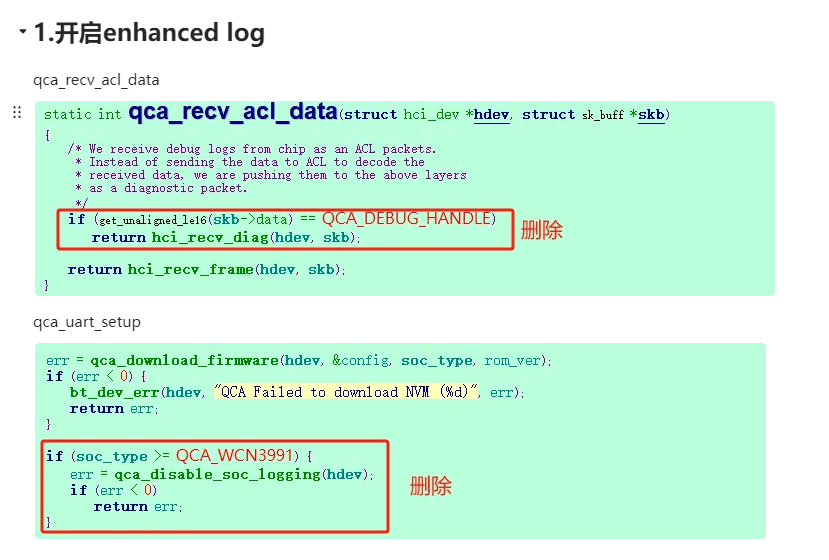
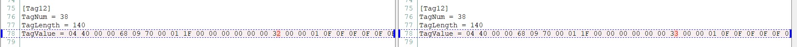
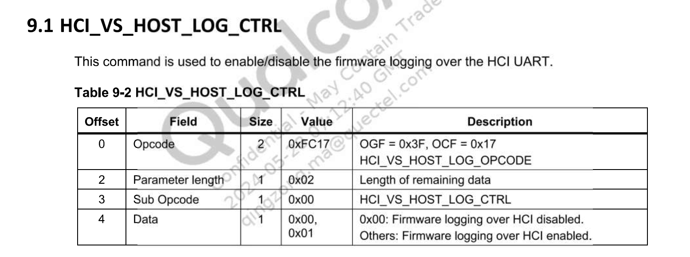

## enhanced log 





可以直接使用hcitool cmd 0x3f 0x17 0x00 0x01 打开




```
/usr/libexec/bluetooth/bluetoothd -n &
mount -o remount rw /
/etc/init.d/S50pipewire start
sleep 0.5
echo 0 > /sys/class/rfkill/rfkill0/state
echo 0 > /proc/bluetooth/sleep/btwrite
sleep 0.5
echo 1 > /sys/class/rfkill/rfkill0/state
echo 1 > /proc/bluetooth/sleep/btwrite
sleep 0.5
hciattach /dev/ttyS1 qca -t120 3000000 flow &


hciconfig hci0 up
hciconfig hci0 name bluez_qcom


hcitool cmd 0x3f 0x17 0x14 0x0f

bluetoothctl
扫描连接蓝牙

pactl set-default-sink 50
amixer -c 0 cset numid=1 3
amixer -c 0 cset numid=2 1
```


#高通
/usr/libexec/bluetooth/bluetoothd -n &
mount -o remount rw /
/etc/init.d/S50pipewire start
sleep 0.5
echo 0 > /sys/class/rfkill/rfkill0/state
echo 0 > /proc/bluetooth/sleep/btwrite
sleep 0.5
echo 1 > /sys/class/rfkill/rfkill0/state
echo 1 > /proc/bluetooth/sleep/btwrite
sleep 0.5
hciattach /dev/ttyS1 qca -t120 3000000 flow &


hciconfig hci0 up

hciconfig hci0 name bluez_qcom


hcitool cmd 0x3f 0x17 0x00 0x01 


pactl set-default-sink 50

amixer -c 0 cset numid=1 3
amixer -c 0 cset numid=2 1