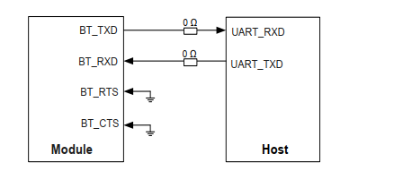
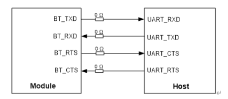

## 流控分为软件流控 硬件流控

在RS232中RTS 与CTS 是用来半双工模式下的方向切换；

如果UART只有RX、TX两个信号，要流控的话只能是软流控

如果有RX，TX，CTS，RTS 四个信号，则多半是支持硬流控的UART；

如果有 RX，TX，CTS ，RTS ，DTR，DSR 六个信号的话，RS232标准的可能性比较大。

SIMCOM公司对RTS/CTS的解释：

（要注意区别是不是讲串口支持硬流控的RTS/CTS，别看为益，在和瑞芯微调试硬件流控时，被这个非主流的解释搞得晕头转向的，下面用灰色小字体表示）

RTS是模块的输入端，用于MCU通知模块，MCU是否准备好，模块是否可向MCU发送信息，RTS的有效电平为低。

CTS是模块的输出端，用于模块通知MCU，模块是否准备好，MCU是否可向模块发送信息，CTS的有效电平为低

HAYES Modem中的RTS ，CTS 是用来进 行硬件流控的。现在通常UART的RTC、CTS的含义指后者，即用来做硬流控的。

**硬流控的RTS、CTS：**

（现在做串口使用RTS/CTS必看内容，因为MTK/）

**RTS （Require ToSend，发送请求）**为输出信号，用于指示本设备准备好可接收数据，低电*有效，低电*说明本设备可以接收数据。

**CTS （Clear ToSend，发送允许）**为输入信号，用于判断是否可以向对方发送数据，低电*有效，低电*说明本设备可以向对方发送数据。

此处有人将CTS翻译为发送允许，我感觉的确比翻译为清除发送好。因为CTS是对方的RTS控制己方的CTS是否允许发送的功能。

只能有软件流控

硬件流控

## realtek的uart

1. UART四条线接上的话，固件是不是不管硬件流控是否打开都能正常使用
    ==》是的，但是为稳定性考虑，建议接硬件流控
2. 贵公司的H5接法是否支持硬件流控，正常的好像是需要RTS CTS都接上去才支持硬件流控的
    ==》支持，三线接法是单向受控，四线是双向
3. 如果只接TX RX，需要使用哪种配置的config
    ==》关闭流控的config，但是不建议
4. 

H5是可以保證資料的有效性 但是會多一些header要傳 所以同樣的baud rate下througthput會少一點

H4是標準UART packet只有很簡易的parity check所以throughput高但不保證資料的有效性

## 对于uart，我的理解，