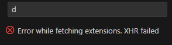
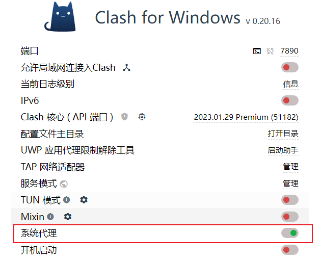
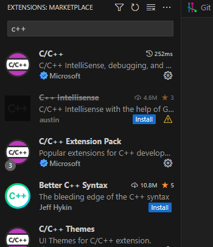

## clash for windows引发的惨案之Visual studio代理服务不可用

Error while fetching extensions. XHR failed 获取扩展时出错。XHR失败

公司电脑不知道什么时候出现了这个错误，尝试了网络上的很多种方法都不行，然后想到自己电脑唯一涉及到代理服务的就是之前用过的vpn工具：clash for windows。

打开这个工具，里面有一个系统代理的选项，开启后， Visual studio就可以搜索到插件了。

现在根本原因不知道是什么，先记录在这里，但是开启系统代理后，公司的邮件好像连接不上了，这里要注意