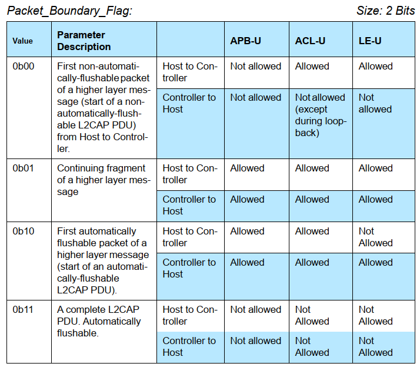

# HCI 数据格式

## commond

Opcode参数分为两个字段，称为Opcode Group Field (OGF)和Opcode Command Field  段(OCF)。OGF占据6bits，而OCF占据10bits。

OGF value 0x3E  为保留组，0x3f为厂商使用

Parameter_Total_Length 为所有paramter的长度，注意不是个数

如何通过OGF和OCF找到对应的HCI command or event

第一张图就是OGF，然后在当前OGF下去找ocf，一般都是按顺序往下找，比如我们的HCI reset 就应该是OGF:0x03 OCF:0x0001

## event

hci event的数据格式很简单，就是8bits的event code, 8bits 的后续参数总长度，然后就是n个event parameter。和command一样，host能接受不超过255字节的包。

根据event code，我们可以在spec中找到对应的说明：

## HCI ACL Data packets  

ACL 数据主要是两个Host进行数据交换   (蓝牙芯片跟蓝牙协议栈交互的L2CAP以及上层数据)

handle 不用介绍，就是一个连接句柄

**PB Flag 如下**

**BC flag**

## HCI Synchronous Data packets  

HCI sco用于从协议栈跟蓝牙芯片双向交户音频数据。HCI sco的格式如下：

Packet_Status_Flag（记录传输状态）

