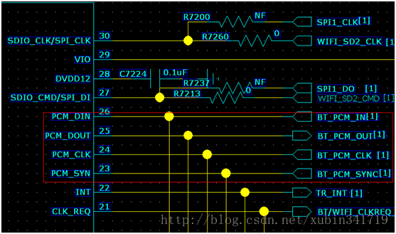

# PCM 概念

## 一分钟看懂什么是PCM编码

无论是普通音乐爱好者还是耳机发烧友，大家对于常见的音频编码格式多少都会有一点了解，比如MP3、AAC、WAV、[FLAC](https://xiazai.zol.com.cn/detail/44/431698.shtml)、DSD等等。但是，如果突然有人跟你聊到PCM编码格式，可能有些人会有一点懵。那么今天我们就利用大约一分钟的时间，简单快速的了解下什么是PCM编码格式。

  PCM编码（Pulse Code Modulation）即脉冲编码调制，于70年代末发展起来并成为CD和DVD的主要音频调制模式。它的采样频率从44.1kHz到192kHz不等，而在其输入端，需要设置滤波器以限制仅使20Hz～22.05kHz的频率通过，这样即可以覆盖人耳可听的全部频率范围（20Hz～20KHz）。

 PCM的比特率（采样大小）从14bit发展到16bit、18bit、20bit直到24bit；采样频率从44.1kHz发展到192kHz。因此，PCM约定俗成了无损编码，因为PCM代表了数字音频中最佳的保真水准。然而，因为输入和输出都需要设置滤波器调整频率，所以PCM编码音频的保真度会受到一定限制。PCM的常见文件格式包括WAV、APE与FLAC，它们均为无损音乐文件格式。

　　至于我们最常说的“无损音频”，一般都是指传统CD格式中的16bit/44.1kHz采样率文件，而知所以称其为“无损压缩”，也是因为其包含了20Hz～22.05kHz这个完全覆盖人耳可闻范围的频率而得名。

  几乎所有的有损压缩格式都是从WAV格式压缩转换而来（其内部的编码依然是PCM），而以前很多MP3设备不支持FLAC、APE、AAC等格式是因为它们不支持这些文件的[解压缩](https://xiazai.zol.com.cn/compress_soft_index/compress_page_1.html)，但是至今还没有一款[播放器](https://xiazai.zol.com.cn/mediaplay_soft_index/mediaplay_page_1.html)不支持WAV格式，这是因为WAV格式本身就是PCM码流。

## 蓝牙UART和[PCM](https://so.csdn.net/so/search?q=PCM&spm=1001.2101.3001.7020)接口传输的信号各是什么？（详见如上链接）

### UART:

１、当你通过蓝牙和别人互传文件时，就用ＵＡＲＴ传输。

数据传输如下所示:AP通过uart把数据发送到bt芯片中，通过无线发射出去，对方接收到后传给AP侧处理。

２、当你用蓝牙耳机听音乐时，音频信号也由ＵＡＲＴ传输。

 音乐数据通过uart 传送出去，对方耳机接收到后解码播放。如果是录音数据，则同样传回手机端存储。

### PCM:传输通话时的语音信号。

 

 

 uart一般是传输文件，也可以传输语音bit流
pcm一般只能传输语音信号

语音通话时数据流：语音数据有3G网络接入，通过PCM传递到蓝牙芯片，蓝牙芯片通过2.4G发射出去，到蓝牙耳机接收，同样[mic](https://so.csdn.net/so/search?q=mic&spm=1001.2101.3001.7020)传回的语言数据做相应处理

## 为什么蓝牙用PCM通道（网络参考）

 纠正个说法，一般手机cpu到蓝牙的通话实时音频传输才都使用pcm，MP3之类的音频走的是urat/usb之类的其他接口。
 真正原因我也不能确定，不过有几个情况可能是原因之一。
 （1）、PCM和IIS的区别在于，PCM一般是固定8k的采样率的单声道音频，最早似乎和固定电话的编码有直接关系，之后所有的话音编码几乎都是在PCM编码基础上再次编码得到的。而IIS则多了一个专门的信号线，采样率也可以配置到较高的频率，如44k；
 （2）、手机通话时候的编码一般都会被解码成8k采样率的PCM码，高了也没有用。因为本来手机通话的话音频段就是300~3400Hz而已，编码也是按8k采样的。某些手机平台并没有IIS接口，相对来说基本上都会有PCM接口；
 （3）、从蓝牙角度讲，蓝牙在制定协议的时候就特意为通话需求制定了一个协议层，专门定义了一种包结构（SCO）用于通话，有很好的实时性。而通过UART传输的包一般为ALC，用分组传输的方式。两种包的编解使用的软硬件都有些区别。sco包支持的基础码率也是8k的pcm.所以一般蓝牙芯片都会有一个PCM接口；
 （4）、还一个原因就是，开始大家这么做了，后来就都这么做了，形成行业规范。

转载：https://blog.csdn.net/xubin341719/article/details/38519555