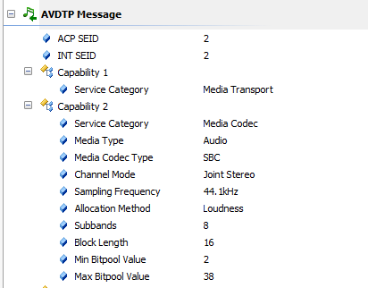

# 一、SBC简介

- SBC（subband codec）次频带编码，也称作子带编码。其基本原理是把信号的频率分为若干子带，然后对每个子带进行编码，并根据每个子带的重要性及特点分配不同的位数（采样深度）来表示数据。
- 在蓝牙A2DP协议中，SBC是一种音频编码系统，专门为蓝牙AV应用程序设计，以获得中等比特率的高质量音频，具有较低的计算复杂度，是需要默认支持的。

# 二、SBC编[解码](https://so.csdn.net/so/search?q=解码&spm=1001.2101.3001.7020)过程

## 2.1、编解码所需的算法参数

- sampling_frequency：采样频率。常用的是16KHz，32KHz，44.1KHz和48KHz

- channel mode：通道模式。可以是单声道，双声道，立体声和联合立体声

- block length：块长度。可以是4,8,12,16

- subbands：子带数量。可以是4或8

- allocation method：分配方式。可以是SNR或Loudness

- bitpool：比特池。范围是2-250。此值越大，编码产生的数据越

  

# 三、SBC编码特性

- SBC是有损编码
  - 由于无线传输的带宽限制，SBC在对每个子频段进行编码时，进行了有损处理，以达到数据压缩的目的。经过SBC编解码以后，PCM数据发生了变化。因此蓝牙设备的音质不是很好。
- SBC支持的采样率
  - 包括44.1kHz、48kHz、32kHz、16kHz。
- SBC支持的声道
  - 支持单声道(MONO CHANNEL)、双声道(DUAL CHANNEL)、立体声(stereo)、联合立体声(Joint Stereo)。