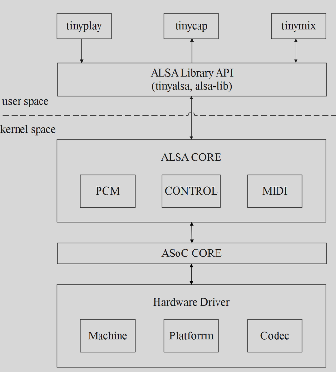
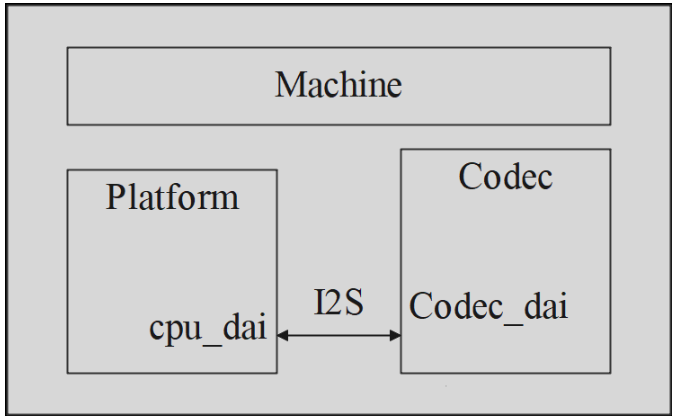
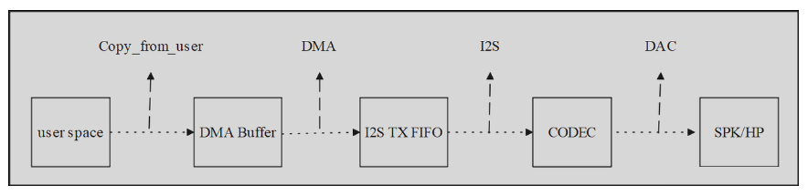
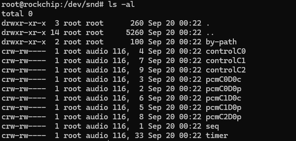
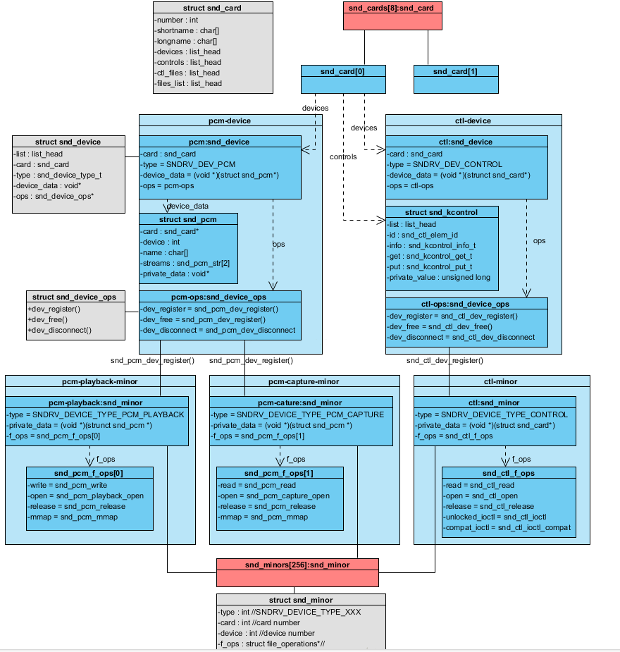

## 概述

ALSA表示高级linux声音体系结构(Advanced Linux Sound Architecture)。它由一系列内核驱动，应用程序编译接口(API)以及支持Linux下声音的实用程序组成。

ALSA项目发起的原由是Linux下的声卡驱动(OSS/Free drivers)没有获得积极的维护。而且落后于新的声卡技术。Jaroslav Kysela早先写了一个声卡驱动，并由此开始了ALSA项目，随后，更多的开发者加入到开发队伍中，更多的声卡获得支持，API的结构也获得了重组。

Linux内核2.5在开发过程当中，ALSA被合并到了官方的源码树中。在发布内核2.6后，ALSA已经内建在稳定的内核版本中并将普遍地使用。

## ALSA框架各模块

ALSA可以分为三层，APP层、ALSA-lib、kernerl-driver



### ALSA Library API：
​        alsa 用户库接口，常见有 tinyalsa、alsa-lib。

### ALSA CORE：
​        Alsa核心层，向上提供逻辑设备（PCM、CTL、MIDI、TIMER…）系统调用，向下驱动硬件设备（Machine、I2S、DMA、CODEC）。

### ASoC CORE：
​        asoc 是建立在标准 alsa core 基础上，为了更好支持嵌入式系统和应用于移动设备的音频 codec 的一套软件体系。

### Hardware Driver：

​        音频硬件设备驱动，由三大部分组成，分别是 Machine、Platform、Codec。

​        Hardware Driver三者的关系如下图所示：



####  Platform缓存：

​        主要作用是完成音频数据的管理，通过CPU的数字音频接口（DAI）把音频数据传送给Codec进行处理，最终由Codec输出驱动耳机或者是喇叭的音信信号。在具体实现上，ASoC有把Platform驱动分为两个部分：snd_soc_platform_driver和snd_soc_dai_driver。其中，platform_driver负责管理音频数据，把音频数据通过dma或其他操作传送至cpu dai中，dai_driver则主要完成cpu一侧的dai的参数配置，同时也会通过一定的途径把必要的dma等参数与snd_soc_platform_driver进行交互。

​        **CPU DAI：**
​         在嵌入式系统里面一般指soc的I2S，PCM总线控制器，负责把音频数据从I2S tx FIFO搬运到codec（playback、capture则相反）。cpu_dai经过 snd_soc_register_dai()来注册。注：DAI是Digital Audio Interface的简称，分为cpu_dai和codec_dai，这二者经过I2S/PCM总线链接；AIF是Audio Interface母的简称，嵌入式系统中通常是I2S和PCM接口。

​        **PCM dma：**
​         负责把dma buffer中的音频数据搬运到I2S tx fifo。值得留意的是：某些情形下是不须要dma操作的，好比modem和codec直连，由于modem自己已经把数据送到fifo了，这时只须要启动codec_dai接收数据便可；该情形下，machine驱动dai_link中须要设定.platform_name = "snd_soc_dummy",这是虚拟dma驱动，实现见sound/soc/soc-utils.c. 音频dma驱动经过 snd_soc_register_platform()来注册，故也经常使用platform来指代音频dma驱动(这里的platform须要与soc platfrom区分开）。

#### Codec:

​      对于回放来讲，userspace送过来的音频数据是通过采样量化的数字信号，在codec通过DAC转换成模拟信号而后输出到外放或耳机，这样我么你就能够听到声音了。codec字面意思是编解码器，但芯片(codec)里面的功能部件不少，常见的有AIF、DAC、ADC、Mixer、PGA、line-in、line-out，有些高端的codec芯片还有EQ、DSP、SRC、DRC、AGC、Echo-Canceller、Noise-Suppression等部件。

##### Machine:

​      指某款机器，经过配置dai_link把cpu_dai、codec_dai、modem_dai各个音频接口给链结成一条条音频链路，而后注册snd_soc_card.和上面两个不同，platform和codec驱动通常是能够重用的，而machine有它特定的硬件特性，几乎是不可重用的。所谓的硬件特性指：

​            1、Soc Platform与Codec的差别。

​            2、DAIs之间的链结方式；

​            3、经过某个GPIO打开AMP；

​            4、经过某个GPIO检测耳机插拔；

​            5、使用某个时钟如MCLK/External-OSC做为I2S，CODEC的时钟源等等。

​    从上面的描述来看，对于回放的情形，PCM数据流向大体如下图所示：



## ALSA设备文件结构



​    我们可以看到以下设备文件：

​            contro1C0 ------>               用于声卡的控制，例如通道选择，混音，麦克风的控制等。

​            pcmC0D0c ------>              用于录音的pcm设备

​            pcmC0D0p ------>              用于播放的pcm设备

​            seq ------>                          音序器

​            timer ------>                        定时器

 其中，C0D0代表的是声卡0中的设备0，pcmC0D0c最后一个c代表capture，pcmC0D0p最后一个p代表playback，这些都是alsa-driver中的命名规则。从上面的列表可以看出，我的声卡下挂了11个设备，根据声卡的实际能力，驱动实际上可以挂上更多种类的设备，在include/sound/core.h中，定义了以下设备类型：

```c
/* type of the object used in snd_device_*()
 * this also defines the calling order
 */
enum snd_device_type {
	SNDRV_DEV_LOWLEVEL,
	SNDRV_DEV_INFO,
	SNDRV_DEV_BUS,
	SNDRV_DEV_CODEC,
	SNDRV_DEV_PCM,
	SNDRV_DEV_COMPRESS,
	SNDRV_DEV_RAWMIDI,
	SNDRV_DEV_TIMER,
	SNDRV_DEV_SEQUENCER,
	SNDRV_DEV_HWDEP,
	SNDRV_DEV_JACK,
	SNDRV_DEV_CONTROL,	/* NOTE: this must be the last one */
};
```

​    通常，我们更关心的是pcm和control这两种设备。


### alsa设备驱动

该层包含的主要数据结构包括:

\- snd_card        表示一个声卡实例, 包含多个声卡设备

\- snd_device   表示一个声卡设备部件

\- snd_pcm        表示一个 PCM 设备, 声卡设备的一种, 用于播放和录音

\- snd_control   表示 Control 设备, 声卡设备的一种, 用于控制声卡

\- snd_pcm_str 表示 PCM 流, 分为 Playback 和 Capture

\- snd_pcm_substream  PCM 子流, 用于音频的播放或录制

\- snd_pcm_ops    PCM 流操作集

 

各结构体之间主要关系图如下所示


