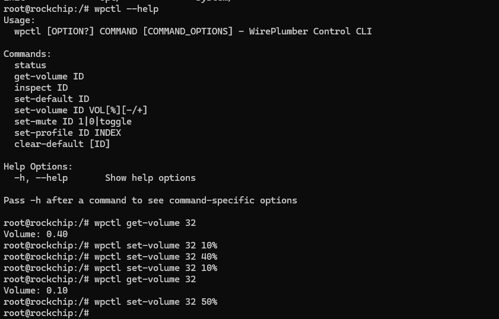

```shell
root@rockchip:/# wpctl --help
Usage:
  wpctl [OPTION?] COMMAND [COMMAND_OPTIONS] - WirePlumber Control CLI

Commands:
  status
  get-volume ID
  inspect ID         ## 查看ID信息
  set-default ID     ## 设置默认音频通道
  set-volume ID VOL[%][-/+]
  set-mute ID 1|0|toggle
  set-profile ID INDEX
  clear-default [ID]

Help Options:
  -h, --help       Show help options

Pass -h after a command to see command-specific options

root@rockchip:/# wpctl get-volume 32
Volume: 0.40
root@rockchip:/# wpctl set-volume 32 10%  #设置音量
root@rockchip:/# wpctl get-volume 32
Volume: 0.10
root@rockchip:/# wpctl set-volume 32 50%

```


```
#realtek
/usr/libexec/bluetooth/bluetoothd -n &
mount -o remount rw /
/etc/init.d/S50pipewire start
sleep 0.5
insmod /usr/lib/modules/hci_uart.ko
sleep 0.5
echo 0 > /sys/class/rfkill/rfkill0/state
echo 0 > /proc/bluetooth/sleep/btwrite
sleep 0.5
echo 1 > /sys/class/rfkill/rfkill0/state
echo 1 > /proc/bluetooth/sleep/btwrite
sleep 0.5
rtk_hciattach -n -s 115200 ttyS1 rtk_h5 &
```


pactl list sinks short
pactl set-default-sink 50

amixer -c 0 cset numid=1 3
amixer -c 0 cset numid=2 1
