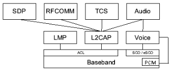

如上图：
音频通路1：Audio->L2CAP->ACL->HCI->Baseband，a2dp音频走这种方式；
音频通路2：Audio->Voice->SCO/eSCO->HCI->Baseband，hfp、hsp蓝牙通话走这种方式；
音频通路3：Audio->Voice->PCM->Baseband，hfp、hsp蓝牙通话走这种方式；
蓝牙通话的方式有音频通路2、音频通路3，这两种方式表现在硬件连接的差异上，音频通路2方式，音频数据是走HCI接口发送给蓝牙基带的，而音频通路3方式是通过PCM接口直接把音频数据传送给基带。