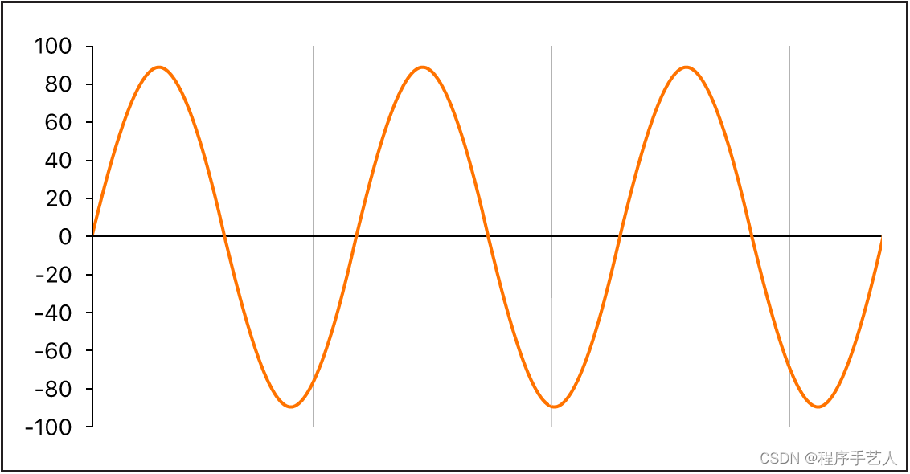
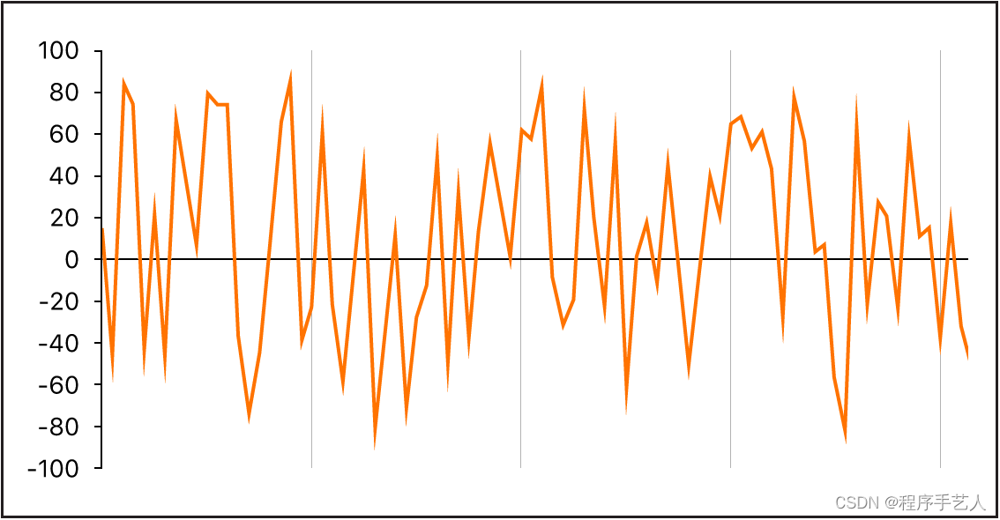
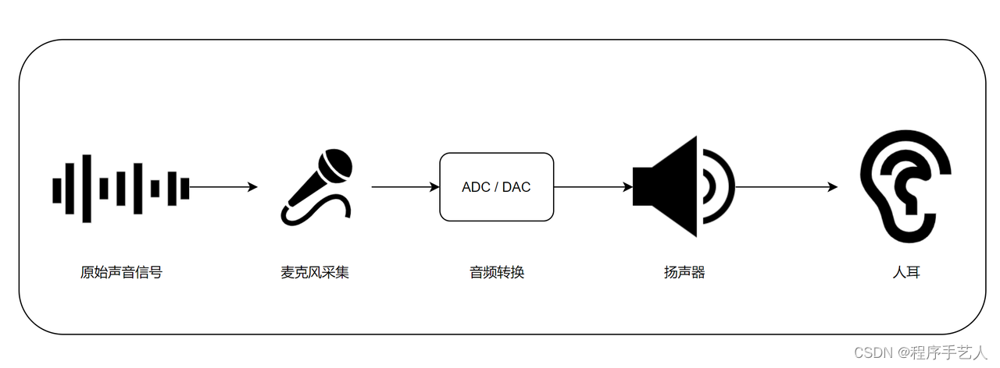
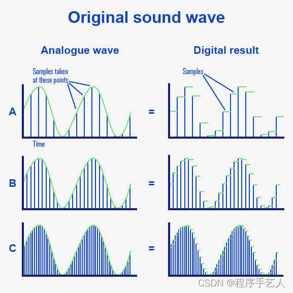
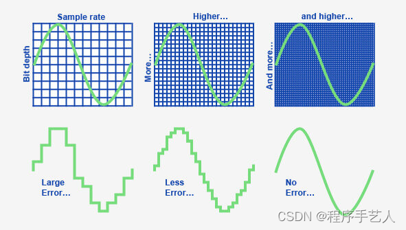
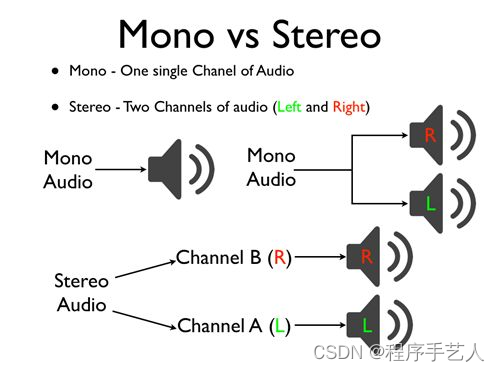
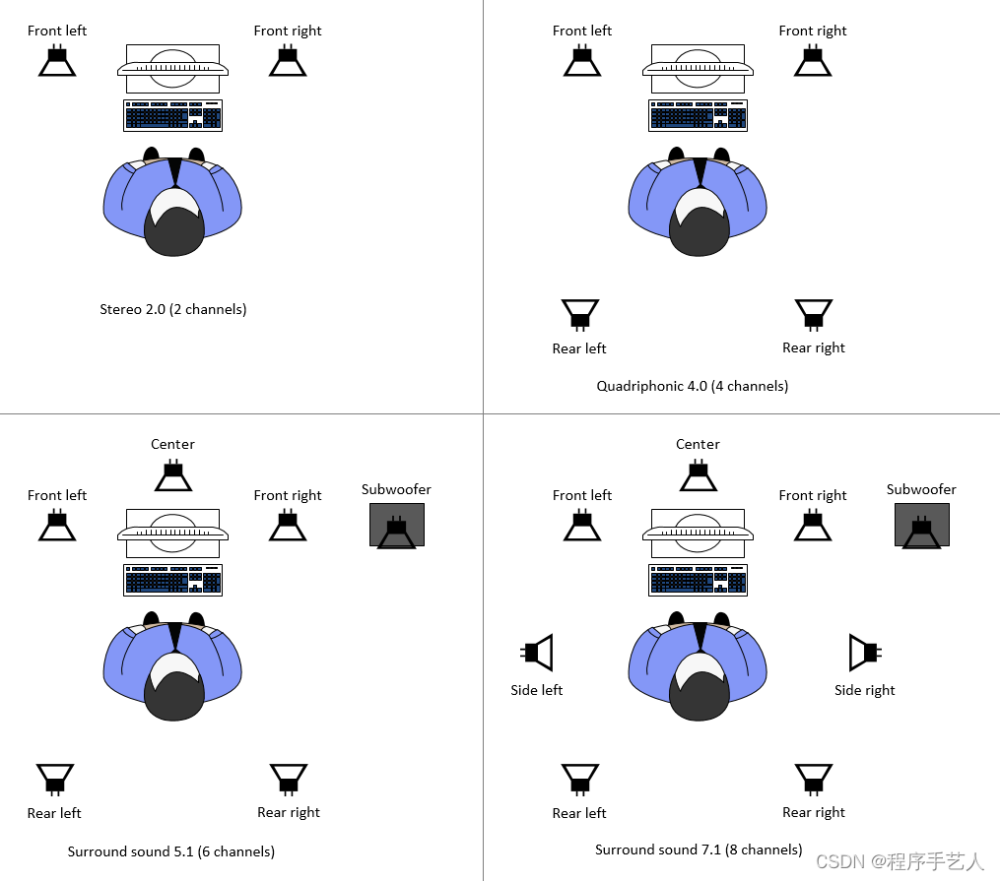

在短视频兴起的背景下，音视频开发越来越受到重视。接下来将为大家介绍音频开发者入门知识，帮助读者快速了解这个领域。 

在这里插入图片描述

 轻柔的音乐、程序员有节奏感的键盘声、嗡嗡的发动机、刺耳的手提钻……这些声音是如何产生的呢？又是如何传到我们耳中的呢？声音是振动产生的声波，通过介质（气体、固体、液体）传播并能被人或动物听觉器官所感知的波动现象。声音的频率一般会以赫兹表示，记为Hz，指每秒钟周期性震动的次数。而分贝是用来表示声音强度的单位，记为dB。

## 1. 认识声音

声音的物理本质非常简单，其实就是两个字：振动。我们对振动应该不陌生，振动的钟、振动 的鼓膜、振动的音叉等等。那么到底振动如何引起的声音，又怎样能被我们听到呢？

从技术上来说，声音是物理能量（如拍手）到空气压力扰动的转换。空气压力中的这种改变通过空气以一连串振动（声波）的形式传播。声音振动也可以通过其他介质传播，如墙壁或地板。

在这里插入图片描述

上图显示了正弦波的示波图（图形显示），这是最简单最纯粹的波形。如果振动不以可辨别的形式传播，则声音就称为噪声。

在这里插入图片描述

波形的重复（示波器中的每个波峰和波谷）被称为循环。每秒钟发生的循环数决定波形的基本音高，通常称为频率，大部分乐器都可以提供振荡器频率控制，以赫兹 (Hz) 为单位，用于确定每秒的循环数，从而决定声音的基本音高。

## 2. 耳朵是如何听到声音

我们的耳朵是一个很神奇的器官，通过耳朵，我们可以感受到周围空气中的声音，转化成信息处理。能够让我们清楚的知道声音的来源。当声波进入耳朵时，会引起鼓膜和耳内的骨头振动。内耳中细小而脆弱的耳毛将振动转换为电信号发送到大脑，然后大脑将信号解析为声音。总结起来耳朵通过外耳、中耳和内耳的协同作用，将声音的机械能转化为神经信号，从而使我们能够听到声音。另外人耳并不是所有的声波都可以听到，只可以听到 20Hz 到 20KHz 之间的声波。 这个过程可以大家搜索下相关视频介绍解释的会更加清楚一些。大家可以听下这个音频，通过听感结合视频中看到的频率分析，感受下。

20Hz-20kHz

## 3. 工程角度的音频播放

在这里插入图片描述

 从工程角度来处理声音时，首先是通过麦克风采集到声音的模拟信号。然后通过音频模数转换器，将模拟信号转换成数字信号。这些数字信号可以被计算机处理和存储，或者通过扬声器输出。扬声器会根据数字信号产生一定频率的震动，然后通过空气传播模拟信号到我们的耳朵。这样我们就能够听到对应的声音。在处理声音时，我们还会应用数字信号处理技术。通过使用数字信号处理算法，我们能够对声音进行滤波、音频增强、降噪等处理，从而进一步优化声音效果。此外，还可以利用多通道录制技术，将不同方向的声音分离出来，实现立体声效果。为了提高声音的传输质量，我们还会使用压缩算法对声音进行压缩，以减少数据量，同时保持一定的音质。这些工程技术能够使我们在日常生活中享受到更清晰、更真实的声音体验。

## 4. 采样率（Sample Rate）

**采样率是每秒从音频信号记录的样本数量的度量**。它以赫兹 (Hz) 为单位进行测量，表示每秒记录音频信号样本的频率。 样本是对特定时间点音频信号响度的度量。采样率是音频信号质量的重要因素，因为它直接影响信号的带宽。更高的采样率可以捕获音频信号的更多细节，从而提高信号质量。然而，更高的采样率也需要更多的存储空间和带宽来存储和传输音频信号。在音频行业中，根据音频信号的预期用途使用不同的采样率。一些最常用的采样率是 44.1kHz、48kHz 和 96kHz。

在这里插入图片描述

 如图所示，如果想完美地重建信号，必须对原始音频进行数千个样本。在A示例中，您可以看到我们的数字结果很差，因为我们的样本不够频繁。在B示例中，我们的数字结果更好并且看起来更平滑。然而，在C示例中，数字结果与原始音频一样平滑。那是因为我们已经采集了足够的样本！换句话说，足够高的采样率可以让我们捕捉到原始声音的每一个细节。

来听一下不同采样率录制的声音，需要注意高频成分的变化，因为采样率越低，高频信息越少。首先是每秒采样次数为16000Hz, 并且可以通过频率分析观察到信号的截止频率为8kHz。 

16k

接下来同样的音乐，每秒采样次数为48000Hz, 并且可以通过频率分析观察到信号的截止频率为24kHz。

48k

## 5. 位深度 (bit depth)

**音频位深度决定了可以为每个音频样本记录的可能幅度值的数量**。位深度越高，捕获的每个样本的幅度值就越多，以重新创建原始音频信号。由于声波是连续波，因此具有无数可能的振幅值，因此我们需要将其振幅值建立为数字位，以准确地再现它们。查看下面的位深度示例： 

***位深度 + 采样率 = 音频带宽***

在这里我们可以看到位深度如何与采样率一起重建一个波周期。在前两个示例中，我们没有足够的可用位来平滑地再现连续声波。但在第三个示例中，我们有足够的可用位来无误地映射信号的幅度值。

当一个信号被采样时，它需要以比特存储采样的音频信息。这就是位深度发挥作用的地方。位深度决定了可以存储多少信息。具有 24 位深度的采样可以存储更多细微差别，因此比具有 16 位深度的采样更精确。

最常见的音频位深度是 16 位、24 位和 32 位。每个都是一个二进制项，代表许多可能的值。更高音频位深度的系统能够表达更多可能的值。更明确地说，让我们看看每个位深度可以存储的最大值数是多少。可以看到两个位深度之间可能值的数量存在巨大差异。

- 16 bit代表能够存储多达 65536 级信息
- 24 bit代表能够存储多达 16777216 级信息
- 32 bit代表能够存储多达 4294967296 级信息

位深度影响的另一个重要因素是信号的动态范围。16 位数字音频的最大动态范围为 96 分贝，而 24 位深度将为我们提供最大 144 分贝。CD 质量的音频以 16 位深度录制，因为一般来说，我们只想处理足够响亮的声音，但同时又不足以损坏设备或耳膜。对于 44.1kHz 的采样率，16 位的位深度足以再现普通人的可听频率和动态范围，这就是它成为标准 CD 格式的原因。

## 比特率：Bitrate

比特率不止出现在音频中，更常见的，是出现在网络传输中。 我们的网速，就经常使用比特率来表示：100MBps，指的是理论下每秒传输 100MByte 的数据。

**那在音频领域，这个词是什么含义呢？**

如果是无损的 PCM 制作的音频数据，则比特率没有太大意义。因为参数已经确定了。我们上面的 44100, 16bit, 2 Channel 的参数的 PCM，他的比特率为 1.4Mbps（就是把上面的 60s 改为 1s 就可以算出来啦）。

比特率这个参数更多的是来描述压缩音频，特别是有损压缩音频的质量。 对于有损压缩，他生下来就要考虑我要压成什么样子 >_>。对于流媒体领域，他们更看重流量带来的压力。PCM 1.4Mbps 的比特率极容易占据大量带宽，同时用户加载时间也将变长。所以他们使用比特率来反向调节音频质量，也就是压缩和丢失的程度。

- 如果用户网络比较差，24kbps 或许是一个不错的选择，这样至少用户可以听到内容。
- 如果用户网络良好，**付费意愿**也比较高，那么 256kpb 也不是不行。

## 6. 音频通道 (channles)

理解音频通道的最简单方法是想象轨道或交通车道。其中单声道代表一 (1) 个轨道，立体声代表两 (2) 个轨道。因此，当以单声道录制时，您将音频录制到单个轨道中。当以立体声录制时，您将音频录制到两个轨道中；左和右。显然立体声可以让声音更加有空间感，但相应的数据量要比单声道的数据量多一倍。

在这里插入图片描述

 还有更多通道数，基本上可以拥有任意数量的通道（扬声器），最常见的配置有：

- 2.0。这是普通立体声音频，具有左右扬声器。所有音乐都以立体声录制，正常的视频媒体播放都是立体声。
- 5.1。这是最标准的环绕声格式，如果你是游戏新手，这将是最简单的。它有普通的左右扬声器、一个中置声道和 2 个环绕扬声器，通常位于您的座位区后面。
- 6.1。它拥有 5.1 环绕声的所有功能，但包括一个额外的后环绕声道，位于您的座位区后面，以获得更身临其境的声音。
- 7.1。这些扬声器系统具有内置系统，基本上将单个后置通道（在 6.1 系统中）的信号分成 2 个音频通道，从而为您提供更高的沉浸感。
- 8.1 或更高。一旦超过 7.1 声道，就进入了非常专业的领域，很可能会自己构建这个系统。添加的扬声器越多，就越会有身临其境的感觉。

在这里插入图片描述

1. 总结

首先，我们了解了声音的物理本质是振动，并且通过介质传播。其次，我们探讨了耳朵如何听到声音，以及人耳能够听到的频率范围。然后，从工程角度出发，介绍了音频是如何播放和录音的，包括麦克风采集声音、模数转换、数字信号处理等。接着，我们讨论了采样率和位深度对音频信号质量的影响。最后，我们介绍了音频通道的概念和常见配置。通过这些内容，读者可以初步了解音频开发的基础知识。