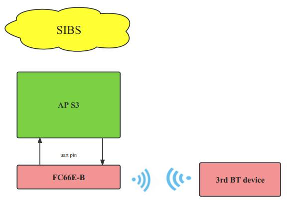
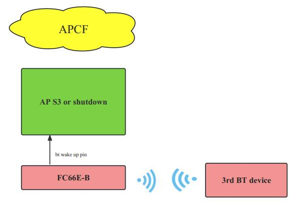

# 高通休眠唤醒

 I heard valve has a need for Bluetooth sleep wake up, so I'm evaluating this, but before I do, I want to make sure what your wake up scenario is like.

​    

At present, there are three scenarios for Bluetooth wake-up. I have listed the implementation details and application restrictions of the current scenario respectively. You can choose which one you want according to the scenarios we have listed or you can refer to us if you have your own wake-up scenario.

 

**NO.1 OOB(out of band) bt wakeup host.**

**Introduction:** The 66E-B is connected to the 3rd Bluetooth Device. When the AMD AP enters S3 sleep, the 3rd Bluetooth Device sends data to the 66E-B. Then 66E-B will output a specific waveform to AP through bt wake up pin, then AMD AP wake up

**Condition:** The connection status of Bluetooth must be included

**Risk:** The current mode may not support some modules, and Qualcomm has replied to us that it may not support, but if you want to choose this solution, we will try it ourselves

 

**NO.2 SIBS(Software In-Band Signaling) bt wakeup host.**

 

**Introduction:** This scenario does not require additional hardware pin intervention, only the uart can achieve the awakening function, if the 3rd Bluetooth device can interact with the 66E data.

**Condition:** It was also introduced just now that uart can wake up AMD aps only with interactive data, so there are four cases as follows that can realize interactive data

1. When the 3rd Bluetooth device is connected to the FC66E, the 3rd Bluetooth Device sends data to the FC66E
2. Before the AMD master enters S3, you need to set the 66E-B to the scannable state (Classical inquiry/page scan or ble adveristing). Then the 3rd Bluetooth device connects to the FC66E-B
3. The FC66E has been BLE paired with the 3rd Bluetooth device, and the device address of the 3rd Bluetooth device has been whitelisted. At this time, before AMD AP goes to S3 sleep, let FC66E execute BLE background connection. If the 3rd Bluetooth Device BLE adversting, it wakes up the AMD AP
4. It is also a background connection, similar to the third point, only in reverse direction, requiring the FC66E to BLE adversting and the 3rd BT device to execute the background connection (if the 3rd device supports it).

**Risks:** Integrating this functionality requires modifications to the uart driver, so collaboration is required

 

**NO.3 APCF(Advertising Packet Content Filter) bt wakeup host.**

**Introduction:** This can be done in the S3 state or shutdown state by having the FC66E perform a BLE command scan and then waking up the AMD AP if the 3rd bluetooth device ble adversting

**Condition:** This application scenario only requires the 3rd BT device to be able to send specific adverstting data